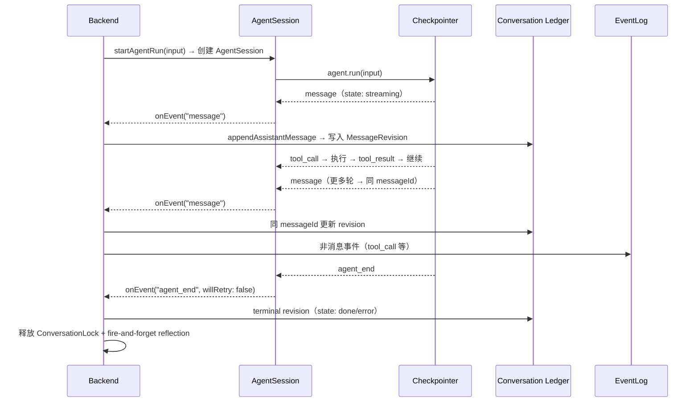

# 一次运行的生命周期

一次 Agent 运行从被触发到结束的生命周期。

## 时间线

## 分阶段说明

**1. 发起**　Backend 收到触发信号（人发消息 / orchestrator 推进 Issue / cron 到点），创建 AgentSession，调用 `session.prompt(input)`。

**2. 执行**　AgentSession 委托给 Framework 的 `runLoop`，按步骤推进（受 maxSteps 约束）。每步可能调模型或调工具。过程拆成 AgentEvent 流。

**3. 固化事实**　AgentSession 的内部订阅者将事件通知给 Backend 注册的 listener。listener 按事件类型分流：消息事件直接 `appendAssistantMessage` 写 conversation ledger；非消息事件（tool_call 等）写入 EventLog。

**4. 收尾**　Run 结束时（`agent_end`），Backend 的 listener 写入 terminal revision 关闭消息，释放 ConversationLock。若被中断（InterruptSignal），AgentSession 保持存活，等待 `resume()` 调用后继续。

## 关联页面

- [事实与投影](facts-and-projections.md)
- [会话消息流](../backend/conversation-projection.md)
- [AgentSession](../harness/harness.md)
- [Framework 运行循环](../runtime/framework.md)
- [Web 消息端到端](../flows/e2e-web-message.md)
- [飞书消息端到端](../flows/e2e-lark-message.md)
