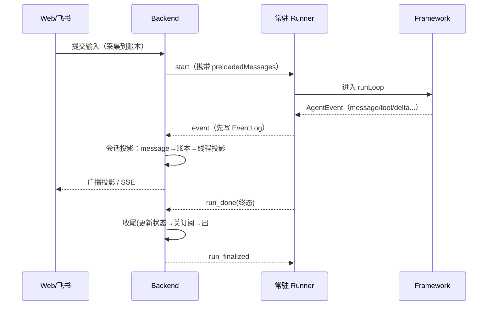

# 一次运行的生命周期

这一页把一次 Agent 运行从「被发起」到「彻底收尾」串成一条时间线，标出每个阶段由谁负责、产出什么事实、触发什么投影。它是理解后端、Runner、Framework、各端如何咬合的总览——具体每一段的细节都另有专页，这里只给骨架和顺序。

## 时间线骨架

## 分阶段说明

**1. 发起**　端采集用户输入，写进对话账本（账本是事实来源）。后端据此向对应 Agent 的常驻 Runner 下达 `start`，这一次要喂的对话以 `preloadedMessages` 随 `start` 传输，而非塞进 AgentSpec。

**2. 执行**　Runner 进入 Framework 的 `runLoop`，一步步推进（受 maxSteps=32、maxForceContinues=3 约束）。循环把过程拆成 `AgentEvent`，Runner 转成协议里的 `event` / `delta` 上报。

**3. 固化事实**　后端每收到一个 `event`，**先写 EventLog**（事实先于投影的不变式），随后会话投影挑出 `message` 类事件包上 runId 写进账本，并广播进各成员的线程投影；`delta` 走实时流单独渲染。

**4. 收尾**　Runner 发 `run_done`（终态：succeeded/error/aborted/interrupted）。后端按固定顺序收尾：更新 attempt/run → 关闭 delta 订阅 → 从 `#active` 移除 → await 所有 onRunComplete → 发 `run_finalized`。Runner 收到后确认 Host 侧彻底结束。

## 顺着这条线往下读

- 事实与投影为什么这么分：见[事实与投影](facts-and-projections.md)
- 投影那座桥的实现：见[会话投影](../backend/conversation-projection.md)
- 编排与收尾握手：见[运行编排器](../backend/run-supervisor.md)
- 循环内部：见[Framework 运行循环](../runtime/framework.md)
- 端到端两个完整例子：见[Web 消息全链路](../flows/e2e-web-message.md)、[飞书消息全链路](../flows/e2e-lark-message.md)
