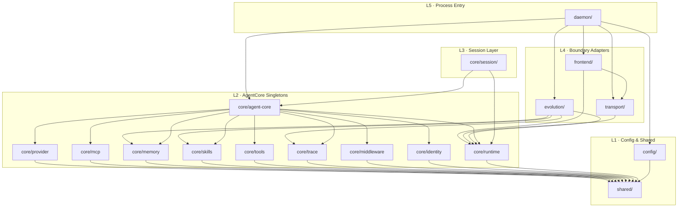
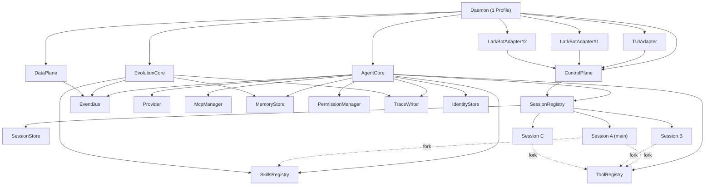

# Lobster 架构 · 完整需求文档 (PRD v1.0)

> 项目代号: Lobster
> 文档版本: v1.0
> 文档类型: 需求 + 架构对齐稿 (含人读规范 + 机读 JSON Schema)
> 编制日期: 2026-05-16
> 范围: my-agent-dev 重构, 统一 TUI 与 Bot 为单 daemon-hosted Agent, 支持 tmux 风格 attach/detach/resume, Profile 三隔离, Evolution 自我迭代闭环

---

## 0. 文档总览

| 章 | 内容 |
|---|---|
| 1 | 业务目标 / 工程目标 / 非目标 |
| 2 | 产品动线与用户旅程 |
| 3 | 架构总览 (Lobster) |
| 4 | 核心概念与关系 |
| 5 | Session 状态机与单 in-flight turn 模型 |
| 6 | Profile 三隔离 |
| 7 | 配置模型 (TOML 双层) |
| 8 | LarkBotAdapter 路由表与 Bot:Agent=N:1 |
| 9 | Trace 永久保留契约 |
| 10 | Evolution 子系统适配 |
| 11 | 其他子系统适配评审 (18 项) |
| 12 | 现状 → 新架构模块对应关系 |
| 13 | 重构后目录结构 |
| 14 | 模块依赖图 |
| 15 | ControlPlane / DataPlane 协议规范 (人读) |
| 16 | 全局不变量 (I + GI + 子系统 I-* + EV-I + P-I) |
| 17 | MVP Stub 清单 |
| 18 | 验收标准 (V + V-S + V-P + EV-V) |
| 19 | 与 Phase 1+2 修复的依赖矩阵 |
| 20 | 渐进迁移路径 (Step 0~7) |
| 21 | 风险与缓解 |
| 22 | 待澄清 (已结案 + 后续追踪) |
| 附录 A | 关键 TypeScript 接口签名 |
| 附录 B | 关键事件 payload 示例 |
| 附录 C | TOML 完整字段示例 |
| 附录 D | 文档历史 |
| 附录 E | JSON Schema 机读规范 (common / envelope / jsonrpc / 23 ControlPlane methods / DataPlane event oneOf) |

---

## 1. 目标

### 1.1 业务目标

- **G1**: 统一 CLI (TUI) 与即时通讯 (Lark Bot) 入口为同一 Agent, 跨入口共享身份、记忆、技能、历史
- **G2**: 支持 tmux 式多前端协作 (同 Agent 同时被 TUI + Bot attach, 事件互通)
- **G3**: 支持多 Profile 隔离 (工作/生活/项目级 Agent 互不串扰)
- **G4**: 支持 Evolution 自我迭代闭环 (trace 复盘 → memory/skill 沉淀 → 下次更优)
- **G5**: 支持外部 Bot 多实例 (N 个 Lark App 凭据共享同一 Agent 大脑)

### 1.2 工程目标

- **E1**: 消除全局可变态 (模块单例、registerTools、setMcpManagerInstance)
- **E2**: 重资源单例化 (Provider / MCP / Memory / Skills / Trace 每 profile 一份)
- **E3**: 轻上下文 per-session 化 (ContextManager / Agent loop / SubToolRegistry)
- **E4**: Frontend 防腐层化, 新增前端不动核心
- **E5**: 协议化通信 (JSON-RPC + 事件流 + cursor), 便于跨进程/远程化

### 1.3 非目标

- N1: 多用户 (MVP 单用户单 daemon, socket 抢占)
- N2: 跨 daemon 集群、多实例选主
- N3: WebUI 实现 (预留 stub)
- N4: Tcp Transport (预留 stub)
- N5: 细粒度 RBAC、审计平台对接
- N6: 历史 trace 自动清理 (永久保留契约)

---

## 2. 产品动线与用户旅程

### 2.1 命令面

| 入口 | 命令 | 行为 |
|---|---|---|
| CLI | `bun agent` | attach 默认 profile main session |
| CLI | `bun agent -p work` | attach work profile main session |
| CLI | `bun agent -p work -s <sid>` | attach 指定 session |
| CLI | `bun agent list` | 列出当前 profile 所有 session |
| CLI | `bun agent health` | 调 system.health |
| TUI 内 | `/resume <sid>` | detach 当前 + attach 目标 session |
| TUI 内 | `/new <title>` | 新建 session |
| TUI 内 | `/detach` | 退出 attach, daemon 继续运行 |
| TUI 内 | `/close <sid>` | 关闭 session (main 不可关) |
| Lark | 私聊/群消息 | adapter 按 anchor 路由到 session; 无则创建 |
| Lark | `/health`、`/list` 等斜杠命令 | 走 ControlPlane |

### 2.2 五大用户旅程

**UJ-1 首次启动 (冷启)**

1. `bun agent` → 检测无运行 daemon → 启动 daemon → 加载 global + profile TOML → 构造 AgentCore + EvolutionCore → SessionRegistry 从 SessionStore 重建 (空) → 创建 main session → TUI attach

**UJ-2 跨入口接力**

1. 工位 TUI 与 Agent 对话 → `/detach` (daemon 留存)
2. 通勤路上 Lark 私聊 Bot → LarkBotAdapter 按 (p2p, userId) anchor 路由 → main session
3. 看到完整上下文, 继续对话

**UJ-3 多前端共视**

1. TUI attach main session
2. Lark group attach (anchor: thread, threadId=T1 → session B)
3. 各自看到自己 session 的事件流; 权限请求精确路由到发起 turn 的 frontend

**UJ-4 Profile 切换**

1. `bun agent -p work` 启 daemon-work
2. 另起 `bun agent -p personal` 启 daemon-personal
3. 两个 daemon 进程互不可见, memory/trace/skills/identity 物理隔离

**UJ-5 Evolution 闭环**

1. 持续对话产生 trace
2. Evolution Core 周期触发 trace review → 生成 pending skill / memory 候选
3. TUI 看到 `evolution.skillProposed` → `/accept <id>` → `skills.reloaded` → 下一 turn 子工具表已含新 skill

---

## 3. 架构总览

### 3.1 类比

| Lobster | tmux |
|---|---|
| daemon | tmux server |
| AgentCore | server 共享资源 |
| Session | tmux session |
| Frontend (TUI/LarkBot) | tmux client |
| ControlPlane | tmux command socket |
| DataPlane | tmux pane 输出流 |

### 3.2 进程模型

- 1 daemon = 1 profile (MVP)
- Session 与 AgentCore 同进程; Frontend 通过 UnixSocket/InMemory 接入
- EvolutionCore 与 AgentCore 同进程平级

---

## 4. 核心概念与关系

### 4.1 概念定义

| 概念 | 定义 | 实例数 |
|---|---|---|
| Profile | workspace + memory + identity + config 的隔离单元 | 1 daemon = 1 profile |
| AgentCore | 重资源容器 | per-profile 单例 |
| EvolutionCore | 进化容器, 与 AgentCore 平级 | per-profile 单例 |
| Session | 轻上下文 | per-profile N 个, 1 个 main |
| Frontend | 前端适配器 (TUI/LarkBot/WebUI) | per-daemon N 个 |
| Bot | LarkBotAdapter 实例 + Lark App 凭据 | per-daemon N 个, 寄生于 daemon |

### 4.2 关键关系

- **Bot : Agent = N : 1**
- **AgentCore : Session = 1 : N** (同进程)
- **Session : Frontend = N : M** (attach 多对多)
- **Profile : Daemon = 1 : 1**

### 4.3 LarkBotAdapter 实质

- 一个 `LarkBotAdapter` 类实例 = 一个 Bot; 持自有 LarkClient + CardPipeline + 凭据
- 通过 ControlPlane attach session, 通过 DataPlane 接收事件
- 无独立进程, 寄生在 daemon 内

---

## 5. Session 状态机与单 in-flight turn 模型

### 5.1 状态

INIT / IDLE / RUNNING / WAITING / CLOSED

### 5.2 转移

```
INIT → IDLE → RUNNING ⇄ WAITING
         ↑       ↓
         └───────┘  (turn done)
       任意态 → CLOSED (显式关闭, main 除外)
```

### 5.3 单 in-flight turn 模型 (Q1 决议)

- RUNNING 时新 input 进 FIFO `pendingInputs`
- 当前 turn 结束 (含 abort) → pop 下一条
- abort 不丢 pendingInputs
- `lastInputFrontendId` 由当次 input 来源 frontend 写入 → 路由 permission/question

---

## 6. Profile 三隔离

| 维度 | 隔离方式 |
|---|---|
| Workspace | `data/profiles/<id>/` 物理目录 |
| Memory | 独立 SQLite db |
| Identity | 独立 `identity.json` |
| Trace | 独立 `trace/<sessionId>/*.jsonl` 子树 |
| Skills | profile-private 在 `plugins/profile/<id>/` |
| Sessions | 独立 `sessions/*.json` |
| Evolution | 独立 `evolution/cursor.json` 与 pending skills |
| Config | profile TOML 覆盖 global |
| Daemon | 独立进程 (无共享内存) |

---

## 7. 配置模型 (TOML 双层)

### 7.1 层级

- `config/global.toml` (全局默认)
- `config/profiles/<id>.toml` (覆盖)
- 加载策略: profile > global > hardcoded default

### 7.2 字段 (摘要)

```toml
[provider]
name = "anthropic"
model = "claude-sonnet-4-5"
max_tokens = 8192        # profile 级 (Q7)

[logging]
path = "logs/"           # 全局级 (Q7)
level = "info"           # 全局级 (Q7)

[trace]
retention = "permanent"  # Q10 不可改

[mcp]
servers = [...]

[evolution]
enabled = true
review_interval = "30m"

[lark]
[[lark.bots]]
app_id = "..."
app_secret_env = "..."
anchor_strategy = "thread"

[transport]
unix_socket_dir = "data/profiles"
```

### 7.3 限额优先级

- 模型 / token 限额 = profile 覆盖
- 日志 / debug = 全局
- LLM API/model = profile 优先 (Q8)

---

## 8. LarkBotAdapter 路由表与 Bot:Agent=N:1

### 8.1 Anchor 模型

```ts
type Anchor = { scope: 'thread' | 'chat' | 'p2p' | 'tui'; key: string }
```

### 8.2 路由表

- key: `(botId, scope, anchorKey)`
- value: `sessionId`
- 命中 → 走目标 session
- 未命中 → 创建新 session (默认 anchor 为来源) 或路由到 main

### 8.3 不变量

- 同 Bot 下 (scope, anchorKey) 唯一映射 1 个 sessionId
- 跨 Bot 不复用 session

---

## 9. Trace 永久保留契约 (Q10)

- 不自动清理已落盘 trace
- 路径: `data/profiles/<id>/trace/<sessionId>/<traceId>.jsonl`
- sessionId 由 RunContext 注入 (#96)
- flush 失败 surface 到 daemon 日志 (#99)
- Evolution 通过增量 cursor 消费, 推进 cursor 不删除文件

---

## 10. Evolution 子系统适配

### 10.1 组成

- Trace Review (周期/阈值触发, LLM 复盘)
- Nudge Engine (运行时轻量提示注入)
- Self-Skill 生成 (产出 pending skill, 落 profile-private)
- Memory 异步写入

### 10.2 定位

- 与 AgentCore 平级单例
- 只读消费 trace + EventBus
- 受控写 memory / profile-skills / nudge

### 10.3 接口契约

```ts
interface EvolutionCore {
  start(): Promise<void>
  stop(graceful?: boolean): Promise<void>
  flush(): Promise<void>
  getProgress(): EvolutionProgress
  forceReview(opts?): Promise<void>
  acceptPendingSkill(id): Promise<void>
  rejectPendingSkill(id, reason?): Promise<void>
}
```

### 10.4 Cursor

- 持久化 `evolution/cursor.json`
- 单调推进、断点续读
- 启动回填 unread trace

### 10.5 Phase 1+2 衔接

依赖 #96 (trace sessionId)、#94 (skill 路径白名单)、#97 (独立配置/LLM 客户端)

### 10.6 EV 不变量 (EV-I1 ~ EV-I7)

- EV-I1 只读 trace
- EV-I2 写入仅限 memory/profile-skills/nudge
- EV-I3 cursor 单调
- EV-I4 不阻塞 AgentCore turn
- EV-I5 profile 隔离
- EV-I6 pending skill 需用户确认
- EV-I7 graceful shutdown 不丢 cursor

### 10.7 EV 验收 (EV-V1 ~ EV-V8)

EV-V1 重启不重复消费 / EV-V2 profile 隔离可见性 / EV-V3 接受后下 turn 子表含新 skill / EV-V4 Evolution 故障 daemon 不挂 / EV-V5 progress 周期事件可订阅 / EV-V6 forceReview 手动触发 / EV-V7 cursor 原子写 / EV-V8 accept 触发 skills.reloaded

---

## 11. 其他子系统适配评审 (18 项)

| # | 子系统 | 归属 | 关键改造 |
|---|---|---|---|
| 1 | Provider/LLM | AgentCore 单例 | 去 registerTools (#54); tools 每 turn 入参 |
| 2 | MCP Manager | AgentCore 单例 | 去模块单例 |
| 3 | Memory | AgentCore 单例 | profile 隔离 db |
| 4 | Skills | 三层 + 子表 | path-validator 全集白名单 (#94) |
| 5 | Hooks/Middleware | AgentCore 单例 | RunContext 携带 sessionId |
| 6 | Trace | AgentCore 单例 | sessionId (#96) + 错误可见 (#99) + 永久 |
| 7 | PermissionManager | 主 + 子队列 | lastInputFrontendId 路由 |
| 8 | ContextManager | per-session | snapshot 50 条 |
| 9 | Compaction | per-session | 复用 Provider |
| 10 | Agent Loop | per-session | 单 in-flight + AbortController |
| 11 | ToolRegistry | 主 + 子表 | fork 不污染主表 |
| 12 | Update Identity | EventBus | 下 turn 生效 (Q11) |
| 13 | AskUserQuestion | 路由 | 同 Permission |
| 14 | SessionStore | 新增 | sessions/*.json |
| 15 | LarkClient | adapter 内 | 去模块单例 (#60) |
| 16 | Lark CardPipeline | adapter 内 | per-Bot Map |
| 17 | Daemon Settings | 注入 | TOML 双层 (#97) |
| 18 | Healthcheck | ControlPlane | system.health (#58) |

每条均覆盖: 现状 → Lobster 定位 → 接口契约 → 衔接 → 不变量 → MVP Stub → Phase 依赖 (详见各子系统 I-* 规范及 §16 汇总)

---

## 12. 现状 → 新架构模块对应关系

### 12.1 顶层映射

| 现状文件 / 模块 | 新架构归属 | 动作 |
|---|---|---|
| `runtime.ts::createAgentRuntime` | `core/agent-core.ts` | 拆分 + 重命名, 重资源上移 |
| `runtime-providers.ts` | `core/bootstrap/*` | 拆 5 子模块 |
| `runtime-providers.ts::setupEvolution` | `evolution/evolution-core.ts` | 抽离顶层平级 |
| `daemon/daemon.ts` | `daemon/daemon.ts` | 重写; TOML → ResolvedSettings 注入 |
| `daemon/session-manager.ts` | `core/session/session-registry.ts` | 重写, 不再 per-session createRuntime |
| `daemon/control-plane.ts` | `transport/control-plane/*` | 整理为 JSON-RPC method registry |
| `im/lark/*` | `frontend/lark/*` | 迁移 + 拆分 |
| `im/lark/client.ts` (模块单例) | `frontend/lark/lark-client.ts` | 去单例 (#60) |
| `tui/*` | `frontend/tui/*` | 改 TUI Adapter |
| `agent/*` | `core/session/session-agent.ts` | per-session |
| `context/*` | `core/session/context-manager.ts` | per-session |
| `compaction/*` | `core/session/compaction.ts` | per-session |
| `providers/*` | `core/provider/*` | 去 registerTools (#54) |
| `mcp/*` + setMcpManagerInstance | `core/mcp/*` | 去模块单例 |
| `memory/*` | `core/memory/*` | profile 隔离 |
| `skills/*` | `core/skills/*` | 三层加载; path-validator (#94) |
| `tools/*` | `core/tools/*` | 主表 + 子表; permission 拆分 |
| `trace/trace-buffer.ts` | `core/trace/trace-writer.ts` | 去单例 + sessionId |
| `trace/agent-middleware.ts` | `core/trace/middleware.ts` | RunContext |
| `hooks/*` `middleware/*` | `core/middleware/*` | 无状态化 |
| `identity/*` | `core/identity/*` + `core/tools/builtin/update-identity.ts` | 拆 store + tool |
| (新) | `core/runtime/run-context.ts` | 跨子系统 ctx |
| (新) | `core/runtime/event-bus.ts` | 内部事件 |
| (新) | `core/session/session-store.ts` | 元数据落盘 |
| (新) | `frontend/frontend.ts` | 防腐层接口 |
| (新) | `transport/*` | UnixSocket / InMemory / Tcp (stub) |

### 12.2 消失项

- 模块级 `setMcpManagerInstance` / `larkClient` 单例
- `Provider.registerTools`
- per-session `createAgentRuntime`
- 模块级 trace sessionId
- `setupEvolution` 嵌入 runtime

### 12.3 新增项

AgentCore / SessionRegistry / Session / SessionStore / Frontend 接口族 / Transport 抽象 / ControlPlane / DataPlane / RunContext / EventBus / EvolutionCore (顶层)

---

## 13. 重构后目录结构

```
my-agent-dev/
├── src/
│   ├── daemon/
│   │   ├── daemon.ts
│   │   ├── lifecycle.ts
│   │   └── index.ts
│   ├── core/
│   │   ├── agent-core.ts
│   │   ├── bootstrap/
│   │   │   ├── provider.bootstrap.ts
│   │   │   ├── mcp.bootstrap.ts
│   │   │   ├── memory.bootstrap.ts
│   │   │   ├── skills.bootstrap.ts
│   │   │   ├── tools.bootstrap.ts
│   │   │   ├── trace.bootstrap.ts
│   │   │   └── index.ts
│   │   ├── runtime/
│   │   │   ├── run-context.ts
│   │   │   ├── event-bus.ts
│   │   │   └── index.ts
│   │   ├── session/
│   │   │   ├── session.ts
│   │   │   ├── session-registry.ts
│   │   │   ├── session-store.ts
│   │   │   ├── session-agent.ts
│   │   │   ├── context-manager.ts
│   │   │   ├── compaction.ts
│   │   │   ├── sub-tool-registry.ts
│   │   │   ├── event-ring.ts
│   │   │   ├── attached-frontends.ts
│   │   │   └── index.ts
│   │   ├── provider/
│   │   ├── mcp/
│   │   ├── memory/
│   │   ├── skills/
│   │   ├── tools/
│   │   │   ├── tool-registry.ts
│   │   │   ├── permission-manager.ts
│   │   │   └── builtin/{update-identity, ask-user}.ts
│   │   ├── trace/
│   │   ├── middleware/
│   │   └── identity/
│   ├── frontend/
│   │   ├── frontend.ts
│   │   ├── adapter-base.ts
│   │   ├── tui/
│   │   ├── lark/
│   │   │   ├── lark-bot-adapter.ts
│   │   │   ├── lark-client.ts
│   │   │   ├── routing-table.ts
│   │   │   ├── card-pipeline.ts
│   │   │   ├── event-handler.ts
│   │   │   └── index.ts
│   │   ├── webui/__stubs__/
│   │   └── index.ts
│   ├── transport/
│   │   ├── control-plane/
│   │   │   ├── control-plane.ts
│   │   │   ├── method-registry.ts
│   │   │   └── methods/{session,input,permission,system,skills,mcp,identity,evolution}.ts
│   │   ├── data-plane/
│   │   │   ├── data-plane.ts
│   │   │   ├── event-types.ts
│   │   │   └── cursor-stream.ts
│   │   ├── transports/
│   │   │   ├── transport.ts
│   │   │   ├── unix-socket-transport.ts
│   │   │   ├── in-memory-transport.ts
│   │   │   └── __stubs__/tcp-transport.stub.ts
│   │   ├── capability.ts
│   │   └── index.ts
│   ├── evolution/
│   │   ├── evolution-core.ts
│   │   ├── trace-review/
│   │   ├── nudge-engine/
│   │   ├── self-skill/
│   │   ├── memory-writer/
│   │   ├── cursor-store.ts
│   │   └── index.ts
│   ├── config/
│   │   ├── settings.ts
│   │   ├── toml-loader.ts
│   │   ├── schema.ts
│   │   ├── defaults.ts
│   │   └── index.ts
│   ├── shared/
│   │   ├── ulid.ts
│   │   ├── atomic-write.ts
│   │   ├── logger.ts
│   │   ├── errors.ts
│   │   └── types/{session, tool, trace}.types.ts
│   └── index.ts
├── tests/ (镜像 src + e2e)
├── plugins/
│   ├── builtin/
│   ├── global/
│   └── profile/<profile-id>/
├── data/profiles/<profile-id>/
│   ├── memory.db
│   ├── identity.json
│   ├── trace/<sessionId>/*.jsonl
│   ├── sessions/*.json
│   ├── skills/
│   └── evolution/{cursor.json, pending-skills/}
├── config/{global.toml, profiles/<id>.toml}
├── docs/architecture/{lobster-overview, control-plane-spec, data-plane-spec, invariants, subsystem-adaptation}.md + schema/
├── scripts/
└── package.json
```

**依赖单向**: `shared ← config ← core ← {frontend, transport, evolution} ← daemon` (由 ESLint `import/no-restricted-paths` 强制)

---

## 14. 模块依赖图

### 14.1 顶层分层



### 14.2 运行期对象



### 14.3 一次 Turn 时序

```mermaid
sequenceDiagram
  autonumber
  participant FE as Frontend
  participant CP as ControlPlane
  participant SR as SessionRegistry
  participant S as Session
  participant AC as AgentCore
  participant DP as DataPlane
  FE->>CP: input.send
  CP->>SR: route(sessionId)
  SR->>S: enqueue(input)
  Note over S: IDLE → RUNNING; lastInputFrontendId = FE
  S->>AC: provider.complete(messages, tools = subRegistry)
  AC-->>DP: assistant.delta
  DP-->>FE: cursor stream
  AC->>S: tool_call (需权限)
  S-->>DP: permission.required (target = FE)
  DP-->>FE: render
  FE->>CP: permission.resolve
  CP->>S: deliver
  S->>AC: continue
  AC-->>S: turn done
  Note over S: RUNNING → IDLE
  S-->>DP: turn.completed
```

### 14.4 多前端 attach/detach

```mermaid
sequenceDiagram
  participant T as TUI
  participant L as LarkBot
  participant CP as ControlPlane
  participant SR as SessionRegistry
  participant S as Session (main)
  participant DP as DataPlane
  T->>CP: session.attach {}
  CP->>SR: resolve main → A
  CP->>S: addFrontend(T)
  DP-->>T: replay EventRing tail
  L->>CP: session.attach {anchor: thread, T1}
  CP->>SR: routing-table → B
  CP->>S: (Session#B) addFrontend(L)
  T->>CP: session.resume {sessionId = B}
  CP->>S: detach T from A; attach T to B
  DP-->>T: snapshot(B, 50) + tail
```

---

## 15. ControlPlane / DataPlane 协议规范 (人读)

### 15.1 总览

| 维度 | ControlPlane | DataPlane |
|---|---|---|
| 协议 | JSON-RPC 2.0 | 单向事件流 + cursor |
| 方向 | Frontend ⇄ Daemon | Daemon → Frontend |
| 帧 | NDJSON | NDJSON |
| 信封 | `{kind: 'rpc', msg}` | `{kind: 'event', ev}` |

### 15.2 错误码

- -32600 invalid request / -32601 method not found / -32602 invalid params / -32603 internal / -32000 session not found / -32001 session busy / -32002 permission target mismatch / -32003 capability not negotiated / -32004 profile mismatch

### 15.3 hello 协商

首条 RPC `hello` 携带 `{frontendId, frontendKind, appVersion, capabilities, lastCursor?}`; 响应 `{daemonVersion, profileId, capabilities}`; 取交集生效; 违反返回 -32003

### 15.4 ControlPlane 方法集

**Session 域**: `session.list / attach / detach / resume / create / close / rename` (7 个)
**Input 域**: `input.send / input.cancel` (2 个)
**Permission/Question**: `permission.resolve / user.answer` (2 个)
**System**: `system.health (#58) / system.shutdown / system.version` (3 个)
**热更新**: `skills.reload / mcp.reload` (2 个)
**Identity**: `identity.get / identity.set` (下 turn 生效) (2 个)
**Evolution**: `evolution.status / forceReview / acceptPendingSkill / rejectPendingSkill` (4 个)

合计: **23 个 methods**

### 15.5 DataPlane 事件集

公共结构 `{evId, cursor, ts, sessionId?, type, payload, target?}`; 事件类型:

`snapshot / assistant.delta / tool.update / permission.required / user.question / turn.started / turn.completed / turn.failed / state.changed / attach.changed / identity.changed / skills.reloaded / mcp.reloaded / evolution.progress / evolution.skillProposed / system.warn`

合计: **16 种事件**

### 15.6 Cursor 与重放

- attach 携带 `lastCursor` → 重放 `(lastCursor, now]`
- 缺省 → 仅推送之后的事件
- 超出 EventRing (1000) → `system.warn {code: 'cursor.expired'}`, MVP 不做 trace replay

### 15.7 协议不变量 (P-I1 ~ P-I8)

- P-I1 hello 前禁 RPC → -32603
- P-I2 permission.resolve 来源 = target, 否则 -32002
- P-I3 同 reqId 仅首个 resolve 生效
- P-I4 input 在 RUNNING 入 FIFO; cancel 幂等
- P-I5 evId 单调
- P-I6 字段只增不减, 新字段必须可选
- P-I7 profile 域无 sessionId; session 域必有
- P-I8 snapshot 仅 attach/resume 后第一帧

---

## 16. 全局不变量

### 16.1 业务不变量 (I1 ~ I12)

- I1: 1 daemon = 1 profile = 1 AgentCore
- I2: 同 profile ≤1 main session
- I3: sessionId 全局 ULID 唯一
- I4: 单 in-flight/session, 新 input FIFO
- I5: lastInputFrontendId 决定 permission/question 路由
- I6: frontend 崩溃不影响 Session; Session 崩溃不影响 AgentCore
- I7: profile 三隔离物理生效
- I8: trace 永久保留
- I9: identity 下 turn 生效, 不通知用户
- I10: skill 三层加载, profile 优先级最高
- I11: main session 不可关闭
- I12: 同 profile sessions 共享同一 AgentCore 全部重资源

### 16.2 全局工程不变量 (GI-1 ~ GI-7)

- GI-1: 模块单例迁入 AgentCore/Adapter
- GI-2: RunContext 显式传递
- GI-3: 重资源 1 profile 1 实例
- GI-4: 轻上下文严格 per-session
- GI-5: 写盘原子, 失败不静默
- GI-6: profile 物理隔离
- GI-7: 故障域三级隔离

### 16.3 子系统不变量 (节选)

- I-P1/2 Provider 无全局态, tools 子表
- I-MCP1/2 连接池单例, 并发以 server 为准
- I-M1/2/3 同 profile 共享 memory, 跨 profile 隔离, 写串行
- I-SK1/2/3 profile-private 不外泄, 优先级 profile > global > builtin, reload 幂等
- I-H1/2 中间件无闭包态, ctx 不可换
- I-T1/2/3 sessionId 完整, flush 错误可见, trace 不删
- I-PM1/2 reqId 首个生效, 跨 session 不可见
- I-CM1/2 messages 仅本 session 增长, systemPrompt turn 开始 freeze
- I-C1 Compaction 占用本 session 名额
- I-A1/2/3 单 in-flight + abort 不丢队列 + 异常不波及 AgentCore
- I-TR1/2 子表只读主表
- I-ID1/2 identity 原子写, 下 turn 必见
- I-AQ1/2 与 Permission 同路由, 跨 session 不可见
- I-SS1/2/3 ≤1 main, meta 原子写, trace 为准
- I-L1/2 LarkClient 非模块单例, adapter 故障不波及
- I-LC1/2 Card Map 限 adapter 生命周期
- I-DS1/2 settings 注入, 无模块读
- I-HC1/2 健康降级仍返回结构化结果

### 16.4 协议不变量 (P-I1 ~ P-I8)

见 §15.7

### 16.5 Evolution 不变量 (EV-I1 ~ EV-I7)

见 §10.6

---

## 17. MVP Stub 清单

| 编号 | Stub | MVP 行为 |
|---|---|---|
| S-1 | `mcp.reload` | 仅冷重连, 进行中 turn 失败 |
| S-2 | `skills.reload('profile')` | 显式触发, 无 watcher |
| S-3 | Permission fallback 无前端 | 直接拒绝 |
| S-4 | Context snapshot | 最近 50 条 |
| S-5 | AskUserQuestion 超时 | 仅记日志, 不重试 |
| S-6 | SessionStore.list | 不分页, messages 不预加载 |
| S-7 | Healthcheck `evolution` | 仅启停, 不汇总性能 |
| S-8 | Skill 同名冲突 | profile > global > builtin, trace 一行 |
| S-9 | Tcp Transport | NotImplementedError |
| S-10 | WebUI Adapter | NotImplementedError |
| S-11 | EventRing 溢出 | 发 warn, 不做 trace replay |
| S-12 | 多用户 | socket 抢占, 不做选主 |
| EV-Stub-1 ~ 7 | Evolution 7 项 | 见 §10 |

---

## 18. 验收标准

### 18.1 功能验收 (V1 ~ V7)

- V1 `bun agent` 默认 attach main
- V2 `bun agent -p X` 启 X profile daemon
- V3 `/resume <sid>` 不丢上下文
- V4 TUI detach 后 daemon 继续运行
- V5 Lark 私聊 → main 路由
- V6 Lark thread → anchor 路由
- V7 多前端共视事件互通, 权限定向

### 18.2 子系统验收 (V-S1 ~ V-S8)

- V-S1 重资源单实例可证 (堆快照)
- V-S2 同 profile 并发 turn 不串扰
- V-S3 profile-private skill 跨 profile 不可见
- V-S4 Update Identity 不打断当前 turn, 下 turn 生效
- V-S5 Permission 精确投递发起 frontend
- V-S6 daemon 重启重建 IDLE sessions
- V-S7 healthcheck 部分降级仍 200 + 明细
- V-S8 trace 长跑无清理

### 18.3 协议验收 (V-P1 ~ V-P8)

见 §15

### 18.4 Evolution 验收 (EV-V1 ~ EV-V8)

见 §10.7

---

## 19. 与 Phase 1+2 修复的依赖矩阵

| Issue | 修复内容 | 解锁子系统 | 落点文件 |
|---|---|---|---|
| #54 | 去 Provider registerTools 全局态 | Provider/Tools/AgentLoop/Compaction | `core/provider/anthropic-provider.ts` |
| #23 | 全局态清理 | Provider/MCP | `core/provider/*` `core/mcp/*` |
| #58 | Healthcheck | ControlPlane | `transport/control-plane/methods/system.ts` |
| #60 | LarkClient 去模块单例 | LarkBotAdapter/CardPipeline | `frontend/lark/lark-client.ts` |
| #94 | path-validator 白名单全集 | Skills 三层 / Evolution 写入 | `core/skills/path-validator.ts` |
| #96 | trace sessionId 注入 | Trace/Hooks/Evolution | `core/trace/middleware.ts` + `core/runtime/run-context.ts` |
| #97 | Daemon settings 注入 | 全部依赖 settings | `config/toml-loader.ts` + `daemon/daemon.ts` |
| #98 | settings 一致性 | 同 #97 | 同上 |
| #99 | trace 错误可见 | Trace 永久保留 | `core/trace/trace-writer.ts` |
| #112 | (待回补) | — | — |

**结论**: Phase 1+2 全部 issue 闭合是 Lobster 落地的硬前置

---

## 20. 渐进迁移路径 (Step 0~7)

| Step | 动作 |
|---|---|
| 0 | 闭合 Phase 1+2 全部 issue (原目录) |
| 1 | 新增 `core/runtime/{run-context, event-bus}` |
| 2 | 抽离 `core/agent-core.ts`, `runtime.ts` 改 thin wrapper |
| 3 | 引入 SessionRegistry + Session, session-manager 改薄壳 |
| 4 | Frontend 抽象落地: 先 TUI 后 Lark |
| 5 | Transport + ControlPlane/DataPlane 抽象 |
| 6 | EvolutionCore 抽离顶层平级 |
| 7 | 删除旧 thin wrapper |

每步保持 e2e 通过; Step 4-6 可并行子任务

---

## 21. 风险与缓解

| 风险 | 影响 | 缓解 |
|---|---|---|
| Phase 1+2 滞后 | Lobster 落地拖延 | Step 0 PR-1.1 优先级最高 |
| 多 Bot 路由表竞态 | 错路由 sessionId | Session.attach 原子操作 |
| EventRing 溢出 | 弱网 frontend 丢事件 | warn + 后续 trace replay 升级路径 |
| Evolution 误写 | 污染 profile-private | path-validator + accept 前置审核 |
| Trace 永久保留磁盘膨胀 | 长期存量 | MVP 接受; v1.2 冷归档 (非删除) |
| profile 切换混淆 | 操作错 profile | CLI 启动横幅 + healthcheck 回显 profileId |
| Lark client 多实例 quota | App quota 触顶 | 每 Bot 限频 + healthcheck 暴露 |
| MCP 冷重连 turn 失败 | 体验劣化 | v1.2 在线重连; MVP 文档化 |

---

## 22. 待澄清

### 22.1 已结案 14 项 (Q1 ~ Q14)

- Q1 RUNNING 新 input FIFO
- Q2-6 推荐
- Q7 模型/token profile 级, 日志/debug 全局级, 统一 TOML
- Q8 LLM API/model profile 优先
- Q9 MVP 单用户, socket 抢占
- Q10 trace 永久保留
- Q11 identity 下 turn 生效
- Q12-13 推荐
- Q14 路由按"最后用户输入来源"

### 22.2 后续追踪

- F-1 #112 内容回补
- F-2 trace 冷归档 (v1.2)
- F-3 多用户/多租户 (v1.2)
- F-4 Tcp Transport / WebUI Adapter 实装 (v1.2)
- F-5 EventRing 溢出 trace replay (v1.2)
- F-6 Lark 多 Bot 限频 (v1.2)

---

## 附录 A · 关键 TypeScript 接口签名

见 specs 文档

---

## 附录 B · 关键事件 payload 示例

见 specs 文档

---

## 附录 C · TOML 完整字段示例

见 specs 文档

---

## 附录 D · 文档历史

| 版本 | 日期 | 变更 |
|---|---|---|
| v1.0 | 2026-05-16 | 初稿: 目标 + 动线 + AgentCore/Session + Bot/Agent 关系 + 14 Q 决议 |
