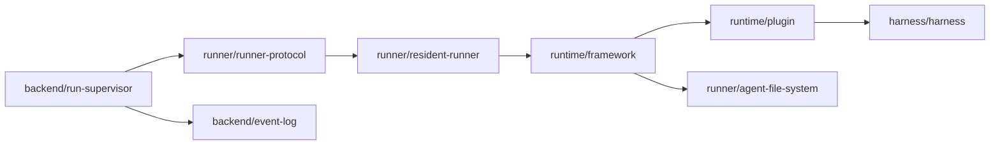
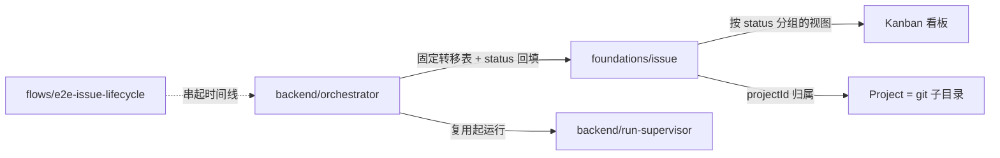

# 跨页架构地图

这张地图把各页之间的依赖关系画出来，方便从任意一页快速跳到它的上下游。

## 核心事实图

## 执行图

## Web 路径

`flows/e2e-web-message` → `surfaces/web` → `conversation/ledger` → `backend/run-supervisor`（`onRunMessage` 直写账本）→ `runner/resident-runner`；非消息事件旁路进 `backend/event-log`，`backend/conversation-projection` 仅做 best-effort 扇出。

## 飞书路径

`flows/e2e-lark-message` → `surfaces/lark-adapter` → `conversation/conversation-and-members` → `backend/run-supervisor` → `backend/conversation-projection`。

## 排障路径

`operations/troubleshooting` 把症状指回正确的事实层：账本、事件日志、会话投影、Runner、Web 草稿或飞书投递。

## 协作设计图（status: design）

下面两页是**已锁定但尚未进代码**的设计抽象，与现状页区分阅读。

`foundations/issue`（唯一新增本体）→ `backend/orchestrator`（驱动状态机的编排器）→ `backend/run-supervisor`（复用执行层）；`flows/e2e-issue-lifecycle` 把这条链路串成跨多次运行的时间线。
