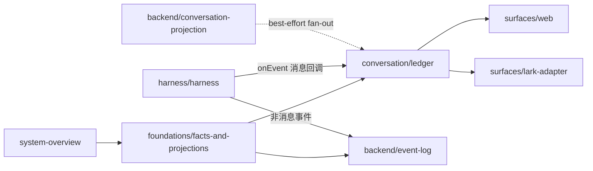
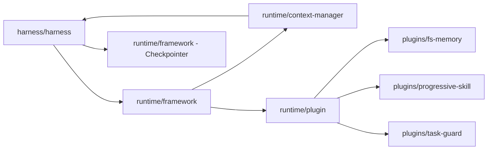
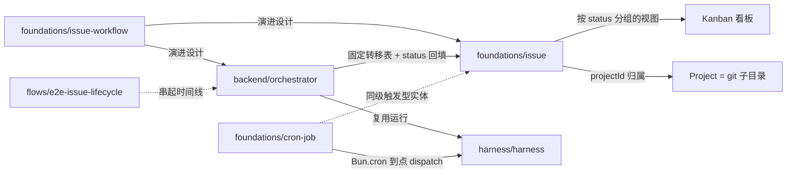

# 跨页架构地图

这张地图把各页之间的依赖关系画出来，方便从任意一页快速跳到它的上下游。

## 核心事实图

## 执行图

## Web 路径

`flows/e2e-web-message` → `surfaces/web` → `conversation/ledger` → `harness/harness`（AgentSession 的 onEvent 回调直写账本）；非消息事件旁路进 `backend/event-log`，`backend/conversation-projection` 仅做 best-effort fan-out。

## 飞书路径

`flows/e2e-lark-message` → `surfaces/lark-adapter` → `conversation/conversation-and-members` → `harness/harness`（AgentSession）→ `backend/conversation-projection`。

## 排障路径

`operations/troubleshooting` 把症状指回正确的事实层：账本、会话消息流、AgentSession、Web 或飞书投递。

## 协作设计图

