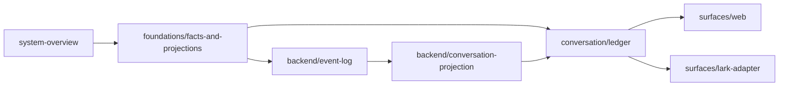
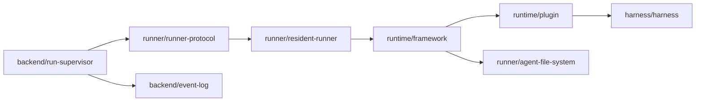

# 跨页架构地图

这张地图把各页之间的依赖关系画出来，方便从任意一页快速跳到它的上下游。

## 核心事实图

## 执行图

## Web 路径

`flows/e2e-web-message` → `surfaces/web` → `conversation/ledger` → `backend/run-supervisor` → `runner/resident-runner` → `backend/event-log` → `backend/conversation-projection`。

## 飞书路径

`flows/e2e-lark-message` → `surfaces/lark-adapter` → `conversation/conversation-and-members` → `backend/run-supervisor` → `backend/conversation-projection`。

## 排障路径

`operations/troubleshooting` 把症状指回正确的事实层：账本、事件日志、会话投影、Runner、Web 草稿或飞书投递。
