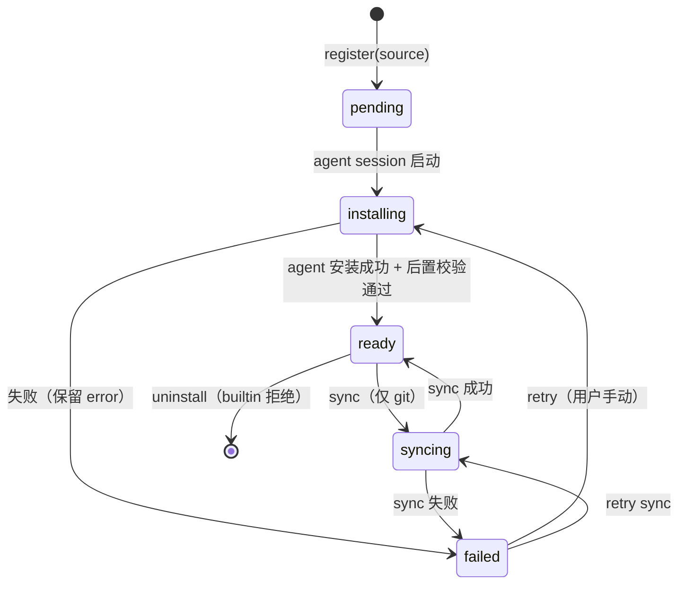
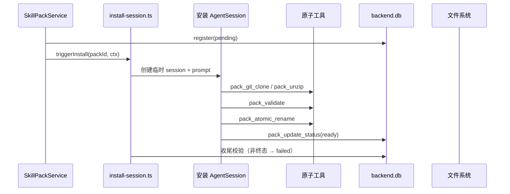

# 技能包管理

技能包是技能集合的**分发单元**——它有来源（git / zip / builtin）、版本、安装状态和完整生命周期。一个 pack 物化为一个磁盘目录，内含若干 `SKILL.md` 子目录。

领域词汇（详见 `CONTEXT.md`）：**Skill**（单个 SKILL.md）、**Skill Pack**（分发单元）、**Skill Root**（物化目录路径）。

## 为什么需要技能包

progressive-skill 插件只认「roots」（目录数组）和「skill」（单个 SKILL.md）两层。缺的是**外面整圈**：技能包不是一等实体（无登记表）、没有安装管线、没有 per-agent 分配。本模块补齐这一圈，把 skill pack 确立为领域实体。

## 数据模型

```sql
skill_pack (
  id            text  PK,
  name          text  NOT NULL,    -- 用户填的展示名
  description   text  NOT NULL,    -- 用户填的描述
  sourceKind    text  NOT NULL,    -- 'builtin' | 'git' | 'zip'
  sourceUrl     text,              -- git URL
  versionRef    text,              -- git ref/branch
  installedRef  text,              -- git commit / zip checksum
  status        text  NOT NULL,    -- pending|installing|ready|failed|syncing
  error         text,
  createdAt     integer NOT NULL,
  updatedAt     integer NOT NULL
)

agent_skill_pack (
  agentId  text NOT NULL,
  packId   text NOT NULL,
  createdAt integer NOT NULL,
  PRIMARY KEY (agentId, packId)
)
```

`installPath` 不存表——由 `id + dataDir` 推导。`enabled` 列为 YAGNI（分配即启用，unassign 即移除）。

## 状态机



`status` 仅经 `applyInstallTransition` 变更——非法转移抛错。`failed→ready` 路径不存在（必须先到 installing/syncing 再 ready），`error` 在转 `ready` 时必被清为 `null`。builtin 包（`sourceKind='builtin'`）不可卸载（API 409）。

## 安装/同步——Agent 驱动

安装/同步不走硬编码 TypeScript 流水线，而是：

1. Backend 提供 **6 个原子工具**（`tools.ts`）：`pack_git_clone` / `pack_unzip` / `pack_git_sync` / `pack_validate` / `pack_atomic_rename` / `pack_update_status`
2. Builtin 技能 `skill-pack-installer`（`skills/skill-pack-installer/SKILL.md`）指导临时 AgentSession 调用这些工具
3. `install-session.ts` 的 `runInstall` / `runSync` 创建临时 session → 投 prompt → 收尾校验（终态非 ready/failed 则强制标记 failed）



**zip 解包安全**：`createPackUnzipTool` 使用 temp→validate→rename 模式——先解到隔离 temp 目录 → `validateExtractedEntries` 逐条 `lstat` 检查 symlink + `realpath` 边界 → 原子 rename。拒绝 symlink（技能包不应含符号链接），拒绝路径穿越。

**git sync**：`createPackGitSyncTool` 使用 `git fetch origin <ref>` + `git reset --hard FETCH_HEAD`，`FETCH_HEAD` 是正确的浅仓库 reset 目标（不用 `origin/HEAD` 因为可能未设置）。同步完成后调用 `invalidateSkillCache(root)` 强制刷新缓存。

## 运行时装配

`span-executor.ts` 的 `executeAgentRun` 通过 singleton registry（`setSkillPackPort` / `getSkillPackPort`）调用 `buildSkillRoots`：

```typescript
// span-executor.ts（实际代码）
const port = getSkillPackPort();
const skillRoots = port ? await buildSkillRoots(agentId, port, config.dataDir) : undefined;
const spec = buildSessionSpec({ ..., skillRoots });
```

无 port 注入时走原有 `progressiveSkillPlugin({ cwd })` 路径——向后兼容。分配变更只对**新建 session** 生效，活 session 不热更。

## Bootstrap

启动时（`seed.ts`）：
1. **Reaper**：`status IN ('pending','installing','syncing')` → 全部标记 `failed`（crash 恢复）
2. **Seed**：若无 builtin 记录 → 从 repo 根 `skills/` 复制到 `<dataDir>/skill-packs/builtin/` → 登记 `status=ready`。源目录不存在时记录 error（不再伪造空 ready 目录）
3. 新建 agent 默认 assign builtin（`agent.service.create` 内 `onCreate` 钩子）

## DELETE 卸载

先 service 校验（builtin → 409），成功后才 `rmSync` 删目录。先删盘再判 builtin 的 bug 已修复。

## 安全边界

- 安装 agent 工具 cwd 锁定在 `<dataDir>/skill-packs/`（`nodeFsAdapter` 带 `inCwd` 路径段校验，防 `/skill-packs-evil` 前缀误判）
- `pack_update_status` 经 `applyInstallTransition` 校验，agent 无法破坏状态机
- 安装/同步过程**绝不执行包内脚本**
- zip 解包：temp→validate→rename 模式——逐条 `lstat` / `realpath` 防 symlink 逃逸和路径穿越
- 上传限制：multipart bodyLimit 50MB
- git 产出的 symlink 不额外拒绝——实际执行仍经 permissionMode + cwd 隔离

## 共享模块

| 模块 | 职责 |
|------|------|
| `entities.ts` | `SkillPackRow` / 状态机 / `applyInstallTransition` / 路径推导 |
| `fs-adapter.ts` | 全仓唯一 `nodeFsAdapter`——路径段校验代替 `startsWith` 前缀误判 |
| `registry.ts` | 模块级 singleton 存放 `SkillPackPort`，`span-executor.ts` 无需依赖注入链 |
| `install-session.ts` | `runInstall` / `runSync` 临时 session 编排 + 故障兜底 |
| `tools.ts` | 6 个原子工具 + `validateExtractedEntries` |
| `http.ts` | 10 个 HTTP 端点 |

## Elysia / Treaty 类型限制

Elysia 将每条路由拆成独立交叉类型成员。`skill-packs` 有 7 条路由，交叉类型层数超过 TypeScript 编译器复杂度上限，导致 treaty 无法推导 `client.api["skill-packs"]` 的完整类型。组件层使用 `as any` 显式声明此限制（5 处）。agent 子路由（`/api/agents/:id/skill-packs`）使用 var reassignment（`app = app.get(...)`）模式产生不同的交叉类型结构，同样需要 `as any`（2 处）。所有 `as any` 均标注原因，非疏漏。

## 关联页面

- [渐进式技能插件](../plugins/progressive-skill.md) — 消费引擎
- [会话工厂](../harness/harness.md) — 装配点
- [数据模型](../backend/data-model.md) — skill_pack + agent_skill_pack 表
- [CONTEXT.md](../../CONTEXT.md) — 领域词汇
