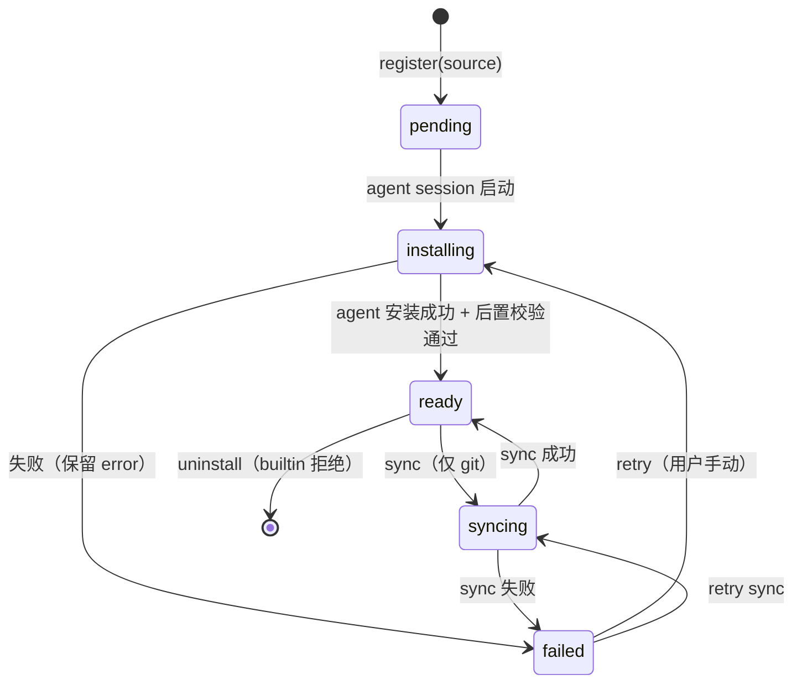
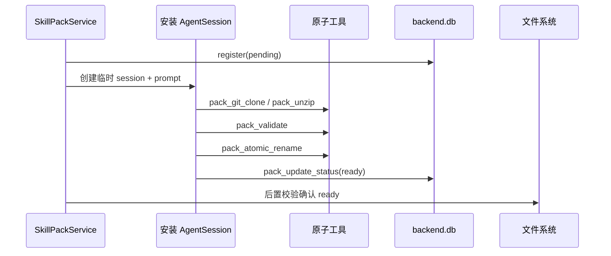

# 技能包管理

技能包是技能集合的**分发单元**——它有来源（git / zip / builtin）、版本、安装状态和完整生命周期。一个 pack 物化为一个磁盘目录，内含若干 `SKILL.md` 子目录。

领域词汇（详见 `CONTEXT.md`）：**Skill**（单个 SKILL.md）、**Skill Pack**（分发单元）、**Skill Root**（物化目录路径）。

## 为什么需要技能包

progressive-skill 插件只认「roots」（目录数组）和「skill」（单个 SKILL.md）两层。缺的是**外面整圈**：技能包不是一等实体（无登记表）、没有安装管线、没有 per-agent 分配。本模块补齐这一圈，把 skill pack 确立为领域实体。

## 数据模型

```sql
skill_pack (
  id            text  PK,
  name          text  NOT NULL,    -- 用户填的展示名
  description   text  NOT NULL,    -- 用户填的描述
  sourceKind    text  NOT NULL,    -- 'builtin' | 'git' | 'zip'
  sourceUrl     text,              -- git URL
  versionRef    text,              -- git ref/branch
  installedRef  text,              -- git commit / zip checksum
  status        text  NOT NULL,    -- pending|installing|ready|failed|syncing
  error         text,
  createdAt     integer NOT NULL,
  updatedAt     integer NOT NULL
)

agent_skill_pack (
  agentId  text NOT NULL,
  packId   text NOT NULL,
  createdAt integer NOT NULL,
  PRIMARY KEY (agentId, packId)
)
```

`installPath` 不存表——由 `id + dataDir` 推导（`join(dataDir, 'skill-packs', id)`）。

## 状态机



状态仅经 `applyInstallTransition` 变更——非法转移抛错。builtin 包（`sourceKind='builtin'`）不可卸载（API 409）。

## 安装/同步——Agent 驱动

安装/同步不走硬编码 TypeScript 流水线，而是：

1. Backend 提供 **6 个原子工具**：`pack_git_clone` / `pack_unzip` / `pack_git_sync` / `pack_validate` / `pack_atomic_rename` / `pack_update_status`
2. Builtin 技能 `skill-pack-installer` 指导临时 AgentSession 调用这些工具
3. Agent 自主处理 git 冲突、dirty tree、diverged branch 等 corner case



所有工具 cwd 锁定在 `<dataDir>/skill-packs/` 内，agent 无法访问系统路径。

## 运行时装配

session-factory 通过 `skill-roots.ts` 的 `buildSkillRoots` 预解析 agent 的已分配 packs → 组 `roots[]`（builtin 在前，pack ID 相对路径）→ 创建共享 `nodeFsAdapter`（root 指向 `<dataDir>/skill-packs/`）→ 传入 `progressiveSkillPlugin`。

```typescript
// 伪代码
const { ws, roots, posixSkillRoot } = await buildSkillRoots(agentId, skillPackPort, dataDir);
// roots = ['builtin', '<uuid1>', '<uuid2>']  — pack ID 相对路径
// ws = nodeFsAdapter(join(dataDir, 'skill-packs'))
// posixSkillRoot = join(dataDir, 'skill-packs')

progressiveSkillPlugin({ ws, roots, posixSkillRoot })
```

分配变更只对**新建 session** 生效。活 session 的 `roots[]` 在创建时固定。

## Bootstrap

启动时：
1. **Reaper**：`status IN ('pending','installing','syncing')` → 全部标记 `failed`
2. **Seed**：若无 builtin 记录 → 从 repo 根 `skills/` 复制到 `<dataDir>/skill-packs/builtin/` → 登记 `status=ready`
3. 新建 agent 默认 assign builtin（`agent.service.create` 内 `onCreate` 钩子）

## HTTP 端点

| 端点 | 说明 |
|------|------|
| `GET /api/skill-packs` | 列表 |
| `POST /api/skill-packs/git` | git 安装 |
| `POST /api/skill-packs/upload` | zip 上传（multipart） |
| `POST /api/skill-packs/:id/sync` | git 同步 |
| `DELETE /api/skill-packs/:id` | 卸载 |
| `GET /api/skill-packs/:id/skills` | 列出包内技能 |
| `GET /api/skill-packs/:id/files?path=` | 浏览文件 |
| `GET /api/agents/:id/skill-packs` | 读 agent 分配 |
| `PUT /api/agents/:id/skill-packs` | 设置 agent 分配 |

## 安全边界

- 安装 agent 工具 cwd 锁定在 `<dataDir>/skill-packs/`
- `pack_update_status` 经 `applyInstallTransition` 校验，agent 无法破坏状态机
- 安装过程**绝不执行包内脚本**
- zip 解包逐条 `assertSafeEntry` 防路径穿越
- zip bomb 防护：解包后总大小 ≤500MB
- 上传限制：multipart bodyLimit 50MB
- git 产出的 symlink 不额外拒绝——实际执行仍经 permissionMode + cwd 隔离

## 关联页面

- [渐进式技能插件](../plugins/progressive-skill.md) — 消费引擎
- [会话工厂](../harness/harness.md) — 装配点
- [数据模型](../backend/data-model.md) — skill_pack + agent_skill_pack 表
- [CONTEXT.md](../../CONTEXT.md) — 领域词汇
