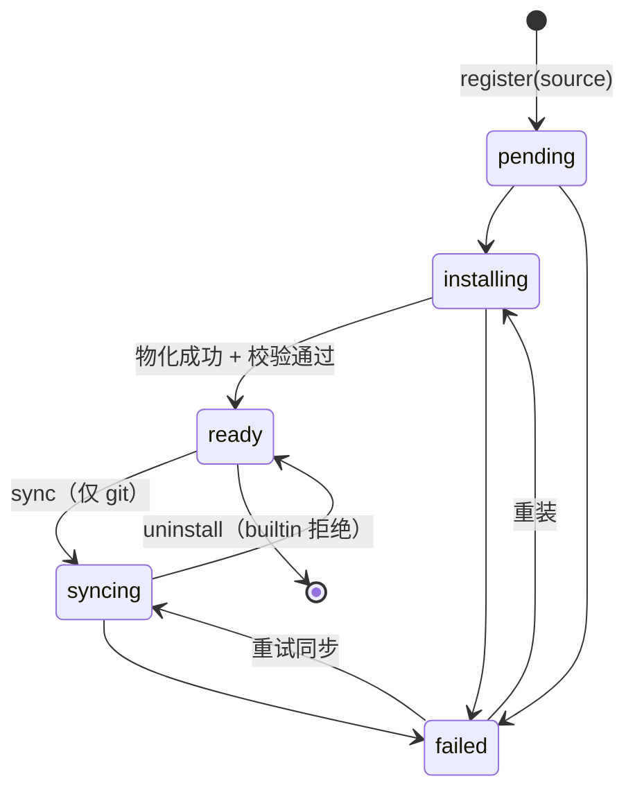

# 技能包管理

一句话：本页是 Skill Pack（技能包）的权威描述。技能包是技能的分发单元，有来源（builtin / git / zip）、版本、安装状态机和 per-Agent 分配；它物化在 `<dataDir>/skill-packs/<packId>`，**安装与同步是确定性的 TypeScript 流程**——git 走 `git fetch` + `reset --hard`，zip 走解包物化，全程没有模型、没有临时 Agent。

## 范围

覆盖：数据模型与状态机、安装与同步流程、安全边界、启动时的恢复与 seed、运行时怎么把 pack 变成 Run 的 `skillRoots`、HTTP 面。

不覆盖：技能的索引与加载（见 [渐进式技能](./progressive-skill.md)）、Agent 分配界面（见 [Web 端](../surfaces/web.md)）、知识包（另一个 feature）。

## 实现文件

- `apps/backend/src/features/skill-pack/entities.ts` — 行类型、状态机、路径推导
- `apps/backend/src/features/skill-pack/install-session.ts` — `runInstall` / `runSync` / `checkUpstream` 与 git 包装
- `apps/backend/src/features/skill-pack/service.ts` — 安装、同步、卸载、lockfile、validate、分配
- `apps/backend/src/features/skill-pack/seed.ts` — 崩溃恢复与 builtin seed
- `apps/backend/src/features/skill-pack/http.ts` — HTTP 端点
- `apps/backend/src/features/skill-pack/skill-index.ts` — 技能扫描器副本（管理界面用）
- `apps/backend/src/features/skill-pack/{tools,fs-adapter,registry,adapter-sqlite}.ts` — 校验助手、路径助手、注册表、表读写
- `apps/backend/src/bootstrap/features.ts` — 装配、run 级 `skillRoots`、reconcile 时的软链
- `packages/source-fetch` — git / zip 物化的公共基座

## 实体

```text
skill_pack
  id, name, description
  sourceKind   'builtin' | 'git' | 'zip'
  sourceUrl    git URL（zip 为 null）
  versionRef   git 分支 / tag / commit
  installedRef 安装结果：git 的 rev 或 zip 的指纹
  status       pending | installing | ready | failed | syncing
  error, keepSynced, createdAt, updatedAt

agent_skill_pack
  agentId, packId, createdAt        -- 复合主键，分配即启用
```

安装路径不存表，由 `id + dataDir` 推出来：`<dataDir>/skill-packs/<packId>`。没有 `enabled` 列——分配即生效，取消分配即移除。

## 状态机


```mermaid
stateDiagram-v2
  [*] --> pending: register(source)
  pending --> installing
  pending --> failed
  installing --> ready: 物化成功 + 校验通过
  installing --> failed
  failed --> installing: 重装
  ready --> syncing: sync（仅 git）
  syncing --> ready
  syncing --> failed
  failed --> syncing: 重试同步
  ready --> [*]: uninstall（builtin 拒绝）
```

`status` 只能经 `applyInstallTransition` 改，非法转移抛错。`failed → ready` 这条捷径不存在（必须先经过 installing 或 syncing），转到 `ready` 时错误字段被清成 null。builtin 包不可卸载，接口返回 409。

## 安装

`installFromGit` / `installFromZip` 先登记一行 `pending`，然后异步触发确定性安装：

```text
running: pending → installing
git 源：fetchGitSource({ url, dataDir, slug, ref? }) → rev
zip 源：materializeZipSource({ buffer, dataDir, slug }) → 指纹
校验：该目录下能扫出至少一个 SKILL.md
成功：installing → ready，installedRef = rev / 指纹
失败：installing → failed，error 记下原因
```

git 的 rev 与 zip 的指纹都写进 `installedRef`，作为"装的是什么"的记录。zip 的 buffer 以 base64 存在安装上下文里传给安装流程，不再落中间文件。两个源都复用 `@chengchenccc/source-fetch`：解包、符号链接拒绝、路径逃逸检查、目录指纹都在那一层，解包模式是先解到临时目录、校验、再原子 rename 到目标。

## 同步

只有 git 源可以同步，流程是：

```text
git fetch <DB 里的 sourceUrl> [versionRef]   → rev-parse FETCH_HEAD
expectedRev 已给且不等于 FETCH_HEAD 时 → 拒绝（confirm 期间上游动过）
git reset --hard FETCH_HEAD
校验 → syncing → ready（installedRef = rev）
```

两个刻意的选择：

- fetch 用**数据库里存的 URL**，不用 `origin`。`.git/config` 就在 pack 目录里，能被包内容或任何进程改写成一个攻击者控制的 transport。
- `versionRef` 会过一遍字符白名单再进 argv（`git fetch` 允许选项出现在位置参数之后，一个以 `-` 开头的 ref 就是注入）。

确认流：默认 `sync` 先做一次上游检查，发现上游动过就抛 `UpstreamChangedError{from, to}`，HTTP 层转成带 `code` / `from` / `to` 的响应让前端确认。用户确认时（`confirm: true`）服务会**再查一次**并把当时的 rev 钉进 `expectedRev`，安装流程比对不一致就拒绝——关掉"确认期间上游又动了一次"的窗口。

## 卸载

先由 service 校验（builtin 直接 409），通过后先清分配关系、再删记录，最后由 HTTP 层删目录。顺序是刻意的：不留"有分配但没有包"的悬挂状态。

## 启动：崩溃恢复与 seed

- **崩溃恢复**：所有 `pending` / `installing` / `syncing` 的行标记为 `failed`，error 写"进程在操作完成前重启"。builtin 例外。
- **builtin seed**：没有 builtin 记录时，把仓库根的 `skills/` 复制到 `<dataDir>/skill-packs/builtin/`，登记一行 `ready` 的 builtin 包。源目录不存在时只建空目录，记录停在 `pending`（不伪造一个空的 ready）。
- 新建 Agent 默认分配 builtin（`onCreate` 钩子）。

## 运行时装配

Run 创建时算一次 `skillRoots`，内容是 builtin 技能目录加上该 Agent 已分配且状态为 READY 的 pack 安装目录；builtin 恒在第一位。这份列表随 Run 快照冻结，只对新 Run 生效。

Reconcile 阶段另外把 READY 的 pack 软链进 Agent 工作区的 `<kind>/skills/`（见 [Agent 工作区与多后端](../agents/workspace-and-backends.md)），这是给独立 CLI 会话和文件浏览用的第二份入口。

## HTTP 面

| 端点 | 作用 |
|---|---|
| `GET /api/skill-packs` | 列出全部 pack |
| `POST /api/skill-packs/git` | 按 git URL 安装（可带 ref 与 `keepSynced`） |
| `POST /api/skill-packs/upload` | 上传 zip 安装 |
| `POST /api/skill-packs/:id/sync` | 同步（body 可带 `confirm`） |
| `DELETE /api/skill-packs/:id` | 卸载（builtin 409） |
| `GET /api/skill-packs/lockfile` | 导出安装状态快照（`skills-lock.json` 形态，含 `keepSynced`） |
| `GET /api/skill-packs/validate` | 逐个 pack 的完整性检查 |
| `GET /api/skill-packs/:id/skills` | 列某个 pack 里的技能 |
| `GET /api/skill-packs/:id/files`、`/:id/search` | 浏览与搜索包内文件 |

## 不变量

1. 安装与同步是确定性流程，不调用模型、不起 Agent。
2. 状态只能经状态机转移，非法转移抛错；`failed → ready` 不存在。
3. builtin 不可卸载，且不参与崩溃恢复。
4. 一个 pack 的物化目录由 `id` 决定，包内自带脚本永不执行。
5. zip 与 git 出来的树都不允许符号链接与路径逃逸。
6. 分配变更只影响新建的 Run。

## 已知缺口

- `GET /api/skill-packs/validate` 把行里的 `installedRef`（git 的 rev 或 zip 的指纹）当物化目录路径去做存在性检查，所以对 git / zip 包必然报 `materialized directory missing`。这个端点的意图是查物化目录与技能可发现性，实现与意图不一致。
- `apps/backend/src/features/skill-pack/registry.ts` 的单例（`setSkillPackPort` / `getSkillPackPort`）只剩 bootstrap 里的写入方，没有读取方，是死代码。
- `tools.ts` 里的 `validateExtractedEntries` 与 `computeDirChecksum` 已无调用方：物化路径改用 `packages/source-fetch` 里的同名实现（那份才是活的）。
- 仓库根的 `skills/skill-pack-installer/SKILL.md` 仍在指导一套已经不存在的安装流程（一套不存在的原子工具 + 临时 Agent），是过期的 builtin 文档。

## 相关页

- [渐进式技能](./progressive-skill.md) — 技能怎么被发现与加载
- [Agent 工作区与多后端](../agents/workspace-and-backends.md) — `<kind>/skills` 软链与 Run 快照
- [数据模型](../backend/data-model.md) — 两张表在整体 schema 里的位置
