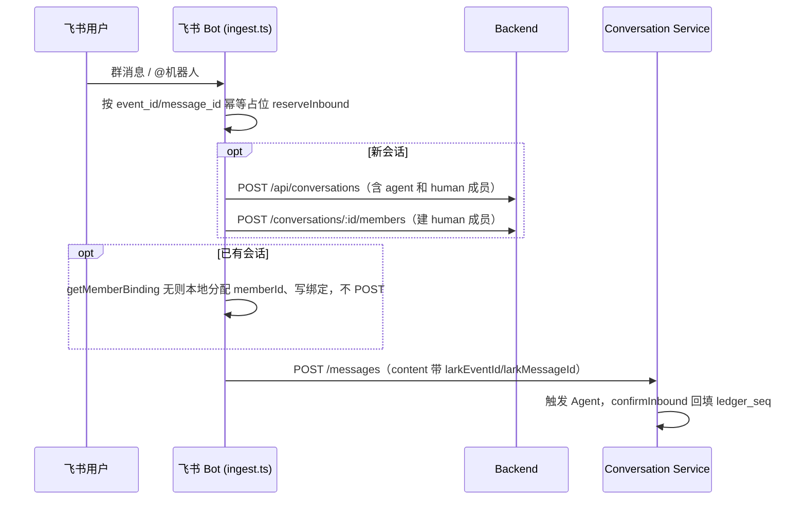
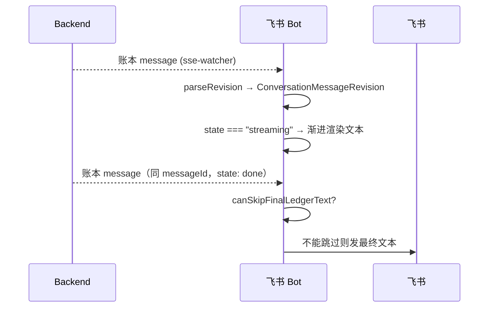

# 飞书适配器

飞书适配器把飞书的群/用户映射成对话/成员，把入站消息 POST 给后端，通过 sse-watcher 消费账本 ConversationMessageRevision 决定流式/最终可见文本。不再有 run-delta-watcher 和streaming 卡片——sse-watcher 是唯一出站流入口。去重依赖 revision 的 messageId + canSkipFinalLedgerText。

## 这页解决什么问题

飞书是外部 IM，有 chat_id、用户、卡片、消息投递规则、webhook/event 语义。后端不该被这些细节绑死。飞书适配器在飞书与后端对话概念之间做翻译。

## 入站流



成员 id 形如 `human:lark:${sender_id}`。建成员路径**区分新会话与已有会话**：新会话路径在 `POST /api/conversations` 后调 `POST /conversations/:id/members` 建成员再写绑定；已有会话路径仅本地分配 memberId + `putMemberBinding`，不调 `/members` API。这样已有会话里新出现的飞书用户不会产生多余的 HTTP 往返。`addressedTo`：单聊为 `[selfAgentId]`；群聊仅当 `isBotMentioned` 才为 `[selfAgentId]`，否则 `[]`（缺 botDisplayName 时 fail-closed）。

## 出站流



`sse-watcher` 是唯一出站流入口。不再有 `run-delta-watcher.ts`、`card-renderer.ts`、`card-sender.ts`、`feedback-reaction.ts`——这些全部删除。ingest 的 `onTriggeredRun` 回调移除，不再为每个 run 启动独立的 delta watcher。

## Revision state 驱动出站逻辑

`sse-watcher` 用 `parseRevision` 解析账本 entry 的 content 为 `ConversationMessageRevision`。`state` 字段驱动出站行为：

- `state === "streaming"`：run 仍在进行。sse-watcher 可将文本渐进渲染为streaming 消息（更新同一 message），但不发最终文本。
- `state === "done"`：terminal revision。到达时查 `canSkipFinalLedgerText`——首次必发一次最终文本（`completeFromLedger` 尚为 0），重连重放时可跳过。
- `state === "error"`：run 失败。发错误文本。

不再有 `_preliminary` 标记。旧的 `_preliminary: true` 压制逻辑（卡片健康时跳过账本消息）被 revision state 替代——`streaming` 仅用于渐进渲染，`done`/`error` 触发最终投递。

## 去重难题与 canSkipFinalLedgerText

```ts
export function canSkipFinalLedgerText(run: RunStreamRecord): boolean {
  return (
    run.status === "done" &&
    !!run.larkMessageId &&
    run.cardSendFailed === 0 &&
    run.cardUpdateFailed === 0 &&
    run.completeFromLedger === 1
  );
}
```

runId 匹配在调用方 `sse-watcher.processEntry` 做：解析 revision 的 `runId`，按 runId 找 `run_stream` 记录，再判 `canSkipFinalLedgerText`。

`completeFromLedger` 只在账本文本成功发出一次之后才置 1。首次投递时该标志为 0，跳不掉——terminal revision 到达时至少会发一次最终文本。跳过逻辑主要压制重连时的重放。

## 内容渲染

`render.ts` 从 `ConversationMessageRevision` 取 `text` 或 `blocks`——只抽 `type==="text"` 块（支持裸字符串、`{text}`、`{blocks}`、`ContentBlock[]`）。没有文本块（纯 tool_use/tool_result）时返回字面量 `"[Unsupported content]"`。工具活动在飞书里完全不可见。

## 失败模式

- 最终答案重复：terminal revision 重放 / `canSkipFinalLedgerText` 没命中。
- 不支持的内容：纯工具块projected into ledger。
- 会话绑定错：飞书 chat 映射到了错误对话。
- 缺成员：飞书用户没解析成 human 成员。

## 关联页面

- [端总览](./overview.md)
- [对话账本](../conversation/ledger.md)
- [会话投影](../backend/conversation-projection.md)
- [飞书消息端到端](../flows/e2e-lark-message.md)
- [排障手册](../operations/troubleshooting.md)
