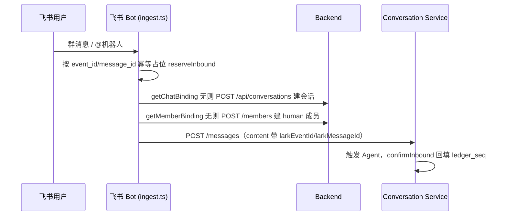
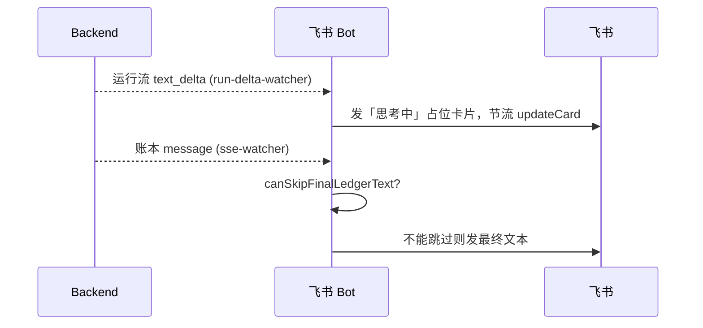

# 飞书适配器

飞书适配器把飞书的群/用户映射成对话/成员，把入站消息 POST 给后端，把运行流渲染成流式卡片，再消费账本消息决定最终可见文本。它最棘手的地方是去重：同一个答案可能从「卡片」和「账本最终文本」两条路各到一次。

## 这页解决什么问题

飞书是外部 IM，有 chat_id、用户、卡片、消息投递规则、webhook/event 语义。后端不该被这些细节绑死。飞书适配器在飞书与后端对话概念之间做翻译。

## 入站流



成员 id 形如 `human:lark:${sender_id}`，**先 POST 建成员、再写本地绑定**，避免半绑定状态。`addressedTo`：单聊为 `[selfAgentId]`；群聊仅当 `isBotMentioned` 才为 `[selfAgentId]`，否则 `[]`（缺 botDisplayName 时 fail-closed）。

## 出站流



流式卡片（`run-delta-watcher.ts`）累积 `text_delta`，每 150ms 或满 120 字 flush 一次 `updateCard`；EOF 时查 `/api/runs/:runId` 终态切换卡片状态。

## 去重难题与真实的 canSkipFinalLedgerText

```ts
export function canSkipFinalLedgerText(run: RunStreamRecord): boolean {
  return (
    run.status === "done" &&
    !!run.larkMessageId &&
    run.cardSendFailed === 0 &&
    run.cardUpdateFailed === 0 &&
    run.completeFromLedger === 1
  );
}
```

它**确实要求 `status === "done"`**，但本身不收 runId 参数——runId 匹配在调用方 `sse-watcher.processEntry` 做：解析账本 content 的信封，取出 `runId`，按 runId 找到对应 `run_stream` 记录，再判 `canSkipFinalLedgerText`。

关键在 `completeFromLedger`：它只在「账本文本成功发出一次之后」才被置 1。所以**首次投递时这个标志还是 0，跳不掉**——拿到流式卡片的用户，仍会至少再收到一次最终账本文本（卡片 + 纯文本重复）。跳过逻辑只能压制重连时的**重放**。叠加上 [会话投影](../backend/conversation-projection.md) 的增量时机（可能在 `done` 之前就写最终文本），重复风险进一步放大。

## 内容渲染

`render.ts` 只抽 `type==="text"` 块（支持裸字符串、`{text}`、`{blocks,runId}`、`ContentBlock[]`）。没有文本块（纯 tool_use/tool_result）时返回字面量 `"[Unsupported content]"`。流式卡片只渲染累积的纯文本，工具活动在飞书里完全不可见。

## 失败模式

- 最终答案重复：卡片 + 账本文本都发了。
- 不支持的内容：纯工具块被投影进账本。
- 会话绑定错：飞书 chat 映射到了错误对话。
- 缺成员：飞书用户没解析成 human 成员。

## 关联页面

- [端总览](./overview.md)
- [对话账本](../conversation/ledger.md)
- [会话投影](../backend/conversation-projection.md)
- [飞书消息端到端](../flows/e2e-lark-message.md)
- [排障手册](../operations/troubleshooting.md)
