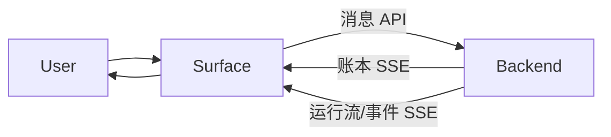

# 端总览

端是面向用户的适配器，目前是 Web 和飞书。它们采集输入、渲染账本与运行流、把外部身份映射成成员、处理 UX 层的去重；但它们不拥有任何持久事实。

## 端拥有什么、不拥有什么

端拥有：输入采集、对话历史渲染、运行进度渲染、外部身份映射、UX 级去重与重试展示。

端不拥有：账本真相、EventLog 真相、Runner 检查点、Agent 触发语义。

## 通用模式

## Web 与飞书的差异

| 维度 | Web | 飞书 |
|---|---|---|
| 身份 | 应用用户/会话 | 飞书 user/chat |
| 实时产出 | Timeline 里的 draft | 流式卡片 |
| 最终产出 | 账本消息 | 账本文本（除非可跳过） |
| 主要风险 | 草稿/乐观消息合并 | 卡片 + 文本重复 |

## 关联页面

- [Web 端](./web.md)
- [飞书适配器](./lark-adapter.md)
- [对话账本](../conversation/ledger.md)
