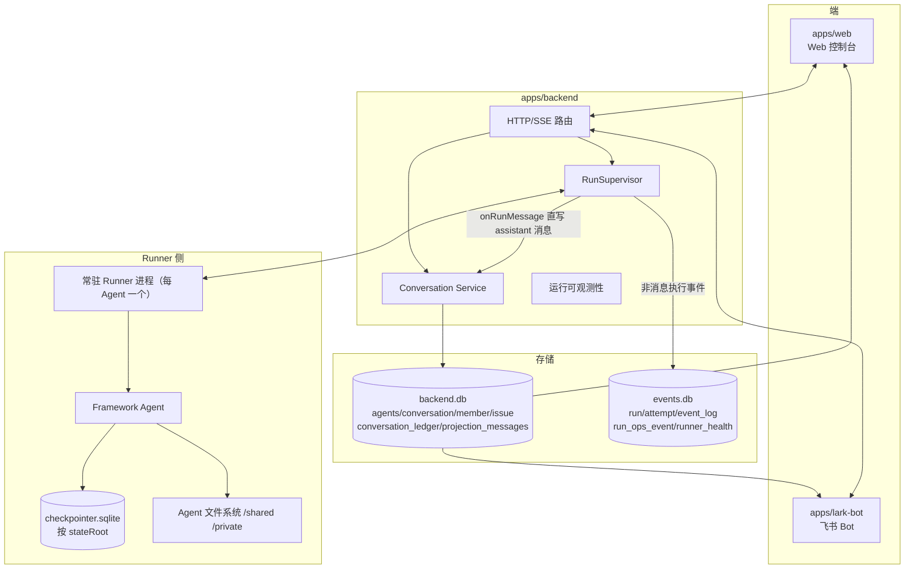
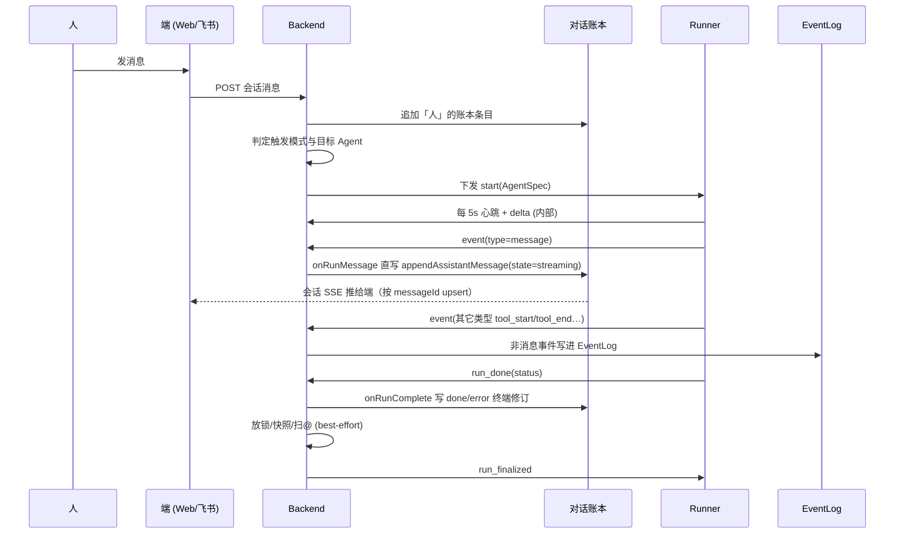

# 系统总览

整个系统是一个「团队 Agent」运行时：端负责输入与渲染，后端持有事实，Runner 在独立进程里执行 Agent，Framework 管 Agent 内部循环。assistant 消息经 `RunSupervisor.onRunMessage` 直写对话账本（与人类消息共用同一条 `appendLedgerEntry` 入口），非消息执行事件（tool_start/tool_end/text_delta）单独进 EventLog；会话投影桥降级为 best-effort 扇出（broadcast 给前端、ops 记录）。对话账本 SSE 是用户可见输出的唯一通道。

## 这套架构在解决什么问题

单 Agent 的循环可以把所有历史塞进一个 `thread.messages` 里，因为只有一个读者、一个写者。但团队 Agent 产品做不到：人、多个 Agent、Web、飞书、后台运行、中断、重试、观测流，全都需要对「同一段活动」的不同视图。所以系统把**执行**和**协作**拆开：

- Runner 执行一个 Agent。
- EventLog 记录这次运行的历史。
- 后端持有团队语义（谁是成员、该触发谁、锁与跳数）。
- 对话账本记录共享对话历史。
- 端渲染这些事实。

## 容器视图

## 分层与各自的边界

| 层 | 名字 | 拥有 | 不该拥有 |
|---|---|---|---|
| L1 | Core 原语 | Message / Tool / ChatModel / Thread | 后端、端、租户语义 |
| L2 | Framework | Agent 主循环、插件、上下文管理、Checkpointer | 成员关系、账本 |
| L3 | Harness | 把文件/工具/插件装配成 Agent | 运行调度、团队路由 |
| L4 | Runner | 进程/会话生命周期、心跳、中止/恢复 | 账本写入规则、飞书/Web 去重 |
| L5 | Backend | agents / conversation / run / event / 账本 / 投影 | 模型与工具内部 |
| L6 | 端 | Web/飞书的输入与渲染 | 任何持久化事实 |

## 一次完整运行的时序

关键点：

1. **消息直写账本、非消息进 EventLog。** 在 `RunSupervisor` 的 `"event"` 分支里，`message` 事件经 `onRunMessage`（critical, awaited）直接 `appendAssistantMessage` 写进账本；其它事件才走 `eventLog.append(...)`。直写失败会抛出、把 run 标记为 error；而 `onRunEvent` 扇出失败只记日志、不影响运行。
2. **终端修订由 onRunComplete 直接写账本。** assistant 消息从 streaming 到 done/error 是同一 `messageId` 的多次直写。`onRunComplete` 取该 run 的最新 assistant revision 作为 base，写 state=done/error 的终端修订关闭消息——base 可从账本重建，不依赖进程内存。已删除 `projectionChain` / `projectRunMessageToLedger`。
3. **对话账本 SSE 是用户可见输出的唯一通道。** `delta` 信道（text_delta/tool_start/tool_end）仍存在于 Runner→Host 协议中，但仅限后端内部（日志/运维）通过 `subscribeDelta()` 消费；`/runs/:id/events` 和 `/runs/:id/stream` HTTP 路由已删除，Web/飞书统一通过对话账本 SSE 接收所有用户可见更新。

## 当前实现的几条边界

- EventLog 由后端 `RunSupervisor` 在收到 Runner 传输的**非消息**事件后追加；Runner 不直接打开 EventLog 库，message 事件根本不进 EventLog。
- assistant 消息在 `apps/backend/src/main.ts` 的 `onRunMessage` 回调里经 `appendAssistantMessage` 直写 `ConversationMessageRevision` 信封（messageId, state=streaming/done/error），与人类消息共用同一条 `appendLedgerEntry` 入口；`onRunComplete` 取最新 assistant revision 写入最终 done/error 修订，再做放锁、todo 快照、@提及扫描。会话投影桥只剩 best-effort 扇出（broadcast/ops）。
- Runner 本地的 `checkpointer.sqlite` 是给 Agent 执行恢复用的；`buildPreloadedMessages` 从[账本](../conversation/ledger.md)直接构建 Message[] 喂给 Agent——不经过 `projection_messages` 中间表。两者名字不同但都涉及「运行前准备上下文」，用途不同要分清。
- Web/飞书统一消费对话账本 SSE，按 `messageId` upsert 到同一个气泡/卡片中。不再有独立的 `/runs/:id/events` 或 `/runs/:id/stream` 连接。
- delta 信道（text_delta/tool_start/tool_end）仅限后端内部日志/运维消费，不直接暴露给端。

## 不变量

1. 对话事实与运行事实分属两类，互不充当对方。
2. 端可以展示数据，但不能成为事实来源。
3. Runner 执行 AgentSpec、上报事件，它不决定对话语义。
4. assistant 消息与人类消息经同一入口（`appendLedgerEntry`）写进账本，账本是对话消息的唯一事实来源；EventLog 只含非消息执行细节。
5. `projection_messages`（线程投影缓存）和 `buildPreloadedMessages` 的 Message[] 都从账本重建；账本不能从它们反向重建。

## 例子：Agent 在 Web 里回答一句话

1. 用户在 Web 发「总结一下这个仓库」。
2. 后端把用户消息（`ConversationMessageRevision`, state=done）追加进账本。
3. 触发逻辑启动目标 Agent 成员的运行。
4. Agent 开始流式产出，Runner 上发 message 事件；`onRunMessage` 把 state=streaming 的修订信封直写账本。
5. 对话账本 SSE 推修订给 Web；Web 按 `messageId` upsert 进气泡，实时刷新内容。
6. Runner 发出 `run_done`（succeeded）。
7. `onRunComplete` 取最新 assistant revision 写入 state=done 修订，关闭该消息。
8. Web 收到 done 修订，标记气泡为最终态。

## 当前缺口

- 端侧按 messageId upsert 的「终态优先」语义需加固——若因网络延迟在 done/error 后收到旧的 streaming 修订，端应忽略。
- assistant 消息直写已去掉 `projectionChain`，但终端修订与扇出仍在 `onRunComplete`/`onRunMessage` 监听器路径里；若要更强的容错与可重试性，可挪进独立持久队列。
- 部分旧文档/接口可能残留 `/runs/:id/events`、`/runs/:id/stream`、`mergedStream`、`projectRunMessageToLedger` 等已删除路由/方法的引用；本 Wiki 一律以当前代码行为准。

## 关联页面

- [事实与投影](./foundations/facts-and-projections.md)
- [RunSupervisor](./backend/run-supervisor.md)
- [会话投影](./backend/conversation-projection.md)
- [Web 端](./surfaces/web.md)
- [飞书适配器](./surfaces/lark-adapter.md)
