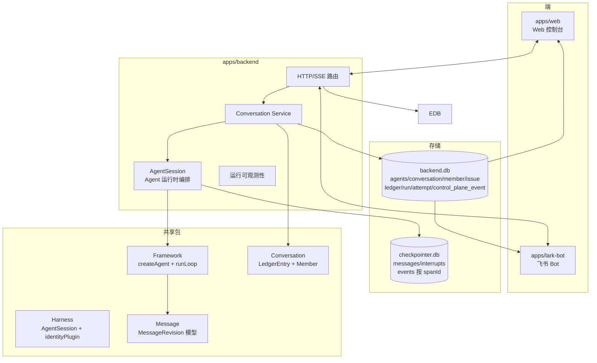
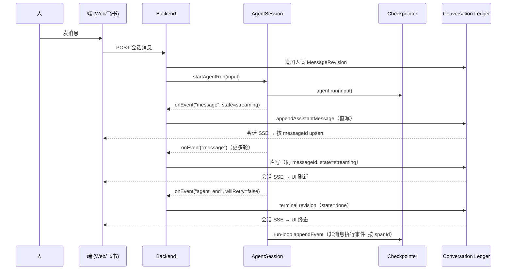

# 系统总览

整个系统是一个「团队 Agent」运行时：端负责输入与渲染，后端持有事实并直接在进程内通过 AgentSession 驱动 Agent 执行。assistant 消息经 `AgentSession.subscribe` 的 `onEvent` 回调直写 conversation ledger，与人类消息共用同一条 `appendLedgerEntry` 入口。非消息执行事件（tool_start/tool_end/llm_call）经 framework run-loop 写入 checkpointer 的执行事实流（`checkpoint_events`，按 spanId 切）。conversation ledger SSE 是用户可见输出的唯一通道。

## 容器视图

## 分层与各自的边界

| 层 | 名字 | 拥有 | 不该拥有 |
|---|---|---|---|
| L1 | Core 原语 | Message / Tool / ChatModel | 后端、端、租户语义 |
| L2 | Framework | Agent 主循环、插件、上下文管理、Checkpointer | 成员关系、账本 |
| L3 | Harness | AgentSession 编排、identityPlugin、compaction | 运行调度、团队路由 |
| L4 | Backend | agents / conversation / run / ops / ledger | 模型与工具内部 |
| L5 | 端 | Web/飞书的输入与渲染 | 任何持久化事实 |

## 一次完整运行的时序

## 关键事实

1. **消息直写账本。** AgentSession 的 `onEvent("message")` 回调直接 `appendAssistantMessage` 写进账本。直写失败抛出，run 标记 error。
2. **terminal revision 在 `agent_end` 时写入。** assistant 消息从 streaming 到 done/error 是同一 `messageId` 的多次直写。`agent_end`（`willRetry=false`）时写入 state=done/error 关闭消息。
3. **conversation ledger SSE 是用户可见输出的唯一通道。** Web 和飞书统一通过 conversation SSE 接收所有用户可见更新，按 `messageId` upsert。

## 不变量

1. 对话事实与运行事实分属两类，互不充当对方。
2. 端可以展示数据，但不能成为事实来源。
3. AgentSession 执行 Agent、发射事件，不决定对话语义。
4. assistant 消息与人类消息经同一入口（`appendLedgerEntry`）写进账本。账本是对话消息的唯一事实来源。
5. Checkpointer 同时持有 session 的运行时恢复状态与执行事实流（按 spanId）——但对话消息的 canonical 在 ledger，不在 checkpointer。

## 关联页面

- [事实与投影](./foundations/facts-and-projections.md)
- [AgentSession](./harness/harness.md)
- [会话消息流](./backend/conversation-projection.md)
- [Web 消息端到端](./flows/e2e-web-message.md)
- [飞书消息端到端](./flows/e2e-lark-message.md)
- [Web 端](./surfaces/web.md)
- [飞书适配器](./surfaces/lark-adapter.md)
