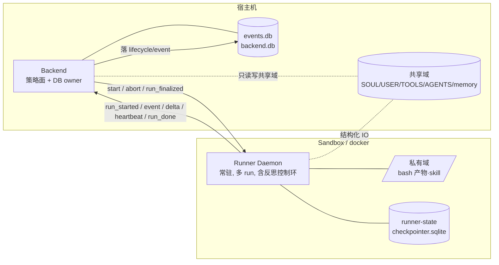
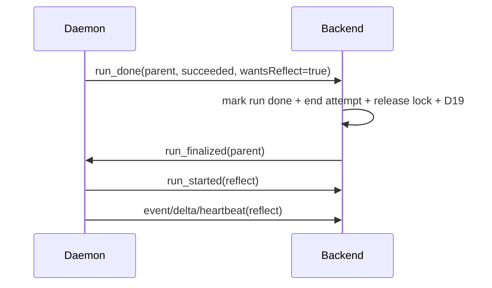

# M14.7 — Resident Runner: 跨 sandbox 边界的常驻执行体

> 根因：今天的 Runner 是 **fork-per-run + 共享文件系统**——`supervisor.fork()` 每个 run `spawn` 一个进程，进程内用 `bun:sqlite` **直接打开 backend 的 `events.db` / `backend.db`**。这俩假设在目标部署形态下同时失效：runner 要进 sandbox（docker），与 backend **不共享文件系统**；每 run 起容器拿不到任何常驻收益。本 spec 把 Runner 改成 **sandbox 内的常驻守护进程**，backend 与它从"共享 sqlite + env 注入"改为 **显式双工协议**，把 backend↔runner 的耦合 **逐项拆干净**，把反思编排 **下沉进 daemon**，并把 workspace 抽象成 **AFS mount table + AgentFsHandle**。
>
> 关联：[16-resident-runner](../../architecture/16-resident-runner.md)（架构母文）· [17-agent-file-system](../../architecture/17-agent-file-system.md)（AFS 长期架构）· [12-backend](../../architecture/12-backend.md)（supervisor / onRunComplete / D19）· [13-agent-spec](../../architecture/13-agent-spec.md)（start payload）· [14-event-log](../../architecture/14-event-log.md)（事件归属）· [M14.3 reflection 后置](./2026-06-10-m14.3-reflection-post-run.md)。本 spec 只描述 M14.7 的 AFS v1 落地切片；完整 AFS 概念见 [17-agent-file-system](../../architecture/17-agent-file-system.md)。
>
> 基线 commit：`next` HEAD（含 M14.6）。前置：先落地"删 inline reflection"修复（见 [16 §九 步骤①](../../architecture/16-resident-runner.md)）——本 spec 假设反思已收敛为"独立 runId 的 post-run job"单路径。

---

## 一、问题：两个被进程生命周期借走的假设

### 1.1 fork-per-run

```ts
// supervisor.ts 现状
const child = spawn("bun", [this.#opts.runnerBin], {
  env: { ...process.env, AGENT_SPEC: specJson },  // ← spec 靠 env 注入，启动一次性
  stdio: ["ignore", "pipe", "pipe"],
});
child.on("exit", (code, signal) => {
  for (const fn of this.#onRunComplete) fn(threadId, runId); // 进程退出 = run 结束
});
```

run 结束、放锁、abort、资源回收、崩溃隔离——全搭在"1 进程 = 1 run"上（详见 [16 §二](../../architecture/16-resident-runner.md)）。

### 1.2 共享文件系统（更硬的阻塞）

```ts
// entry.ts 现状 —— runner 直接打开 backend 的 sqlite 文件
cpDb = new Database(spec.storage.checkpointer.path);          // backend.db (L88)
sink = sqliteEventLog({ db: spec.storage.eventLog.path });   // events.db (L125)
hbDb = new Database(spec.storage.eventLog.path);              // 心跳直写 (L106)
```

runner 进程 **直接读写 backend 的两个 sqlite 文件**。目标部署里 backend 在宿主、runner 在 sandbox，宿主只 mount workspace / runner-state 进容器，`events.db` / backend lifecycle DB 留宿主侧——sandbox 内 runner **不能再碰 backend DB**。所以必须先把"runner 直接碰 backend DB"断掉：

- run event / delta / heartbeat / run_done 经 Transport 发回 backend，由 backend 落库。
- checkpoint / interrupt / checkpoint events 不再回写 backend DB，改由 runner-daemon 内部 `SQLiteCheckpointer` 写入 durable runner-state sqlite。

### 1.3 审计后新增的硬约束：Checkpointer 不只是 messages

现有 framework 的 `Checkpointer` 不是单纯的 messages 存取，还承载 **interrupt/resume** 与 checkpoint event 审计：

```ts
// packages/framework/src/checkpointer.ts 现状语义
interface Checkpointer {
  load(threadId): Promise<Message[]>;
  save(threadId, messages): Promise<void>;
  saveInterrupt?(threadId, state): Promise<void>;
  consumeInterrupt?(threadId): Promise<InterruptState | null>;
  appendEvent?(threadId, event): Promise<void>;
  readEvents?(threadId): Promise<CheckpointEvent[]>;
}
```

所以 M14.7 **不能**只设计 `{ type:"checkpoint", messages }`，也不能把 checkpoint 简化成 JSON/NDJSON 文件。否则工具审批中断无法恢复、`resume()` 的 interrupt 消费丢失、checkpoint event 审计链断掉。本版引入 **runner-local SQLiteCheckpointer**（§四 4.2）：runner-daemon 内部仍拿到完整 `Checkpointer` 接口，但它写的是 runner-state volume 上的 sqlite，不是 backend DB，也不是 `AgentFS.write()`。

---

## 二、目标形态



| 关注点 | 今天 | M14.7 后 |
|---|---|---|
| 谁拥有 `events.db` / `backend.db` | runner 直接写 | **唯独 backend** |
| runner 怎么持久化事件 | `sqliteEventLog` 进程内直写 | 经协议发回 backend，backend 落库 |
| Checkpointer | runner 开 `backend.db` 读写 | daemon 内 `SQLiteCheckpointer` 写 durable runner-state sqlite；backend 不拥有 checkpoint payload |
| 心跳 | runner 直写 `attempt` 表 | runner 发 run-level `heartbeat` 消息 |
| attempt pid | run 进程 pid | **不再是 run 边界**；cancel/reaper 不再依赖 pid（§五） |
| API key | backend 注入 `spec.apiKey` | daemon 启动 env（`ANTHROPIC_API_KEY`/`ANTHROPIC_AUTH_TOKEN`） |
| workspace | spec.workspace 宿主路径 | `agentId + daemon roots` 解析 AFS mounts |
| run 边界 | 进程退出 | `run_done` 消息 |
| spec 注入 | `AGENT_SPEC` env（一次） | `start` 命令（双工，可多次） |
| abort | `SIGTERM` | `abort` 消息（单 run 级） |
| **反思编排** | backend `orchestrateReflection` | **daemon 控制环**，但等 backend `run_finalized` ACK 后启动 |
| sandbox 粒度 | — | **per-agent = per-workspace**；dev 可一 daemon 多 agent（见 §四） |

---

## 三、传输边界：Transport 抽象

把"怎么传"与"传什么"解耦。协议契约是 `RunnerTransport`，不是 unix socket。M14.7 首个实现是 `UnixSocketTransport + NDJSONCodec`；未来 backend 与 runner/agent 拆成不同服务时，可新增 `WebSocketTransport` / `GrpcStreamTransport` / HTTP2 stream，不改变 run lifecycle message 语义。

### 3.1 接口

```ts
// packages/runner-protocol/src/transport.ts (新包)
export interface RunnerTransport {
  start(): Promise<void>;
  stop(): Promise<void>;
  send(msg: HostToRunner | RunnerToHost): Promise<void>;
  onMessage(cb: (msg: HostToRunner | RunnerToHost) => void): Unsubscribe;
  onClose(cb: (reason: CloseReason) => void): Unsubscribe;
  onError(cb: (err: Error) => void): Unsubscribe;
}
```

### 3.2 消息 schema：控制 + 产品事件

```ts
// packages/runner-protocol/src/messages.ts
// 每条 run 归属消息显式带 runId；checkpoint payload 不进 Transport
export type HostToRunner =
  | { type: "start"; runId: string; spec: AgentSpecV2; reflect?: boolean }
  | { type: "abort"; runId: string }
  // backend 完成 run_done 后的 DB 副作用（状态、放锁、D19）后再 ACK；daemon 收到后才 fire reflect
  | { type: "run_finalized"; runId: string };

export type RunnerToHost =
  | { type: "run_started"; runId: string; parentRunId: string; threadId: string; kind: "reflect" }
  | { type: "event"; runId: string; event: AgentEvent }
  | { type: "delta"; runId: string; event: AgentEvent }
  | { type: "heartbeat"; runId: string }
  | { type: "run_done"; runId: string; status: "succeeded" | "error" | "aborted"; wantsReflect?: boolean };
```

> 关键变更：Transport 不承载 checkpoint payload。daemon 内部不再拿 `start.history` 伪装恢复，而是拿 `SQLiteCheckpointer implements Checkpointer`。如果后续需要性能优化，`start` 可以附带 `initialMessages` 做 warm cache，但它不是语义来源。

### 3.3 Codec：NDJSON（首个实现）

M14.7 首个 codec 延用今天 stdout 的 NDJSON 纪律：**一行一个 JSON，UTF-8，`\n` 分帧**。一个共享 framer 处理半包/粘包：

```ts
// packages/runner-protocol/src/ndjson-codec.ts
export function makeFramer(onMsg: (obj: unknown) => void, onBadFrame: (line: string) => void) {
  let buf = "";
  return (chunk: string | Uint8Array) => {
    buf += typeof chunk === "string" ? chunk : Buffer.from(chunk).toString("utf8");
    let nl: number;
    while ((nl = buf.indexOf("\n")) >= 0) {
      const line = buf.slice(0, nl); buf = buf.slice(nl + 1);
      if (!line.trim()) continue;
      try { onMsg(JSON.parse(line)); }
      catch { onBadFrame(line); }
    }
  };
}
export const encode = (m: unknown) => JSON.stringify(m) + "\n";
```

容量约束：Transport 只传 run event / delta / heartbeat / control，不传 checkpoint messages；超大附件不进协议，走 workspace 文件。坏帧连续超过阈值（如 16）主动 close 触发重连。

### 3.4 Transport 实现装配

| 实现 | 场景 | 机制 |
|---|---|---|
| `UnixSocketTransport` | M14.7 开发 + 单机 sandbox 部署 | daemon `Bun.listen({ unix })`；backend `Bun.connect({ unix })`；dev=本机 sock 文件，prod=容器编排桥接 sock |
| `MemoryTransport` | 单测 | 进程内双队列对拍，无 socket |
| `WebSocketTransport` / `GrpcStreamTransport` | 后续跨服务部署 | backend service ↔ runner service 的双向流；不改变 lifecycle message schema |

```ts
// daemon 侧（server）：单 backend client；重连替换 socket；未连接时 outbound 缓冲
Bun.listen({
  unix: socketPath,
  socket: {
    open: (s) => { this.#client = s; this.#flushOutbound(); },
    data: (_s, chunk) => this.#framer(chunk),
    close: () => { this.#client = undefined; this.#onClose?.(); },
  },
});
async send(m) { const s = this.#client; if (s) s.write(encode(m)); else this.#outbound.push(m); }
```

```ts
// backend 侧（client）：退避重连 + flush outbound
async #connect() {
  for (let delay = 100; ; delay = Math.min(delay * 2, 1000)) {
    try {
      this.#sock = await Bun.connect({ unix: this.#path, socket: {
        data: (_s, c) => this.#framer(c),
        close: () => { this.#sock = undefined; this.#onClose?.(); void this.#connect(); },
      }});
      this.#flushOutbound(); return;
    } catch { await Bun.sleep(delay); }
  }
}
```

> 项目硬约束"sandbox 内不得起 TCP 监听端口"。M14.7 的 `UnixSocketTransport` 是文件 socket，全程不开 TCP。后续跨服务通信应由 runner service 对外建立受控连接或由平台网关承载，不能让 sandbox 内随意开放监听端口。

### 3.5 连接生命周期

- **发现**：dev 走固定 `RUNNER_SOCK`；prod 走容器编排桥接的容器内固定 sock。backend `#daemonFor(agentId)` 映射到 sock 路径（dev 可全 agent 同一 sock；prod 每 agent 各自容器 sock）。
- **缓冲**：连接未就绪时 `send` 入 outbound 队列，open/重连后 flush。保证 backend 先发的 `start` 不丢。
- **重连**：backend 断开自动退避重连；daemon 断开后等 backend 重连。in-flight run 的后续 `event`/`run_done` 发到新连接。
- **请求-响应**：本 milestone 的 Transport 不需要通用 RPC 层；`run_finalized` 是显式 ACK 消息。checkpoint 不走 Transport。
- **兜底**：连接彻底失联时，backend run-level heartbeat reaper 按 `heartbeat_at` 超时标 stale，不靠 pid。

---

## 四、Daemon 内部：多 agent + run registry + SQLiteCheckpointer + 反思控制环

daemon 是 agent-无关执行体：它只知道三个根路径（`--private-root` / `--shared-root` / `--state-root`），每个 `start` 携带 `spec.agentId`，daemon 按 `root/agentId` 约定解析该 agent 的 workspace 与 runner-state。dev 可一 daemon 跑多 agent，prod 可一 agent 一 daemon；代码同构。

### 4.1 Run registry

```ts
type RunHandle = {
  agent: Agent;
  abort: AbortController;
  spec: AgentSpecV2;
  ws: AgentFsHandle;
  reflect: boolean;
  pendingReflect?: boolean;       // run_done 后若需要反思，等待 backend run_finalized ACK
};

class RunnerDaemon {
  #runs = new Map<string, RunHandle>();
  #finalized = new Map<string, RunHandle>();  // 已 run_done、待 run_finalized 的 parent run
  #ws = new Map<string, AgentFsHandle>();   // agentId → handle cache
  #model: ChatModel;
  #privateRoot: string;
  #sharedRoot: string;
  #stateRoot: string;
  #transport: RunnerTransport;
  #checkpointers = new Map<string, Checkpointer>();

  #handleFor(agentId: string): AgentFsHandle {
    let h = this.#ws.get(agentId);
    if (!h) {
      h = makeAgentFsHandle({ sharedRoot: join(this.#sharedRoot, agentId), privateRoot: join(this.#privateRoot, agentId) });
      this.#ws.set(agentId, h);
    }
    return h;
  }

  async onStart(msg: Extract<HostToRunner, { type: "start" }>) {
    const ws = this.#handleFor(msg.spec.agentId);
    const checkpointer = this.#checkpointerFor(msg.spec.agentId); // §4.2
    const agent = await createGenericAgent({
      workspace: ws,
      model: this.#model,
      threadId: msg.spec.threadId,
      checkpointer,
    });
    this.#runs.set(msg.runId, { agent, abort: new AbortController(), spec: msg.spec, ws, reflect: msg.reflect ?? true });
    void this.#drive(msg.runId);
  }

  async #drive(runId: string) {
    const run = this.#runs.get(runId)!;
    let status: "succeeded" | "error" | "aborted" = "succeeded";
    try {
      for await (const ev of run.agent.run(run.spec.input, { signal: run.abort.signal, maxSteps: run.spec.maxSteps })) {
        await this.#transport.send(routeByType(runId, ev));
        this.#maybeHeartbeat(runId);
      }
    } catch (err) {
      status = run.abort.signal.aborted ? "aborted" : "error";
      if (status === "error") this.#log.error(`run ${runId} failed`, err);
    } finally {
      this.#runs.delete(runId);
      const wantsReflect = status === "succeeded" && run.reflect && await this.#shouldReflect(run);
      await this.#transport.send({ type: "run_done", runId, status, wantsReflect });
      // 不立即 fire reflect。等 backend 完成 run_done 副作用后发 run_finalized，再启动。
      if (wantsReflect) this.#finalized.set(runId, run);
    }
  }

  async onRunFinalized(msg: Extract<HostToRunner, { type: "run_finalized" }>) {
    const parent = this.#finalized.get(msg.runId);
    if (!parent) return;
    this.#finalized.delete(msg.runId);
    void this.#fireReflect(parent);
  }

  async #shouldReflect(run: RunHandle): Promise<boolean> {
    if (run.spec.mode === "resume" || run.spec.mode === "reflect") return false;
    if (await run.ws.fs.exists("BOOTSTRAP.md")) return false;
    return true;
  }

  async #fireReflect(parent: RunHandle) {
    const reflectRunId = crypto.randomUUID();
    await this.#transport.send({ type: "run_started", runId: reflectRunId,
      parentRunId: parent.spec.runId, threadId: parent.spec.threadId, kind: "reflect" });
    const reflectAgent = parent.agent.fork({ threadId: `reflect:${parent.spec.threadId}` });
    const reflectSpec: AgentSpecV2 = { ...parent.spec, runId: reflectRunId, input: reflectionGuidance(), mode: "reflect" };
    this.#runs.set(reflectRunId, { agent: reflectAgent, abort: new AbortController(), spec: reflectSpec, ws: parent.ws, reflect: false });
    void this.#drive(reflectRunId);
  }

  onAbort({ runId }: Extract<HostToRunner, { type: "abort" }>) {
    this.#runs.get(runId)?.abort.abort("cancelled");
  }
}
```

### 4.2 SQLiteCheckpointer（关键落地点）

一个 checkpointer 不拆多个目录。M14.7 用一个 sqlite DB 文件表达完整 `Checkpointer` 语义：

```text
$RUNNER_STATE_ROOT/<agentId>/checkpointer.sqlite
```

DB 内部用多张表区分 checkpoint、interrupt、checkpoint event。runner-state 不是普通 AFS workspace，也不通过 `AgentFS` 暴露给 tools；它是 runner 内部持久状态卷。

```ts
// packages/runner-daemon/src/sqlite-checkpointer.ts
export class SQLiteCheckpointer implements Checkpointer {
  constructor(private db: Database) {}

  async load(threadId: string): Promise<Message[]> {
    const row = this.db.query("SELECT payload_json FROM checkpoints WHERE thread_id = ?").get(threadId);
    return row ? JSON.parse(row.payload_json) : [];
  }

  async save(threadId: string, messages: Message[]): Promise<void> {
    this.db.query(`
      INSERT INTO checkpoints(thread_id, generation, payload_json, updated_at)
      VALUES (?, 1, ?, ?)
      ON CONFLICT(thread_id) DO UPDATE SET
        generation = generation + 1,
        payload_json = excluded.payload_json,
        updated_at = excluded.updated_at
    `).run(threadId, JSON.stringify(messages), Date.now());
  }

  async saveInterrupt(threadId: string, state: InterruptState): Promise<void> {
    this.db.query(`
      INSERT INTO interrupts(thread_id, payload_json, created_at)
      VALUES (?, ?, ?)
      ON CONFLICT(thread_id) DO UPDATE SET
        payload_json = excluded.payload_json,
        created_at = excluded.created_at
    `).run(threadId, JSON.stringify(state), Date.now());
  }

  async consumeInterrupt(threadId: string): Promise<InterruptState | null> {
    return this.db.transaction(() => {
      const row = this.db.query("SELECT payload_json FROM interrupts WHERE thread_id = ?").get(threadId);
      if (!row) return null;
      this.db.query("DELETE FROM interrupts WHERE thread_id = ?").run(threadId);
      return JSON.parse(row.payload_json);
    })();
  }

  async appendEvent(threadId: string, event: CheckpointEvent): Promise<void> {
    this.db.query(`
      INSERT INTO checkpoint_events(thread_id, event_json, created_at)
      VALUES (?, ?, ?)
    `).run(threadId, JSON.stringify(event), Date.now());
  }

  async readEvents(threadId: string): Promise<CheckpointEvent[]> {
    return this.db.query(`
      SELECT event_json FROM checkpoint_events
      WHERE thread_id = ?
      ORDER BY id ASC
    `).all(threadId).map((r) => JSON.parse(r.event_json));
  }
}
```

schema：

```sql
CREATE TABLE IF NOT EXISTS checkpoints (
  thread_id TEXT PRIMARY KEY,
  generation INTEGER NOT NULL,
  payload_json TEXT NOT NULL,
  updated_at INTEGER NOT NULL
);

CREATE TABLE IF NOT EXISTS interrupts (
  thread_id TEXT PRIMARY KEY,
  payload_json TEXT NOT NULL,
  created_at INTEGER NOT NULL
);

CREATE TABLE IF NOT EXISTS checkpoint_events (
  id INTEGER PRIMARY KEY AUTOINCREMENT,
  thread_id TEXT NOT NULL,
  event_json TEXT NOT NULL,
  created_at INTEGER NOT NULL
);

CREATE INDEX IF NOT EXISTS idx_checkpoint_events_thread_id
ON checkpoint_events(thread_id, id);
```

daemon 按 agent 缓存 checkpointer：

```ts
#checkpointerFor(agentId: string): Checkpointer {
  let cp = this.#checkpointers.get(agentId);
  if (cp) return cp;

  const dbPath = join(this.#stateRoot, agentId, "checkpointer.sqlite");
  cp = new SQLiteCheckpointer(openCheckpointerDb(dbPath));
  this.#checkpointers.set(agentId, cp);
  return cp;
}
```

**不变量**：

- daemon 永远不直接打开 backend lifecycle DB / event DB。
- backend 不拥有也不解析 checkpoint payload。
- framework 仍看到完整 `Checkpointer`，从而保住 interrupt/resume/event 审计。
- checkpoint DB 必须位于 durable runner-state volume，不能放在会随 sandbox 销毁的 private workspace。
- 同一 `agentId + threadId` 的 checkpoint 单写由 backend run lock 保证；SQLiteCheckpointer 不负责跨 runner 分布式锁。
- 后续 prod 可替换为 `PostgreSQLCheckpointer`，但接口仍是 framework `Checkpointer`。

### 4.3 崩溃隔离与资源回收

- `#drive` try/catch 是每个 run 的异常边界；一个 run 抛错只发自己的 `run_done(error)`。
- `finally` 里 `#runs.delete` 释放 abort/thread 引用。
- 顶层 `uncaughtException`/`unhandledRejection` 只记 fatal 日志；若 daemon 真的退出，backend reaper 通过 heartbeat 超时标 stale。

---

## 五、Backend 侧：supervisor + Attempt v2

### 5.1 supervisor 从 fork 到 start

```ts
start(runId, threadId, spec, reflect = true) {
  const daemon = this.#daemonFor(spec.agentId);
  this.#insertRunAndAttempt({ runId, threadId, status: "running", pid: null }); // Attempt v2：pid 不再是 run 边界
  daemon.send({ type: "start", runId, spec, reflect });
}
```

收消息侧：

```ts
daemon.onMessage(async (msg) => {
  switch (msg.type) {
    case "run_started":
      this.#db.run("INSERT INTO run (run_id, thread_id, status, started_at) VALUES (?,?,?,?)",
        [msg.runId, `reflect:${msg.threadId}`, "running", Date.now()]);
      break;
    case "event":      await this.#eventLog.append(threadIdOf(msg.runId), msg.runId, msg.event); break;
    case "delta":      this.#pushEphemeral(msg.runId, msg.event.type, msg.event.payload); break;
    case "heartbeat":  this.#touchHeartbeat(msg.runId); break;
    case "run_done":
      await this.#onRunDone(msg.runId, msg.status);   // 状态、attempt end、放锁、D19
      daemon.send({ type: "run_finalized", runId: msg.runId }); // ACK 后 daemon 才 fire reflect
      break;
    default: this.#log.warn(`unknown msg type ${(msg as any).type}`);
  }
});
```

backend 不处理 checkpoint RPC。backend event-log 与 checkpointer event 是两套事件：

| 类型 | Owner | 存储 | 用途 |
|---|---|---|---|
| backend event-log | backend | backend event DB | UI 展示、run 审计、D19、run lifecycle 恢复 |
| checkpoint event | runner checkpointer | `checkpointer.sqlite` / future Postgres | framework resume、interrupt、内部 checkpoint 审计 |

### 5.2 Attempt v2：pid 去语义化

常驻 daemon 后，**pid 不再是 run 的边界**。一个 daemon 进程可承载多个 run；按 pid cancel 等于误杀整个 daemon。

规则：

1. `attempt.pid` 在 M14.7 后置 `NULL` 或仅作 `daemon_pid` 诊断字段，**不得用于 cancel/reaper 判定**。
2. reaper 唯一依据改为 run-level `heartbeat_at` 与 `ended_at is null`。
3. cancel 唯一入口改为 `transport.send({ type:"abort", runId })`。
4. `cancelByPid` 删除；M14.7 不保留 v1 runner 兼容路径。
5. `rediscover` 只恢复 run ledger 与锁状态，不恢复 pid kill 能力。
6. 若需要 daemon 诊断，新增 `daemon_id` / `socket_path` / `last_seen_at`，不要复用 run attempt pid。

```ts
// reaper v2：不再 process.kill(pid,0)
UPDATE attempt
SET ended_at = now, status = 'stale'
WHERE ended_at IS NULL AND heartbeat_at < now - staleTimeoutMs;
```

### 5.3 反思 ACK 时序

上一版只保证 daemon **发送** `run_done` 早于 `run_started`。本版升级为：**backend 完成 `run_done` 副作用后** 才允许反思。



这让"主 run `run_done` → backend 放锁/D19 → reflect start"从消息顺序不变量升级成副作用完成顺序不变量。

---

## 六、AgentSpec v2

`spec.storage` / `spec.apiKey` / `spec.attemptId` 移除；显式新增 `agentId`。

```ts
export interface AgentSpecV2 {
  schemaVersion: "2";
  runId: string;
  agentId: string;        // 新增：daemon 用 agentId + roots 定位两域 workspace
  threadId: string;
  input: string;
  mode: "run" | "resume" | "reflect";  // reflect 仅 daemon 内部生成；backend start 不下发 reflect
  maxSteps?: number;
  // 保留现有上下文字段：conversationId/senderMemberId 等按现有 schema 迁移，不得因 v2 丢失
}
```

```diff
- apiKey: string
- storage.eventLog.path
- storage.checkpointer.path
- attemptId: string
- workspace: string   // 删除：不再从 backend 下发宿主路径/容器路径
+ agentId: string     // daemon 自行解析 join(sharedRoot/privateRoot, agentId)
```

替代：

- **apiKey** → daemon env `ANTHROPIC_API_KEY ?? ANTHROPIC_AUTH_TOKEN`。
- **事件** → `event` / `delta` 消息。
- **Checkpointer** → daemon 内 `SQLiteCheckpointer`；DB 位于 durable runner-state volume。
- **心跳** → `heartbeat` 消息。
- **workspace** → `agentId + daemon roots`。
- **mode** → backend 下发 `run|resume`；daemon 内部创建 reflect 时用 `reflect`。

> `schemaVersion` 升 `"2"`，双向 validate 拦截跨版本错配（见 [13-agent-spec](../../architecture/13-agent-spec.md)）。

---

## 七、Workspace 抽象：AFS v1 挂载表 + 一次性迁移

完整 AFS 架构见 [17-agent-file-system](../../architecture/17-agent-file-system.md)。本节只约束 M14.7 必须落地的切片：逻辑绝对路径、`AgentFS` mount table、shared/private/external 三域、`AgentFsHandle`、runner-daemon 挂载方式，以及删除旧 `workspace: string` 契约。

### 7.1 按访问边界切两域

| 域 | 谁访问 | 存什么（现状文件） | 存储要求 |
|---|---|---|---|
| **共享域** | backend **和** agent 都要 | `SOUL.md` / `USER.md` / `BOOTSTRAP.md` / `TOOLS.md` / `AGENTS.md` / `memory/` | 可放 NAS / 对象存储 |
| **私有域** | 只有 agent | bash 工作产物、`write`/`edit` 落的文件、skill 目录、临时下载 | 必须可 POSIX 化 |

`TOOLS.md` / `AGENTS.md` 纳入共享域：它们参与 system prompt 与 agent 长期策略，需要可审计、可迁移、可由 backend/UI 读取。若后续确认它们仅 agent 私用，必须在本表另列私有归属；不能留作隐式默认。

### 7.2 能力靠类型表达

不写 `supportsWrite` 开关字段——能力靠"实现/不实现接口"表达。

```ts
export interface ReadableBackend {
  read(relPath: string): Promise<string | null>;
  list(relPath: string): Promise<string[]>;
  stat(relPath: string): Promise<{ mtimeMs: number; size: number } | null>;
  exists(relPath: string): Promise<boolean>;
}
export interface WritableBackend extends ReadableBackend {
  write(relPath: string, content: string): Promise<void>;
  mkdirp(relPath: string): Promise<void>;
  remove(relPath: string): Promise<void>;
}
```

### 7.3 Mount table：最长前缀匹配是本 milestone 的一等能力

`AgentFS` 不再内置 `#shared/#private` 两槽，而是维护一张 **mount table**。每个挂载点声明：

- `prefix`： 绝对逻辑前缀，以 `/` 开头，以 `/` 结尾；根挂载是 `/`。
- `backend`： 实际实现，只需看到去掉 prefix 后的相对路径。
- `domain`： `shared | private | external`，用于审计、backend 访问控制、POSIX 暴露策略。
- `writable`： 由 backend 是否实现 `WritableBackend` 推导，不手写开关。
- `posixRoot?`： 若该挂载点可 POSIX 化，提供子进程可见根路径；对象存储/SaaS provider 留空。

```ts
export type AgentFsDomain = "shared" | "private" | "external";

export interface MountEntry {
  prefix: string;                 // e.g. "/", "/memory/", "/skills/", "/mnt/drive/"
  backend: ReadableBackend;
  domain: AgentFsDomain;
  posixRoot?: string;             // bash/grep/glob 可见时才填
}

export class AgentFsAccessError extends Error {}

export class AgentFS {
  #mounts: MountEntry[];
  constructor(mounts: MountEntry[]) {
    this.#mounts = normalizeMounts(mounts); // 校验 prefix 形态，按 prefix.length 降序排序
  }

  #resolve(path: string): { mount: MountEntry; relPath: string } {
    const p = normalizeAbs(path);           // "SOUL.md" → "/SOUL.md", 禁止 ".."
    const m = this.#mounts.find((x) => p === x.prefix.slice(0, -1) || p.startsWith(x.prefix));
    if (!m) throw new AgentFsAccessError(`no mount for path: ${path}`);
    return { mount: m, relPath: stripPrefix(p, m.prefix) };
  }

  #readable(p: string): { backend: ReadableBackend; relPath: string } {
    const { mount, relPath } = this.#resolve(p);
    return { backend: mount.backend, relPath };
  }
  #writable(p: string): { backend: WritableBackend; relPath: string } {
    const { mount, relPath } = this.#resolve(p);
    if (!("write" in mount.backend)) throw new AgentFsAccessError(`read-only mount: ${p}`);
    return { backend: mount.backend as WritableBackend, relPath };
  }
  read(p: string)             { const r = this.#readable(p); return r.backend.read(r.relPath); }
  list(p: string)             { const r = this.#readable(p); return r.backend.list(r.relPath); }
  stat(p: string)             { const r = this.#readable(p); return r.backend.stat(r.relPath); }
  exists(p: string)           { const r = this.#readable(p); return r.backend.exists(r.relPath); }
  write(p: string, c: string) { const r = this.#writable(p); return r.backend.write(r.relPath, c); }
  mkdirp(p: string)           { const r = this.#writable(p); return r.backend.mkdirp(r.relPath); }
  remove(p: string)           { const r = this.#writable(p); return r.backend.remove(r.relPath); }

  mountsForDomain(domain: AgentFsDomain): MountEntry[] {
    return this.#mounts.filter((m) => m.domain === domain);
  }
  posixRoots(): string[] {
    return this.#mounts.flatMap((m) => m.posixRoot ? [m.posixRoot] : []);
  }
}
```

最长前缀匹配的效果：若同时挂 `/` 和 `/memory/`，读 `/memory/profile.md` 必定命中 `/memory/`，不会落到 `/`。这使 shared/private 之外的 provider 可以按路径自然覆盖默认挂载。

### 7.4 默认挂载布局：shared/private 是 mount table 的初始项

逻辑路径一律使用绝对路径（`/SOUL.md`、`/memory/x.md`、`/skills/foo/SKILL.md`）。本 milestone 不保留裸相对路径兼容；消费者迁移时必须统一改成绝对逻辑路径。默认挂载如下：

| prefix | domain | backend | posixRoot | 说明 |
|---|---|---|---|---|
| `/` | private | `LocalBackend(privateRoot)` | `privateRoot` | 默认落私有域；bash 工作产物、临时文件、skill 默认在这里 |
| `/SOUL.md` | shared | `FileBackend(sharedRoot/SOUL.md)` 或 `LocalBackend(sharedRoot)` 映射 | `sharedRoot`（可选） | agent 身份 |
| `/USER.md` | shared | 同上 | `sharedRoot`（可选） | 用户偏好 |
| `/BOOTSTRAP.md` | shared | 同上 | `sharedRoot`（可选） | genesis 判定 |
| `/TOOLS.md` | shared | 同上 | `sharedRoot`（可选） | 工具策略 |
| `/AGENTS.md` | shared | 同上 | `sharedRoot`（可选） | agent 策略 |
| `/memory/` | shared | `LocalBackend(sharedRoot/memory)` / NAS backend | `sharedRoot/memory`（可选） | 长期记忆 |
| `/mnt/drive/` | external | 后续 `DriveProvider` | 无 | 本 milestone 可不注册，但接口支持 |

```ts
export function makeDefaultMounts(o: { sharedRoot: string; privateRoot: string; sharedPosix?: boolean }): MountEntry[] {
  return [
    { prefix: "/memory/", domain: "shared", backend: new LocalBackend(join(o.sharedRoot, "memory")), posixRoot: o.sharedPosix ? join(o.sharedRoot, "memory") : undefined },
    ...["SOUL.md", "USER.md", "BOOTSTRAP.md", "TOOLS.md", "AGENTS.md"].map((name) =>
      ({ prefix: `/${name}`, domain: "shared", backend: new FileBackend(join(o.sharedRoot, name)), posixRoot: o.sharedPosix ? o.sharedRoot : undefined }) satisfies MountEntry),
    { prefix: "/", domain: "private", backend: new LocalBackend(o.privateRoot), posixRoot: o.privateRoot },
  ];
}
```

> 实现可选优化：单文件共享挂载也可以不用 `FileBackend`，改为一个 `LocalBackend(sharedRoot)` 配合 `prefix`/`relPath` 映射。技术契约只有一条：共享文件不能因为 `/` 私有根存在而落到私有域。

### 7.5 `isShared`：审计 helper，不得参与运行时迁移

最长前缀匹配后，`isShared` 不再决定路由；路由只看 mount table。它只保留给测试断言和审计脚本，用于验证默认 shared 文件都已注册 mount：

```ts
const SHARED_FILES = new Set(["SOUL.md", "USER.md", "BOOTSTRAP.md", "TOOLS.md", "AGENTS.md"]);
const SHARED_PREFIXES = ["memory/"];
export function isShared(relPath: string): boolean {
  const p = relPath.replace(/^\.?\//, "");
  return SHARED_FILES.has(p) || SHARED_PREFIXES.some((pre) => p.startsWith(pre));
}
```

消费者迁移后不得再出现 `if (isShared(path)) ... else ...` 的运行时分支；所有读写统一调用 `AgentFS.#resolve`。

### 7.6 `AgentFsHandle`

```ts
export interface AgentFsHandle {
  fs: AgentFS;
  privateRoot: string;       // bash/grep/glob 的默认 cwd
  posixRoots: string[];      // sandbox.ts 允许前缀：privateRoot + 所有可 POSIX mount 的挂载项
}
export function makeAgentFsHandle(o: { sharedRoot: string; privateRoot: string; sharedPosix?: boolean }): AgentFsHandle {
  const mounts = makeDefaultMounts(o);
  const fs = new AgentFS(mounts);
  return { fs, privateRoot: o.privateRoot, posixRoots: fs.posixRoots() };
}
```

backend identity handler 装配只注册共享挂载，不注册 `/` 私有根：

```ts
const fs = new AgentFS(makeSharedOnlyMounts({ sharedRoot: join(sharedRoot, agentId), sharedPosix: false }));
```

于是 backend 读 `/tmp/a.txt` 这类私有路径时没有任何 mount 命中，直接抛 `AgentFsAccessError("no mount")`；这比二槽模型里的 `private=undefined` 更泛化，也能覆盖未来 external mount 的访问控制。

### 7.7 消费者迁移：一次性切到 AgentFsHandle，不保留向后兼容

迁移不是兼容层，而是 **删除裸 `workspace: string` 契约**。本 milestone 结束时，agent/harness/plugins/tools 只接受 `AgentFsHandle`；runner-stdio 没有使用价值，直接删除，不作为兼容适配层。

#### 7.7.1 新入口契约

```ts
// packages/harness/src/create-generic-agent.ts
export interface GenericAgentOptions {
  workspace: AgentFsHandle;        // 必填，不再接受 string
  model: ChatModel;
  threadId: string;
  checkpointer: Checkpointer;
  // ...其它现有字段原样保留
}
```

所有调用方必须在进入 harness 前构造好 `AgentFsHandle`：

- runner-daemon：按 `agentId + roots + mounts` 构造（见 §7.7.2）。
- CLI/测试：用 `makeDevAgentFsHandle(root)` 显式创建 shared/private 子目录和默认 mounts，不再把 root string 直接传给 harness。
- backend identity handler：只构造 shared-only `AgentFS`，不调用 `createGenericAgent`。

#### 7.7.2 runner-daemon 如何挂载

runner-daemon 启动时只拿四类输入：

```bash
bun packages/runner-daemon/src/bin.ts \
  --socket "$RUNNER_SOCK" \
  --private-root "$WS_PRIVATE_ROOT" \
  --shared-root "$WS_SHARED_ROOT" \
  --state-root "$RUNNER_STATE_ROOT"
```

每个 `start` 消息带 `spec.agentId`。daemon 按 `agentId` 生成该 agent 的挂载表：

```ts
class RunnerDaemon {
  #privateRoot: string;
  #sharedRoot: string;
  #stateRoot: string;
  #ws = new Map<string, AgentFsHandle>();
  #checkpointers = new Map<string, Checkpointer>();

  #handleFor(agentId: string): AgentFsHandle {
    let h = this.#ws.get(agentId);
    if (h) return h;

    const sharedRoot = join(this.#sharedRoot, agentId);
    const privateRoot = join(this.#privateRoot, agentId);

    const mounts: MountEntry[] = [
      ...makeDefaultMounts({ sharedRoot, privateRoot, sharedPosix: true }),
      // 本 milestone 的 external provider 只用 MemoryBackend 做契约测试；prod 默认不注册真实 SaaS mount
      { prefix: "/mnt/drive/", domain: "external", backend: new MemoryBackend(), posixRoot: undefined },
    ];

    h = new AgentFsHandle({ fs: new AgentFS(mounts), privateRoot });
    this.#ws.set(agentId, h);
    return h;
  }

  #checkpointerFor(agentId: string): Checkpointer {
    let cp = this.#checkpointers.get(agentId);
    if (cp) return cp;

    const dbPath = join(this.#stateRoot, agentId, "checkpointer.sqlite");
    cp = new SQLiteCheckpointer(openCheckpointerDb(dbPath));
    this.#checkpointers.set(agentId, cp);
    return cp;
  }
}
```

挂载结果：

| 逻辑路径 | 命中 mount | 物理/后端 |
|---|---|---|
| `/SOUL.md` | `/SOUL.md` shared | `${sharedRoot}/SOUL.md` |
| `/memory/today.md` | `/memory/` shared | `${sharedRoot}/memory/today.md` |
| `/skills/foo/SKILL.md` | `/` private | `${privateRoot}/skills/foo/SKILL.md` |
| `/tmp/a.txt` | `/` private | `${privateRoot}/tmp/a.txt` |
| `/mnt/drive/spec.md` | `/mnt/drive/` external | `MemoryBackend` mock |

checkpoint 不在上表中。`$RUNNER_STATE_ROOT/<agentId>/checkpointer.sqlite` 是 runner 内部状态 DB，不是 AFS 逻辑路径，也不暴露给 read/write/edit/bash/grep/glob。

#### 7.7.3 消费者逐项迁移

1. **`createGenericAgent`**：删除 `workspace: string`；所有内部插件/工具从 `AgentFsHandle` 派生。
2. **`bootstrap.ts`**：把 `readOrEmpty(path.join(workspace,...))` 改为 `ws.fs.read("/SOUL.md")`、`ws.fs.read("/USER.md")`、`ws.fs.read("/TOOLS.md")`、`ws.fs.read("/AGENTS.md")`、`ws.fs.read("/memory/<date>.md")`；删除 `workspace-reader.ts`。
3. **`reflectionGuidance` / genesis 判断**：所有 `BOOTSTRAP.md` 访问改为 `ws.fs.exists("/BOOTSTRAP.md")`，不再 `existsSync(path.join(workspace,...))`。
4. **`plugin-fs-memory`**：删除 `dir` 参数，改收 `AgentFS`；读写固定使用 `/memory/` 前缀，如 `/memory/2026-06-12.md`。
5. **`plugin-progressive-skill`**：删除 `dir` 参数，改收 `AgentFsHandle`；默认 skill 路径是 `/skills/`，走 private 根。若未来 skill 迁到共享域，只改 mount table，插件代码不变。
6. **tools-common `read/write/edit`**：输入 path 先规范化为逻辑绝对路径，再走 `ws.fs.read/write`；禁止 `Bun.file(path)` 直读 workspace。
7. **tools-common `bash/grep/glob`**：仍是 POSIX 子进程，但 cwd 固定为 `workspace.privateRoot`；path sandbox 允许 `workspace.posixRoots`。
8. **backend identity handler**：不读宿主 workspace 目录；按 agentId 构造 shared-only mounts，经 `AgentFS` 读写 `/SOUL.md`、`/USER.md`、`/memory/`。
9. **CLI/测试入口**：必须显式创建 `AgentFsHandle`；不允许把 string 传进 harness。测试若只需要本地单目录，也要通过 helper 建 shared/private 两个子目录。

#### 7.7.4 删除项

- 删除 `packages/runner-stdio/` 整包，不重命名保留。
- 删除 `packages/harness/src/workspace-reader.ts`。
- 删除所有 `createGenericAgent({ workspace: string })` 调用点。
- 删除 workspace 结构化读写中的 `node:fs` / `Bun.file` 直读路径（子进程工具除外）。

### 7.8 bash / grep / glob：基于 mount table 暴露 POSIX roots

bash/grep/glob 是子进程，只能作用在可 POSIX 化文件树上。

> 本 spec 取"灵活档"：bash/grep/glob 默认 cwd 是 `privateRoot`；同时 `sandbox.ts` 允许所有 `fs.posixRoots()` 返回的挂载根。共享域、external provider 只有在 mount entry 提供 `posixRoot` 时才对子进程可见。代价是可见范围随后端能力变化（NAS/FUSE 可 mount → bash 能 `grep memory/`；对象存储/SaaS provider 无 `posixRoot` → 看不见）。

`sandbox.ts` 的允许 root 从单一 workspace 路径扩为 `handle.posixRoots`；其中必含 `privateRoot`，并可包含 `/memory/`、`/mnt/drive/` 等可 POSIX 化挂载。

### 7.9 错误语义

| 场景 | `AgentFS` 行为 | 等价 code |
|---|---|---|
| `read` 路径不存在 | 命中 mount 后 backend 返回 `null` | `not_found` |
| 无 mount 命中 | 抛 `AgentFsAccessError("no mount")` | `forbidden` |
| 只读 mount `write` | 抛 `AgentFsAccessError("read-only mount")` | `unsupported_operation` |
| 路径非法（`..`/空 path/非绝对规范化失败） | 抛 `AgentFsAccessError("invalid path")` | `forbidden` |
| 其它后端异常 | 原样上抛，由工具转 tool error | `internal_error` |

### 7.10 WorkspaceProvider

```ts
export interface WorkspaceProvider {
  provision(agentId: string, template?: string): Promise<void>;
  teardown(agentId: string): Promise<void>;
}
```

`MountWorkspaceProvider` = `infra/workspace.ts` 现状搬迁，但建两域目录：共享域放 `SOUL/USER/TOOLS/AGENTS/BOOTSTRAP/memory`；私有域建空目录。Provider 只负责 provision/teardown 与 roots，不参与 mount table 运行时派发；运行时派发由 `AgentFS` 负责。后续 SandboxWorkspaceProvider/NasBackend 不在本 milestone。

### 7.11 Mount table 扩展示例：把外部 provider 挂进 workspace

本 milestone 至少要让挂载表机制可运行，但不要求实现真实 Drive/Calendar provider。测试中用 `MemoryBackend` 证明最长前缀覆盖即可：

```ts
const fs = new AgentFS([
  ...makeDefaultMounts({ sharedRoot, privateRoot, sharedPosix: true }),
  { prefix: "/mnt/drive/", domain: "external", backend: new MemoryBackend(), posixRoot: undefined },
]);
await fs.write("/tmp/a.txt", "private");       // 命中 `/` private
await fs.read("/memory/profile.md");           // 命中 `/memory/` shared
await fs.read("/mnt/drive/spec.md");           // 命中 `/mnt/drive/` external
```

测试必须覆盖三条规则：

1. **最长前缀优先**：`/memory/` 覆盖 `/`，不因根挂载存在而落私有域。
2. **后注册覆盖同 prefix**：同 prefix 重复注册时后者替换前者，方便测试/租户级 override。
3. **路径规范化**：`foo.md` 规范化成 `/foo.md`；包含 `..` 的路径直接拒绝，不能靠 backend 自己兜底。

---

## 八、开发期：同起同杀（拓扑 B）

`bun run dev` 一条命令起 backend + web + runner daemon；Ctrl+C 一起干净杀。

```bash
export RUNNER_SOCK="${BACKEND_DATA_DIR:-./.backend-data}/runner.sock"
# daemon 与现有 dev.sh 保持同等 fallback：ANTHROPIC_API_KEY or ANTHROPIC_AUTH_TOKEN
export WS_PRIVATE_ROOT="${BACKEND_DATA_DIR:-./.backend-data}/private"
export WS_SHARED_ROOT="${BACKEND_DATA_DIR:-./.backend-data}/shared"
export RUNNER_STATE_ROOT="${BACKEND_DATA_DIR:-./.backend-data}/runner-state"
rm -f "$RUNNER_SOCK"
bun packages/runner-daemon/src/bin.ts --socket "$RUNNER_SOCK" \
  --private-root "$WS_PRIVATE_ROOT" --shared-root "$WS_SHARED_ROOT" \
  --state-root "$RUNNER_STATE_ROOT" &
DAEMON_PID=$!

bun apps/backend/src/main.ts &
BACKEND_PID=$!
# ... web 同今天 ...

cleanup() {
  kill "$BACKEND_PID" "$WEB_PID" "$DAEMON_PID" 2>/dev/null || true
  pkill -f 'runner-daemon' 2>/dev/null || true
  rm -f "$RUNNER_SOCK"
}
trap cleanup INT TERM EXIT
```

daemon 内取 key：

```ts
const apiKey = process.env.ANTHROPIC_API_KEY ?? process.env.ANTHROPIC_AUTH_TOKEN;
if (!apiKey) throw new Error("ANTHROPIC_API_KEY or ANTHROPIC_AUTH_TOKEN is required");
```

backend shutdown 钩子只关 transport，不杀 daemon：

```ts
process.on("SIGTERM", async () => { await supervisor.disposeDaemons(); await supervisor.dispose(); });
```

---

## 九、耦合清单：逐项拆干净

| # | 耦合点 | 现状（file:line） | 拆法 |
|---|---|---|---|
| 1 | runner 直开 `backend.db`（checkpointer messages） | `entry.ts:86-89` | 删；改为 runner-local `SQLiteCheckpointer` 写 durable runner-state sqlite |
| 2 | runner 直开 `backend.db`（interrupt/event） | `checkpointer.ts` / `create-agent.ts` 语义 | 删；`saveInterrupt/consumeInterrupt/appendEvent/readEvents` 由 `SQLiteCheckpointer` 本地事务实现 |
| 3 | runner 直开 `events.db`（心跳） | `entry.ts:104-107,115` | 删；`heartbeat` 消息 |
| 4 | runner 直建 `sqliteEventLog` | `entry.ts:123-126,165-167` | 删；`event`/`delta` 消息 |
| 5 | 事件双写（durable + stdout） | `entry.ts:165-167` + `supervisor.ts:301-327` | 合一：Transport 消息→backend 落库；stdout NDJSON 业务解析删除 |
| 6 | inline reflection | `entry.ts:243-254` | 删；daemon 控制环 + `run_finalized` ACK |
| 7 | cold-verify fork loop | `entry.ts:179-241` | 保留逻辑，迁入 daemon `#drive` |
| 8 | `spec.apiKey` | `main.ts:158,238` + `entry.ts:60` | 删；daemon env fallback |
| 9 | `spec.storage.*` | `main.ts:162-165,244-247` | 删（AgentSpec v2） |
| 10 | `spec.attemptId` | `entry.ts:104,110,115` | 删；backend 按 runId 定位 attempt |
| 11 | `spec.workspace` 宿主路径 | AgentSpec / main spec builder | 删；新增 `agentId`，daemon 自行解析 roots |
| 12 | `spawn` + `AGENT_SPEC` env | `supervisor.ts:288-291` | 改 `transport.send({ type:"start" })` |
| 13 | `child.on("exit")` | `supervisor.ts:333-363` | 改 `run_done` + `run_finalized` |
| 14 | `child.stdout/stderr` | `supervisor.ts:301-331` | 改 `transport.onMessage` |
| 15 | cancel 走 SIGTERM/SIGKILL | `supervisor.ts:371-402` | 改 `abort` 消息；删除 M14.7 路径的 `cancelByPid` |
| 16 | reaper 用 pid 探活 | `supervisor.ts:99-181` | Attempt v2：只按 heartbeat 超时判 stale |
| 17 | rediscover 重挂 pid | `supervisor.ts:404-436` | 只恢复 ledger/lock，不恢复 pid kill |
| 18 | backend 编排反思 | `main.ts:359` + `reflect-orchestrator.ts` + `runMeta` | 删；daemon 编排；backend 仅 ACK finalized |
| 19 | `runnerBin` | `main.ts:38` | 删 |
| 20 | `buildSpecJson` 注入 storage/apiKey/workspace | `main.ts:127-169` | 去掉；返回 AgentSpecV2 对象，新增 agentId |
| 21 | `forkRun` 重复 spec builder | `main.ts:205-251` | 收敛单一 builder |
| 22 | backend 依赖 `runner-stdio` | `package.json:23` | 删除 `packages/runner-stdio/` 整包与所有引用；backend 依赖 `runner-protocol` |
| 23 | `createGenericAgent` 收裸路径 | `create-generic-agent.ts` | 删除 `workspace: string` 契约，改为必传 `AgentFsHandle`；所有调用点同步迁移 |
| 24 | backend identity handler 直读 workspace | `agent/http.ts:85-163` | 改走 shared-only `AgentFS` mounts |
| 25 | workspace 备/拆焊死 `node:fs` | `infra/workspace.ts` | 抽象 `WorkspaceProvider`；两域目录 |
| 26 | agent/skill/memory 直调 `node:fs` | `bootstrap.ts` / plugins / tools | 全量改 `AgentFS`/`AgentFsHandle`；`workspace-reader.ts` 删除 |
| 27 | 共享前缀硬编码散落 | identity / reflectionGuidance / bootstrap | `isShared()` 仅作审计 helper；真实路由改由 mount table 最长前缀匹配，默认挂载含 TOOLS/AGENTS |
| 28 | `sandbox.ts` 单 root 防护 | `tools-common/src/sandbox.ts:52` | root 扩为 `AgentFsHandle.posixRoots`（privateRoot + 所有有 posixRoot 的 mount） |
| 29 | workspace 路由只能 shared/private 二选一 | 旧 `AgentFS` 设想 | 本 milestone 直接实现 AFS mount table：prefix/domain/backend/posixRoot，最长前缀匹配，支持 `/mnt/drive/` 等 external provider 测试挂载 |

---

## 十、不变量

1. **每条 run 归属消息显式带 `runId`**。常驻多路复用下 runId 归属错误 = 跨会话串台。
2. **backend lifecycle DB / event DB 唯独 backend 写**。daemon 不打开 backend DB；Checkpointer 语义由 runner-local `SQLiteCheckpointer` 持久化到 runner-state DB。
3. **backend 不解析 checkpoint payload**。backend 只拥有 run lifecycle、attempt、lock、D19 与 event log；checkpoint payload 属于 runner 执行恢复状态。
4. **Checkpointer 语义完整保留**。`load/save/interrupt/event` 全覆盖；不得用 `start.history` 替代 interrupt/resume。
5. **主 run `run_done` → backend 完成收尾 → `run_finalized` → reflect start**。反思启动等待 backend 副作用完成 ACK。
6. **attempt pid 不再是 run 边界**。cancel/reaper 不依赖 pid；cancel 唯一入口是 `abort(runId)`。
7. **反思编排在 daemon、策略在 backend**。backend 仅传 `reflect` 策略与 `run_finalized` ACK。
8. **一切结构化 IO 经 `AgentFS`，按 mount table 最长前缀路由**。shared/private 只是默认挂载；external provider 也是挂载项。
9. **能力否定靠类型在场与否表达**。无 mount = forbidden；只读 mount 无 `WritableBackend`。
10. **私有域必须可 POSIX 化**。子进程工具只看 `AgentFsHandle.posixRoots`；共享/external mount 只有提供 `posixRoot` 时可见。
11. **Transport 抽象可换、lifecycle 协议不变**。业务代码依赖 `RunnerTransport`，不得依赖 socket path、`net.Socket`、本机 pid 或 unix socket 低延迟假设。

---

## 十一、文件改动清单

| 文件 | 改动 |
|---|---|
| `packages/runner-protocol/`（新包） | `transport.ts`、`messages.ts`（start/abort/run_finalized/event/delta/heartbeat/run_done）、`codec.ts`、`ndjson-codec.ts`、`unix-socket-transport.ts`、`memory-transport.ts`；不包含 checkpoint RPC |
| `packages/runner-daemon/` | 新建常驻 daemon 包：run registry、SQLiteCheckpointer、反思 ACK 控制环、`#handleFor(agentId)`、`#checkpointerFor(agentId)`、socket `bin.ts`；不得从 `runner-stdio` 重命名保留兼容入口 |
| `packages/runner-daemon/src/sqlite-checkpointer.ts` | 新增：实现 framework `Checkpointer`，写 runner-state sqlite |
| `apps/backend/src/features/run/supervisor.ts` | spawn→start；child events→transport；run_done 后发送 run_finalized；Attempt v2；cancel 改 abort；不处理 checkpoint RPC |
| `apps/backend/src/main.ts` | buildSpecV2 新增 agentId、移除 apiKey/storage/attemptId/workspace；删 reflect-orchestrator/runMeta/runnerBin |
| `apps/backend/src/features/run/reflect-orchestrator.ts` | 删除 |
| `packages/agent-spec/src/index.ts` | schemaVersion v2；新增 agentId；移除 apiKey/storage/attemptId/workspace |
| `packages/agent-fs/` | `ReadableBackend`/`WritableBackend`、`AgentFS` mount table、`MountEntry`、`LocalBackend`、`FileBackend`、`MemoryBackend`（测试）、`AgentFsHandle`、`makeDefaultMounts`、`isShared`（审计 helper，含 TOOLS/AGENTS） |
| `packages/workspace-provider/` | `WorkspaceProvider` + `MountWorkspaceProvider`（两域） |
| `packages/harness/src/create-generic-agent.ts` | 删除 `workspace: string`，改为必传 `AgentFsHandle`；接收 framework `Checkpointer` |
| `packages/harness/src/bootstrap.ts` | 改 `AgentFS.read` 读共享域文件；删除 `workspace-reader.ts` |
| `packages/plugin-fs-memory/` / `plugin-progressive-skill/` / `tools-common` | 全量改 AgentFS/AgentFsHandle；bash/grep/glob 走 `posixRoots` |
| `packages/tools-common/src/sandbox.ts` | 允许 `AgentFsHandle.posixRoots` 多前缀 |
| `apps/backend/src/features/agent/http.ts` | identity handler 改 AgentFS（shared only） |
| `apps/backend/package.json` | 删 `runner-stdio`，加 `runner-protocol` |
| `scripts/dev.sh` | 拓扑 B；daemon env fallback；传入 private/shared/state roots；cleanup daemon/sock |
| `bun.lock` | 重新生成 |

---

## 十二、提交拆分（每步带可验证 checkpoint）

1. `feat(runner-protocol): lifecycle messages + Transport abstraction + NDJSON/UnixSocket/Memory adapters`
   - ✅ framer 半包/粘包/坏帧测试；socket 重连/outbound 缓冲测试；业务代码只依赖 `RunnerTransport`。
2. `feat(runner): add SQLiteCheckpointer on runner-state db`
   - ✅ `load/save`、`interrupt save/consume`、`append/read events` 契约测试全绿；`consumeInterrupt` 事务测试全绿。
3. `feat(runner-daemon): create resident daemon package with run registry, agent mounts, and runner-state`
   - ✅ daemon 内两 run 并发；`agentId` 解析到不同 workspace roots 与 runner-state db；`runner-stdio` 包已删除且无引用。
4. `feat(runner): remove direct backend sqlite access; events/heartbeat via transport, checkpoint via runner-state`
   - ✅ `lsof` daemon 无 backend lifecycle DB / event DB；resume interrupt 测试绿；runner-state sqlite 存在且可恢复。
5. `feat(runner): reflection in daemon with run_finalized ACK`
   - ✅ 主 run done 后 backend ACK 前 reflect 不启动；ACK 后启动；genesis 不反思。
6. `refactor(backend): supervisor spawn→transport start; Attempt v2 pidless reaper/cancel`
   - ✅ cancel 只 abort 单 run；reaper 只按 heartbeat；不调用 `cancelByPid`。
7. `feat(spec): AgentSpec v2 add agentId remove apiKey/storage/attemptId/workspace`
   - ✅ v1 被拒；v2 validate；daemon env fallback。
8. `feat(agent-fs): AFS mount table + capability facade + default mounts incl TOOLS/AGENTS`
   - ✅ 最长前缀匹配、同 prefix 后注册覆盖、无 mount/只读 mount 错误、backend 无 private 触私有抛错、shared 文件归属测试。
9. `refactor(harness): require AgentFsHandle in createGenericAgent`
   - ✅ 所有 `createGenericAgent` 调用点传 `AgentFsHandle`；仓库内无 `workspace: string` harness 契约残留。
10. `refactor(workspace): migrate bootstrap/plugins/tools to AgentFS`
    - ✅ bootstrap/plugins/tools 走门面；bash roots 测试绿；external MemoryBackend 挂 `/mnt/drive/` 的读写测试绿。
11. `chore: remove runner-stdio refs; dev.sh topology B`
    - ✅ `grep -r runner-stdio` 零命中；`bun run dev` 同起同杀。

---

## 十三、验收清单

### 协议 / Transport

- [ ] `runner-protocol` 单测覆盖 NDJSON 半包、粘包、坏帧熔断、重连、outbound 缓冲。
- [ ] backend 未连上时 daemon/runner 的 outbound 消息可缓冲；重连后 flush。
- [ ] backend supervisor 与 runner-daemon 只依赖 `RunnerTransport`，不依赖 unix socket 具体类型或 socket path。
- [ ] protocol schema 不包含 checkpoint payload/RPC；checkpoint 不经 Transport。

### Checkpointer / runner-state

- [ ] `SQLiteCheckpointer` 覆盖 `load/save`、`saveInterrupt/consumeInterrupt`、`appendEvent/readEvents`。
- [ ] `consumeInterrupt` 在事务内完成 read + delete。
- [ ] 同一 `agentId` 重启 daemon 后可从 runner-state sqlite resume。
- [ ] runner-state DB 不放在 private workspace；清理 privateRoot 不影响 checkpoint。
- [ ] backend 不读取、不解析 checkpoint payload。
- [ ] daemon 进程未打开任何 backend lifecycle DB / event DB。

### Backend / Attempt v2

- [ ] 单 run：event/delta/heartbeat/run_done 全经 Transport；events.db 由 backend 写。
- [ ] attempt.pid 不参与 M14.7 cancel/reaper；cancel 单 run 只发 `abort(runId)`，不 kill daemon。
- [ ] reaper 只按 heartbeat 超时标 stale；daemon 崩溃后锁释放。
- [ ] backend 重启后 rediscover 不恢复 pid kill 能力；重连后 in-flight run_done 可落库。

### 反思

- [ ] 主 run `run_done` 后，backend 完成状态/attempt/放锁/D19，再发 `run_finalized`。
- [ ] daemon 收 `run_finalized` 后才 `run_started(reflect)`。
- [ ] genesis run（有 `BOOTSTRAP.md`）不触发反思。
- [ ] backend 无 `orchestrateReflection` / `runMeta` / `reflect-orchestrator.ts` 残留。

### Workspace

- [ ] AgentSpecV2 显式包含 `agentId`，不再包含 `workspace`/`storage`/`apiKey`/`attemptId`。
- [ ] 两个 agentId 解析到不同 shared/private roots，互不串目录。
- [ ] `SOUL.md` / `USER.md` / `BOOTSTRAP.md` / `TOOLS.md` / `AGENTS.md` / `memory/` 均命中 shared 挂载，不落 `/` private。
- [ ] AgentFS mount table 最长前缀匹配：`/memory/` 覆盖 `/`；`/mnt/drive/` external mock 可挂载并读写。
- [ ] 同 prefix 后注册覆盖前注册；包含 `..` 的 path 被 `AgentFS` 拒绝。
- [ ] backend `AgentFS` 只注册 shared mounts，读私有 path 因无 mount 抛 `AgentFsAccessError`。
- [ ] `createGenericAgent` 只接受 `AgentFsHandle`；仓库内不存在 `createGenericAgent({ workspace: "..." })` 或 `WorkspaceInput = string | AgentFsHandle`。
- [ ] bash/grep/glob：只放行 `AgentFsHandle.posixRoots`；mount 无 `posixRoot` 时对子进程不可见。

### Dev / 清理

- [ ] `bun run dev` 同起 backend + web + daemon；支持 `ANTHROPIC_API_KEY` 或 `ANTHROPIC_AUTH_TOKEN`。
- [ ] Ctrl+C 后三者无残留、端口释放、sock 删除。
- [ ] `grep -r runner-stdio` 全仓零命中。
- [ ] `bun test` 全绿。

---

## 十四、不做什么（技术契约）

- **不实现真正 docker 编排**。本 milestone 交付 Transport abstraction/daemon/workspace/SQLiteCheckpointer/dev socket 路径；镜像、bind-mount、sock 桥接后续做。
- **不实现 NAS / 对象存储后端**。`NasBackend` 仅留接口；本次两域都可用 `LocalBackend`，external provider 用 `MemoryBackend` 做 mount table 契约测试。
- **不实现真实 SaaS provider**。本 milestone 实现 AFS mount table 机制与 `/mnt/drive/` mock 挂载测试，不接真实云盘/日历/工单 API。
- **不改 EventLog / D19 投影语义**。backend event-log 仍按 runId 写入/读取；变的只是产品事件进入 backend 的路径。
- **不改反思业务语义**。反思仍是主 run 后、独立 runId、`reflect:` 线程、不持主锁；只是启动方从 backend 换成 daemon，且等待 `run_finalized` ACK。
- **不实现 PostgreSQLCheckpointer**。本 milestone 先实现 SQLiteCheckpointer；生产环境后续可替换为 PostgreSQLCheckpointer，但不得把 checkpoint payload 放回 backend lifecycle DB。
- **不实现跨服务 Transport adapter**。本 milestone 只实现 `UnixSocketTransport` 和 `MemoryTransport`；但协议和业务代码必须依赖 `RunnerTransport` 抽象，为后续 WebSocket/gRPC stream 留扩展位。

---

## 十五、实施记录（2026-06-12）

实际交付与 spec 的差异：

| 维度 | spec v6 计划 | 实际落地 |
|------|-------------|---------|
| **Checkpointer** | `SQLiteCheckpointer` runner-local | ✅ 复用现有 `sqliteCheckpointer`，`consumeInterrupt` 事务化 |
| **AFS** | mount table + domain | ✅ canonical namespace + alias resolver（三层路径：logical→canonical→backend），无 exact file mount |
| **Daemon** | 多 agent cache | ✅ agent-scoped（`--agent-id`，单 AgentFsHandle，单 Checkpointer） |
| **Model** | ModelFactory | ✅ daemon 启动时 env 校验，禁止空 model |
| **Resume** | `agent.resume()` | ✅ `#iteratorFor` switch 分派 |
| **Abort** | finally 块修正 | ✅ |
| **Registry** | transport 直连 | ✅ `RunnerRegistry` 接口 + `DevRunnerRegistry`（lazy spawn + dispose）+ `ProdRunnerRegistry`（resolve only） |
| **Run lifecycle** | beginAttempt | ✅ reflect run_started 创建 attempt + active mapping |
| **run_finalized** | async ACK | ✅ `onRunComplete` 支持 Promise，D19 完成后发 ACK |
| **Legacy 清理** | runnerBin/stdio/V1/pid 删除 | ✅ runnerBin 删除，fork() spawn block 删除，AgentSpecV1 从 main.ts 删除，HTTP routes 切 V2 spec objects |
| **Dev** | dev.sh 拓扑 B | ✅ daemon 生命周期归 `DevRunnerRegistry`，dev.sh 只起 backend + web，不 spawn/pkill daemon |

**未完成（后续 milestone）**：
- `ProdRunnerRegistry` 仅接口，未实现真实 endpoint resolver
- `sandbox.ts` 多 root（posixRoots）未迁移
- `AgentSpecV2` discriminated union（run/resume/reflect 类型分支）未做
