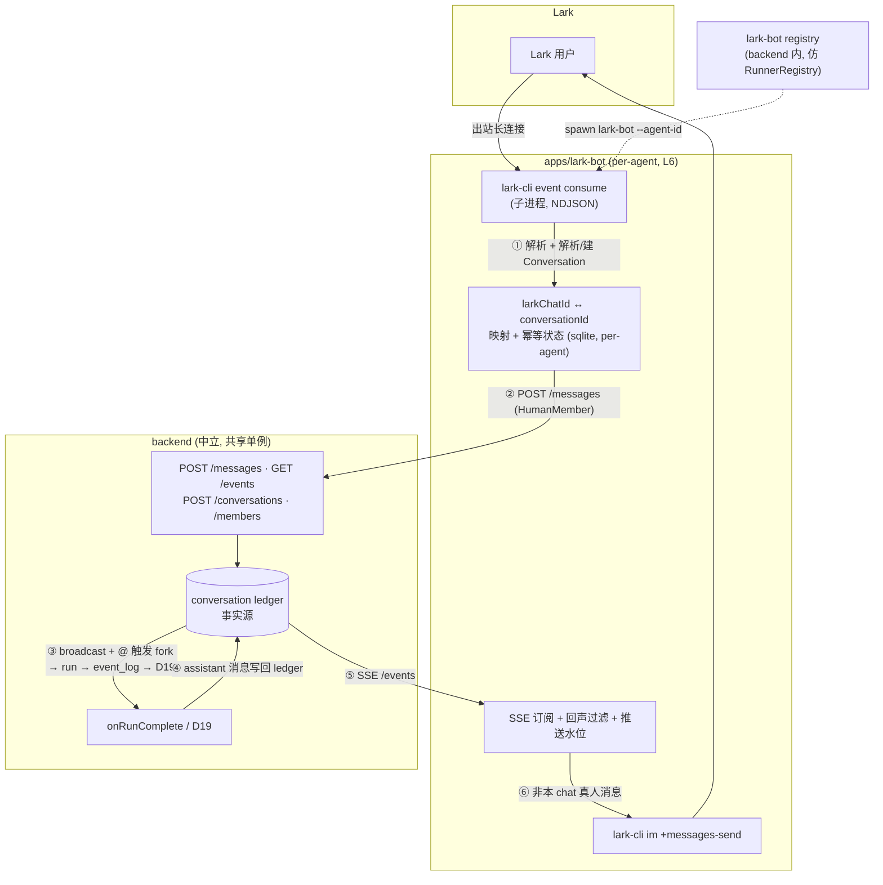
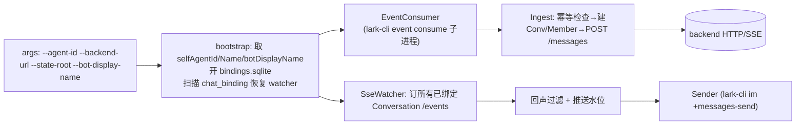
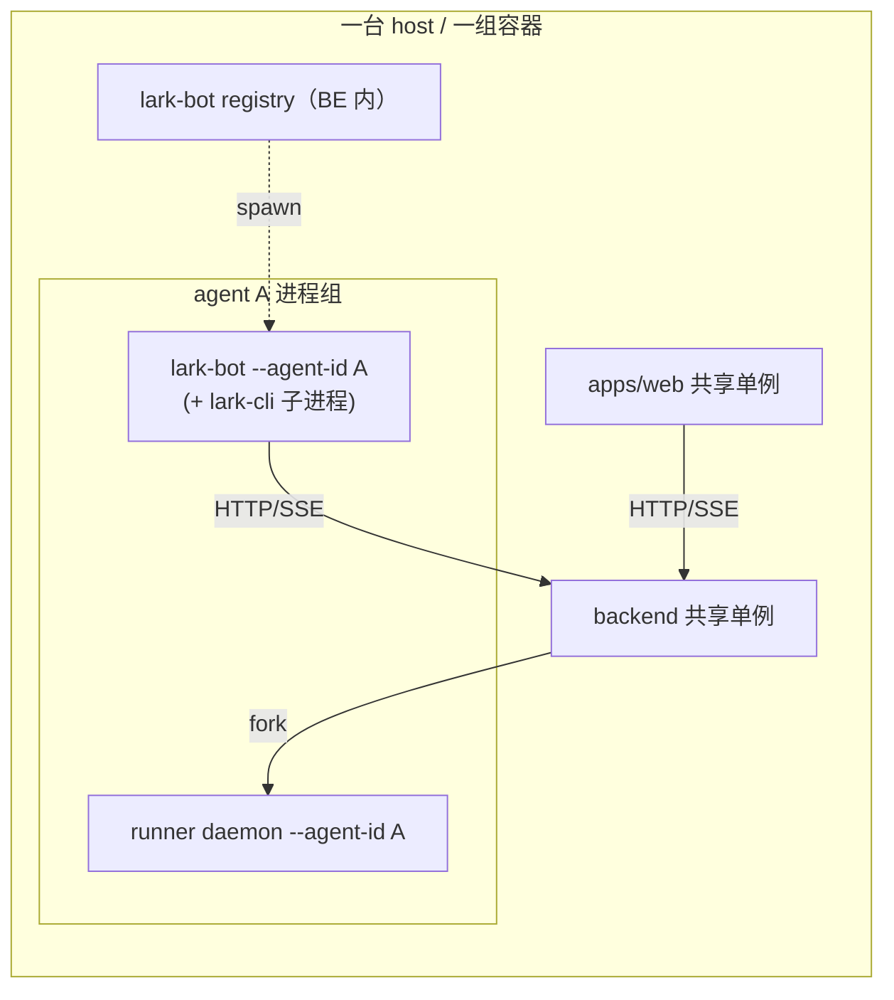

# M15 — Lark Bot：把一个 agent 接成一个 Lark 机器人（per-agent L6 surface）

> 根因：今天系统有三个会话入口——`apps/web`、`apps/cli`、HTTP 直连——它们都把消息 `POST` 进 backend 那条**中立的 conversation ledger**，再经 SSE 读回历史。但「真人在 Lark 里跟 bot 说话、agent 跑、回复推回 Lark，同一段对话还能在 web 上看到历史」这条路径**还不存在**。本 spec 新增第四个 surface `apps/lark-bot`：一个 **per-agent 的 L6 进程**，借 [`lark-cli`](https://github.com/larksuite/cli) 当 Lark 传输层，入站以 HumanMember 身份走**与 web/CLI 完全相同的 `POST /messages`** 入口，出站订 ledger SSE 推回 Lark。两个方向都终于 ledger——这是双向历史一致的根。
>
> 关联：[18-im-adapter](../../architecture/18-im-adapter.md)（架构母文，本 spec 的设计全部源于此）· [15-conversation](../../architecture/15-conversation.md)（被投影到的会话模型 + ledger/event_log 分工）· [12-backend](../../architecture/12-backend.md)（消费的 HTTP/SSE 契约 + D19 投影）· [16-resident-runner](../../architecture/16-resident-runner.md) / [M14.7 spec](./2026-06-12-m14.7-resident-runner.md)（per-agent daemon，与本层是兄弟，提供 registry 编排范式）· [13-agent-spec](../../architecture/13-agent-spec.md)。
>
> 基线 commit：`next` HEAD（含 M14.7 resident-runner + AFS v1）。前置：M14.7 已落地——backend 已有 per-agent 进程编排范式（`RunnerRegistry`），agent CRUD + agentStore + conversation service 均已稳定。
>
> 本轮只交付 **Lark**，且只交付**真人把消息推进系统 + agent 回复推回 Lark**这条闭环。富卡片、流式回显、群内多 agent 协调、入站附件均明确划在范围外（§十四）。

---

## 一、问题：缺一个把 IM 会话投影进 ledger 的 surface

### 1.1 现状：三个 surface 都只说 backend 公开 HTTP/SSE

```ts
// 现有入站：web / cli / 测试都调同一个 HTTP 入口
POST /api/conversations/:id/messages
  { senderMemberId, addressedTo: string[], content }
// → svc.postMessage → appendLedgerEntry → broadcast →（按 addressedTo）forkRun
```

```ts
// 现有出站：所有 surface 订同一条 SSE
GET /api/conversations/:id/events   // Last-Event-ID / ?afterSeq= 续读
// ← ledger 每条 entry（含 D19 写回的 assistant 消息）
```

会话模型对 surface **完全中立**（[15-conversation §八](../../architecture/15-conversation.md)）：任何 member 发消息 = `POST /messages`，任何 surface 看历史 = 订 SSE。Lark 要接进来，**不需要改 backend 的会话语义**，只需要第四个调同一组 API 的进程。

### 1.2 Lark 自带「conversation id」，必须显式映射

Lark 的会话标识体系与我们的会话模型是**两套独立的 ID 空间**，必须建一张显式映射表把它们对齐。下面先把 Lark 侧的事实摸清（§三），再设计映射（§四）。

### 1.3 凭据即身份 → 进程必须 per-agent

`appId/appSecret` 不是「连接参数」，而是**这个 agent 在 Lark 里的脸**：一个 bot = 一个 Lark app = 一个 agent。身份不可共享，所以 adapter 必然 per-agent（[18 §一](../../architecture/18-im-adapter.md)）。这决定了进程拓扑（§九）与 registry 设计（§七）。

---

## 二、目标形态



| 关注点 | 今天 | M15 后 |
|---|---|---|
| Lark 消息进系统 | 无路径 | adapter `POST /messages`（HumanMember），与 web/cli 同入口 |
| Lark 消息出现在 web 历史 | 无路径 | 入站直写 ledger → web 订 SSE 即见 |
| agent 回复推回 Lark | 无路径 | D19 写回 ledger → adapter 订 SSE → `im send` |
| Lark chat ↔ 系统会话 | 无映射 | per-agent sqlite 映射表 `larkChatId → conversationId` |
| 入站重复投递 | 未处理 | `event_id` + `message_id` 消费记录防重复写 ledger / 重复触发 run |
| bot 进程归属 | — | per-agent，由 backend lark-bot registry 拉起，与 runner daemon 兄弟 |
| Lark 协议（OAuth/加解密/长连接/发送） | — | 全部委托 `lark-cli`，自己零实现，不监听端口 |

---

## 三、Lark 侧事实：标识体系与事件 schema

设计映射前，必须先锁定 Lark 自己的会话/身份模型。以下为 `lark-cli event consume im.message.receive_v1` 经过 Process hook 后的扁平 NDJSON 输出字段；实现时必须用真实样本校准 fixture，见 §八。

| Lark 概念 | 形态 | 稳定性 / 语义 | 我们怎么用 |
|---|---|---|---|
| `chat_id` | `oc_xxx` | p2p 与 group 都有；同一对 (app, chat) 内稳定 | 会话主键 → `larkChatId` |
| `chat_type` | `p2p` / `group` | 区分单聊 / 群聊 | 决定触发语义（§五） |
| `event_id` | string | 每次事件投递的全局唯一 id | 入站幂等首选键（§四） |
| `message_id` | `om_xxx` | 每条消息唯一，同一消息重复投递时稳定 | 入站幂等辅助键（§四） |
| `open_id` | `ou_xxx` | 发消息用户在本 app 下的 id；跨 app 不同 | HumanMember.userRef（§四） |
| `union_id` | `on_xxx` | 用户在同一开发者下跨 app 稳定 | 暂不用；未来跨 bot 合并身份时再议 |
| `user_id` | 租户内 id | 敏感、需额外权限 | 不取（最小权限） |
| `content` | string | `lark-cli` 已把 text/post 等渲染成可读文本，并把 mention key 替换成 `@name`；interactive 卡片保持 raw JSON | 入站文本与 group @bot 判定输入 |
| `sender_id` | `ou_xxx` | 发送者 open_id | HumanMember.userRef（§四） |
| `thread_id` | `omt_xxx` | 话题群里一条 thread；与 chat_id 一对多；当前扁平输出不暴露 | 本轮不投影（§十四） |
| bot display name | 用户配置，如 `CodingBot` | `lark-cli` 扁平输出不包含 `mentions[]`，也不可靠暴露 bot 自身 open_id | group 里用 `content.includes("@" + botDisplayName)` 判定是否 @bot |
| App ID | `cli_xxx` | app 身份 | = `larkAppId`（§六） |

> **关键：lark-cli 的 `im.message.receive_v1` 是扁平 NDJSON。** 它不会把 raw `mentions[]` 数组暴露给 adapter——text/post 消息的 mention key 会被 `BuildMentionKeyMap` + `ResolveMentionKeys` 转成 `@name` text 内联到 `.content`。因此 group @bot 判定**只能靠 `content.includes("@" + botDisplayName)`**，没有 mention 数组可查。这是 spec 与原架构文档（[18 §三](../../architecture/18-im-adapter.md#三投影lark-概念--我们的-conversation--member)）的关键偏离——架构文档用 raw Lark API 描述模型，但 lark-cli 的 Process hook 已改变了输出形状。

**成员事件**（用于未来把群成员进出投影成 ledger 的 `member.joined/left`）：

| 事件 | 含义 |
|---|---|
| `im.chat.member.user.added_v1` | 用户加入群 |
| `im.chat.member.user.deleted_v1` | 用户离开群 |
| `im.chat.member.bot.added_v1` | bot 被拉进群（首见 → 建 Conversation 的时机之一） |
| `im.chat.disbanded_v1` | 群解散（解绑映射） |

> **本轮只消费 `im.message.receive_v1`。** 成员/解散事件是 §十四 的扩展口子——MVP 只在「首次见到某 chat_id 的消息」时惰性建 Conversation，不主动追踪成员进出。这样 MVP 只订一类事件，最小闭环。

---

## 四、ID 映射：两套 ID 空间如何对齐（本 spec 的核心）

### 4.1 三层对齐

Lark 的 (chat, user, app) 三元组，逐一映射到系统的 (Conversation, HumanMember, AgentMember)：

| Lark | 系统 | 绑定方式 |
|---|---|---|
| `chat_id`（`oc_`） | `conversationId` | per-agent 映射表 `larkChatId → conversationId`；首见新 chat → 建 Conversation |
| 发消息的 `open_id`（`ou_`） | `HumanMember`，`memberId = "human:lark:" + open_id`，`userRef = "lark:" + open_id` | 首见新 open_id → `POST /conversations/:id/members` 建 HumanMember |
| 本 bot 背后的 agent | `AgentMember`，`memberId = agentId`，`agentId = agentId` | 建 Conversation 时一并加入；沿用 web 现有 memberId 约定 |

**关键决策一：为什么需要一张显式映射表，而不是直接拿 `chat_id` 当 `conversationId`？**

- `conversationId` 是系统内部主键，可能被 web 端先创建、被多 surface 共享、未来一个 Conversation 挂多 agent；`chat_id` 是 Lark 私有命名空间且 per-app（同一个群对不同 bot 是不同视角）。把两者焊死会污染系统主键空间，也挡死「web 先建会话、再绑 Lark」这类未来路径。
- 一张 `larkChatId → conversationId` 表把耦合收敛到 adapter 一处，backend / ledger 对 Lark 概念零感知（不变量 §十）。

**关键决策二：为什么 AgentMember 的 `memberId` 不加 `agent:` 前缀？**

现有 web 添加 agent member 时已经用 `memberId = agentId`。D19 senderMemberId、`deriveThreadId(conversationId, memberId)`、hard delete checkpoint 清理都围绕这个约定工作。Lark 侧如果改成 `agent:<agentId>`，同一个 agent 会在 web 与 Lark 两条入口下变成两个 AgentMember，破坏线程、去重和清理语义。所以本 spec 只给 Lark human 加 namespace：`human:lark:<open_id>`；AgentMember 沿用 `agentId`。

### 4.2 映射表归属：per-agent，存在 adapter 本地

映射是 **per-agent 的小状态**（一个 bot 只认自己见过的 chat），不进 backend DB——否则 backend 就认识了 `chat_id`，破坏「backend 对 surface 无感」。存在 adapter 进程本地的一个小 sqlite。

**本地 sqlite 事务边界（硬约束）**：同一次 ingest 中，所有本地 sqlite 写入——`inbound_message` reserve、`chat_binding` create/update、`member_binding` create/update、`pushed_seq` 初始化——必须在同一个 `db.transaction(() => {...})` 中完成。跨进程的 `POST /messages` 不能和 sqlite 放在一个事务中（这是物理事实），但本地状态必须事务化，避免「首见 chat 只写了一半」的脏状态。

`pushed_seq` 语义：`pushed_seq = 0` 是特殊值，表示「尚未推送任何 ledger entry，SSE watcher 从 earliest seq 开始 catch-up」。不是「已推到 seq 0」（ledger seq 从 1 开始自增）。

路径约定：

| 场景 | bindings sqlite 路径 |
|---|---|
| dev | `${BACKEND_DATA_DIR}/lark-bot/<safeAgentId>/bindings.sqlite` |
| prod | 由 `LARK_BOT_STATE_ROOT` 注入，默认 `<stateRoot>/lark-bot/<safeAgentId>/bindings.sqlite` |
| archive agent | 停止 lark-bot，但保留 bindings 与 profile，便于恢复 |
| hard delete agent | 删除 bindings sqlite，并清理 profile/keychain namespace（若 lark-cli 支持） |
| dev cleanup | 只清子进程与 socket；除非显式 reset，不默认删除 bindings.sqlite |

```sql
CREATE TABLE chat_binding (
  lark_chat_id    TEXT PRIMARY KEY,   -- oc_xxx
  conversation_id TEXT NOT NULL,      -- 系统 conversationId
  chat_type       TEXT NOT NULL,      -- p2p | group
  created_at      INTEGER NOT NULL,
  pushed_seq      INTEGER NOT NULL DEFAULT 0  -- 出站推送水位（§五）
);

CREATE TABLE member_binding (
  lark_chat_id    TEXT NOT NULL,
  lark_open_id    TEXT NOT NULL,      -- ou_xxx
  member_id       TEXT NOT NULL,      -- 系统 HumanMember.memberId = human:lark:<open_id>
  PRIMARY KEY (lark_chat_id, lark_open_id)
);

CREATE TABLE inbound_message (
  lark_event_id   TEXT PRIMARY KEY,   -- event_id；入站幂等首选键
  lark_message_id TEXT NOT NULL,      -- om_xxx；同一消息重复投递时稳定
  lark_chat_id    TEXT NOT NULL,
  conversation_id TEXT,               -- null=reserved, 回填=confirmed（见 §4.3 step 0/2）
  ledger_seq      INTEGER,            -- null=reserved, 回填=confirmed
  status          TEXT NOT NULL DEFAULT 'processing',  -- processing | posted | failed
  created_at      INTEGER NOT NULL,
  UNIQUE(lark_message_id)
);
```

> `inbound_message` 是必须状态，不是「持久入站队列」。它同时记录已消费的 Lark `event_id` 与 `message_id`：**先 reserve（step 0，status='processing'，conversation_id/ledger_seq 为 null），再 POST /messages（step 1），成功后 confirm 回填（step 2，status='posted'）**。优先用 `event_id` 防事件重复投递；再用 `message_id` 防同一消息被不同事件路径或重放重复写 ledger / 重复触发 run。step 0 的 reserve 在本地 sqlite 事务中完成——宁可 POST 失败丢一条入站，也绝不重复触发 run。

### 4.3 首见 chat：惰性建会话（解析 / 建立流程）

```
on inbound message {event_id, chat_id, chat_type, sender_id, message_id, content, senderDisplayName}:

    # ═══ Step 0: 幂等 reserve（先占位，后 POST） ═══
    # 本地 sqlite 事务内：reserve inbound_message + 建 binding
    # 宁可 POST 失败丢一条入站，也不能在 POST 成功后漏记导致重复触发 run
    BEGIN TRANSACTION (local sqlite)
    if db.inbound_message.exists_event(event_id) or db.inbound_message.exists_message(message_id):
        COMMIT; return  # 已消费，绝不重复 POST /messages，也绝不重复触发 run
    db.inbound_message.reserve(event_id, message_id, chat_id, conversationId=null, ledger_seq=null,
                               status="processing")

    binding = db.chat_binding.get(chat_id)
    if not binding:
        # 建系统 Conversation，把本 agent 作为 AgentMember 一并加入
        agentMemberId = selfAgentId  # 沿用现有 web/backend 约定，不加 agent: 前缀
        resp = POST /api/conversations {
            members: [{ kind:"agent", memberId: agentMemberId, agentId: selfAgentId,
                        displayName: selfAgentName }]
        }
        conversationId = resp.conversationId
        db.chat_binding.put(chat_id, { conversationId, chat_type, pushed_seq: 0 })
        binding = ...
        sseWatcher.watch(conversationId, afterSeq=0)  # 新绑定动态加订

    # 解析发消息的人 → HumanMember（deterministic memberId，见 §七.3）
    memberId = db.member_binding.get(chat_id, sender_id)
    if not memberId:
        memberId = "human:lark:" + sender_id
        POST /api/conversations/{conversationId}/members {
            kind:"human", memberId, userRef:"lark:"+sender_id,
            displayName: senderDisplayName ?? sender_id
        }
        db.member_binding.put(chat_id, sender_id, memberId)
    COMMIT  # 本地状态已事务化落盘

    # ═══ Step 1: POST /messages（跨进程，不能和 sqlite 同事务） ═══
    # 触发语义见 §五，决定 addressedTo
    resp = POST /api/conversations/{conversationId}/messages {
        senderMemberId: memberId,
        addressedTo: <§五 决定>,
        content: { text: content, source: "lark", larkEventId: event_id, larkMessageId: message_id }
    }

    # ═══ Step 2: 回填 ledger_seq（POST 成功后补完整） ═══
    db.inbound_message.confirm(event_id, ledger_seq=resp.seq, status="posted")
```

> **幂等语义选择（硬约束）**：`POST /messages` 成功后 `inbound_message.confirm` 失败 → 消息已在 ledger，但该 event 不会被重新 POST（已在 step 0 预约）。代价是**宁可丢入站也不重复触发 run**——极端崩溃窗口可能丢一条 Lark 消息，但绝不会重复写 ledger / 重复 fork run。这与 §5.3 的「入站必须去重」一致。

> **memberId 选 deterministic 前缀**（Lark human 为 `human:lark:<open_id>`；agent 为现有 `agentId`）而非随机：adapter 重启后不查表也能复算同一 memberId。`POST /members` 在 memberId 已存在时必须幂等（见 §七 backend 改动）。

### 4.4 selfAgentName 与 sender displayName

- **selfAgentName**：lark-bot 启动时调用 `GET /api/agents/:id` 读取 `name` 字段，作为 AgentMember `displayName`。可允许 `--agent-name` CLI 参数覆盖，便于测试；没有传参时必须走 HTTP 获取。
- **sender displayName**：不要猜 Lark 字段路径。fixture 校准前 ingest 只强依赖 `sender_id`；displayName 可为空或 fallback 为 `open_id`。真实样本确认字段后，再从 parser 层输出 `senderDisplayName?: string`。

---

## 五、触发语义 + 回声过滤 + 幂等

### 5.1 触发：p2p 隐式点名，group 仅 @bot

直接落到现有 `addressedTo` + `resolveTriggerTargets` 机制（[15 §三](../../architecture/15-conversation.md)），不靠 prompt：

```
agentMemberId = selfAgentId
if chat_type == "p2p":
    addressedTo = [agentMemberId]              # 单聊每条都点名
elif chat_type == "group":
    mentioned = content.includes("@" + botDisplayName)
    addressedTo = [agentMemberId] if mentioned else []   # 未@ → 只广播可见，不起 run
```

群里未 @bot 的消息仍 `POST /messages`（`addressedTo=[]`）——它要进 ledger 让 agent「看得见上下文」，只是不起 run。**不回应靠机制（空 addressedTo），不靠 prompt。**

> **为什么是 `content.includes("@displayName")` 而不是查 mentions 数组？** lark-cli 的 Process hook (ConvertBodyContent) 已经把 raw mentions 数组消费掉、将 mention key (`@open_id`) 替换成 `@displayName` 内联进 `.content` 文本。adapter 看不到原始 mentions 数组，只能靠 display name 的文本匹配。这也是为什么 `--bot-display-name` 必须在启动时传入、且在 Lark 侧必须与创建 app 时设置的机器人名称一致。

### 5.2 出站：只推「非本 chat 真人」的 ledger entry

adapter 订 ledger SSE 会收到**所有** member 的消息，包括它自己刚 POST 进去的真人消息。推回 Lark 前过滤，否则用户看到自己的话被复读：

```
on ledger entry from GET /conversations/{cid}/events:
    if entry.seq <= binding.pushed_seq: continue       # 重连续读水位
    if entry.kind != "message": continue               # todo/member 事件 MVP 不推
    if entry.senderMemberId is a HumanMember of THIS chat:
        binding.pushed_seq = entry.seq; continue        # 本 chat 真人 → 回推=回声
    if entry.senderMemberId == "__system__": continue  # MVP 不推系统消息（hop-cap 等）
    # 走到这 = agent 回复 / 其他 surface（web）发言 / 未来其他 agent
    lark-cli im +messages-send --chat-id {lark_chat_id} --text render(entry.content)
    binding.pushed_seq = entry.seq
```

判据干净：**消息来源方向**。来自 Lark 的（本 chat 真人）不回推；来自系统内部的（agent 回复、web 端发言）才推。这天然支持「web 上有人发言、Lark 端也看得到」。

> **判断「本 chat 真人」**：本 chat 的真人 memberId 都形如 `human:lark:<open_id>`，且都在 `member_binding(chat_id, *)` 里。adapter 查本地表即可判定，不需问 backend。

### 5.3 幂等边界：入站 exactly-once，出站 at-least-once

- **入站**：先 reserve `inbound_message`（step 0，status='processing'），再 `POST /messages`（step 1），后 confirm 回填（step 2，status='posted'）。step 0 在本地 sqlite 事务中完成——同一 `event_id` 或 `message_id` 不会通过 step 0 的 reserve 检查，因此绝不重复写 ledger、绝不重复触发 run。极端情况（step 1 成功但 step 2 失败）：消息已在 ledger，但保留 `status='processing'` 且 `ledger_seq` 留空——该 event 不会被重新 POST（step 0 已占位），代价是**宁可丢一条入站，也不重复触发 run**。
- **出站**：MVP 只承诺 at-least-once。`pushed_seq` 能避免 SSE 重连续读和正常重启带来的重复发送，但无法消除「`im send` 已成功、进程在写 sqlite 水位前崩溃」这类窗口。

`lark-cli im +messages-send` 支持 `--idempotency-key <key>`，底层写入消息 API 的 `uuid` 字段。M15 出站必须传 `<conversationId>:<ledgerSeq>` 作为 idempotency key，让 Lark 侧去重——配合 `pushed_seq` 水位，双保险消除正常重放。

如果后续要把出站重复概率进一步压低，可引入 outbox：

```sql
CREATE TABLE outbound_delivery (
  conversation_id TEXT NOT NULL,
  ledger_seq      INTEGER NOT NULL,
  lark_chat_id    TEXT NOT NULL,
  status          TEXT NOT NULL, -- pending | sent | failed
  created_at      INTEGER NOT NULL,
  updated_at      INTEGER NOT NULL,
  PRIMARY KEY (conversation_id, ledger_seq, lark_chat_id)
);
```

但只要 Lark 发送接口没有可传入的去重 token，outbox 也不能严格证明 exactly-once。因此 M15 MVP 的技术契约是：**入站必须去重；出站以水位 + idempotency key 防正常重复，崩溃窗口允许极低概率复发**。

### 5.4 回复粒度：MVP 发最终回复

D19 是 **run 结束后**一次性把 assistant 消息写进 ledger（非流式）。所以默认形态「agent 跑完，Lark 收到一条完整回复」。长任务期间 Lark 端安静，web 端可看 `/runs/:id/events` 流式增量。流式回显是 §十四 旋钮。

---

## 六、传输层：`lark-cli` 接管全部 Lark 协议

整套设计的 Occam 支点：OAuth/token 刷新、长连接、加解密、事件 schema、发送 API、凭据存储——**一行不写**，全委托 [`lark-cli`](https://github.com/larksuite/cli)。

**入站** — 子进程 NDJSON：

```
lark-cli --profile agent:<safeAgentId> event consume im.message.receive_v1 --as bot
# 每行一条 JSON 打到 stdout；这是出站长连接，不监听端口
# stderr 有 ready-marker；退出有 reason
```

这与 backend 读 runner daemon stdout 的 NDJSON 模式**结构同构**——按行读子进程输出，已有成熟套路（[M14.7 Transport](./2026-06-12-m14.7-resident-runner.md)）。

**出站** — 一条命令发回：

```
lark-cli --profile agent:<safeAgentId> im +messages-send --chat-id <oc_...> --text <reply> --as bot --idempotency-key <conversationId>:<seq>
```

**botDisplayName 配置**：`lark-cli` 的 `im.message.receive_v1` 扁平输出不暴露 `mentions[]`，也不需要获取 bot 自身 `open_id`。group @bot 判定改为依赖启动参数 `--bot-display-name`：`content.includes("@" + botDisplayName)`。

**botDisplayName 缺失行为（固定，不留给实现二选一）**：
- p2p 消息：正常消费并触发 agent（`addressedTo=[agentId]`），不依赖 `botDisplayName`；
- group 消息：仍 `POST /messages`（`addressedTo=[]`）入 ledger，但不触发 agent，因为无法可靠判定 @bot；
- 启动时 warn log：`[lark-bot] botDisplayName missing — group @mention detection disabled`；
- `lark.status` 派生为 `degraded`（非 `error`）：进程不 crash，p2p 继续可用，UI 明确提示「group mention disabled: missing botDisplayName」。

`botDisplayName` 来自 web 创建/编辑 agent 时配置。该值必须与 Lark 后台设置的机器人名称一致——不一致会导致 group @bot 漏判（内容中有 `@<真名>` 但配置的是另一个名字），不触发但不丢数据。

```
1. p2p: chat_type == "p2p" → addressedTo=[agentId]。
2. group: botDisplayName 已配置 且 content includes "@" + botDisplayName → addressedTo=[agentId]；否则 []。
3. botDisplayName 缺失时 group：addressedTo=[]，消息入 ledger 但不触发 agent（无 @bot 判定能力）。
4. text/post 的 @ 会被 lark-cli ConvertBodyContent / ResolveMentionKeys 渲染成 @name；interactive 卡片 content 是 raw JSON，MVP 不把卡片当 @bot 触发。
5. parser 单测用真实 event consume 样本 fixture 校准字段路径和 @name 文本。
```

**lark-cli 能力 spike（提交 4 前置 checkpoint）**：M15 实现前必须先在目标运行环境执行一次 CLI 能力确认，而不是把 README 示例当成稳定协议。以下均来自 [lark-cli 源码核验](#)（`events/im/message_receive.go`、`skills/lark-event/SKILL.md`、`skills/lark-im/references/lark-im-messages-send.md`、`skills/lark-shared/SKILL.md`）：

| 需要确认 | 验收产物 |
|---|---|
| `event consume` 输出是否真为 NDJSON、换行/半包行为如何 | 保存至少一条 p2p 与一条 group @bot 原始样本到 `apps/lark-bot/fixtures/` |
| stderr ready-marker / exit reason 的确切格式 | `event-consumer.test.ts` 覆盖 ready、正常退出、异常退出 |
| `im +messages-send --text` 是否可用，长文本/特殊字符如何传 | `sender.test.ts` 覆盖纯文本、换行、JSON 字符 |
| group @bot 判定 | `bootstrap.test.ts` 固化 `--bot-display-name` 必填/缺失行为；parser fixture 覆盖 `content` 中的 `@name` |
| profile / 多 app 隔离能力 | 明确用官方 `--profile` 参数；`config init --name <name> --app-id <id> --app-secret-stdin` 非交互写入；若不支持则用 per-agent env var 隔离 |

**源码核验结论（2026-06-13）**：

- `im.message.receive_v1` 的 `lark-cli event consume` 输出是扁平 NDJSON：`type/event_id/timestamp/id/message_id/create_time/chat_id/chat_type/message_type/sender_id/content`；raw `mentions[]` 被 Process hook 消费掉，**不暴露给 adapter**。
- text/post 的 mention key 由 `BuildMentionKeyMap` + `ResolveMentionKeys` 转成 `@name`，因此 group @bot MVP **只能**基于配置的 `botDisplayName` 在 `content` 中匹配；interactive 卡片保持 raw JSON，不纳入 MVP 触发。
- `event consume` 必须监 stderr ready marker `[event] ready event_key=<key>` 后再宣布 running；unbounded 非 TTY 子进程会把 stdin EOF 当作优雅退出，父进程必须保持 stdin 不关闭或使用有界参数；停止用 SIGTERM，**严禁 SIGKILL**（跳过 PreConsume hook 的 OAPI unsubscribe 会泄漏服务端订阅）。
- `im +messages-send` 支持 `--as bot` 与 `--idempotency-key`，实现会把 key 写入消息 API 的 `uuid` 字段；M15 出站必须传 `<conversationId>:<ledgerSeq>` 作为幂等键。
- `config init` 支持 `--name` 与 `--app-secret-stdin`，可非交互写入既有 app 凭据；`--new` 是创建新 app 的浏览器流程，不应由 backend 自动调用。

**凭据 / profile 初始化**：`lark-cli` 支持全局 `--profile` 与 `config init --name <profile> --app-id <id> --app-secret-stdin --brand <feishu|lark>`。因此 M15 **不应**在 backend 请求生命周期内调用会创建新 app 且阻塞浏览器的 `config init --new`；应使用 UI 提供的既有 Lark appId/appSecret，通过 stdin 写入 appSecret 初始化 `agent:<safeAgentId>` profile。backend 在创建/更新 agent 请求生命周期内会**短暂接触** appSecret，但必须满足：不入库、不日志化、不出现在错误消息、不写 trace、不以 argv 暴露。

> **只取长连接，不要 webhook。** webhook 需监听端口 + 公网回调；本轮只用 `event consume` 的出站长连接。

---

## 七、Backend 侧改动：agent 的 lark 元数据 + lark-bot registry

backend 只做三件事，且**绝不认识 Lark 消息语义**：① 存 agent 的 lark 元数据；② 在请求生命周期内把 appSecret 交给 lark-cli profile 初始化（不持久化、不日志化）；③ 编排 lark-bot 进程起停。

### 7.1 AgentRow 扩展（migration）

沿用 migrations 命名约定（schema 修改段 5000–5999，append 至数组末尾）。注意：多条 `ALTER TABLE ADD COLUMN` 放在同一个 migration 里有半迁移风险；本轮拆成三条独立 migration，每条只加一列。

```ts
// apps/backend/src/infra/sqlite/migrations.ts —— 追加在数组末尾
{
  name: "backend_v18_agents_lark_enabled",
  id: 5004,
  up: `ALTER TABLE agents ADD COLUMN lark_enabled INTEGER NOT NULL DEFAULT 0`,
},
{
  name: "backend_v19_agents_lark_app_id",
  id: 5005,
  up: `ALTER TABLE agents ADD COLUMN lark_app_id TEXT`,
},
{
  name: "backend_v20_agents_lark_profile_ref",
  id: 5006,
  up: `ALTER TABLE agents ADD COLUMN lark_profile_ref TEXT`,
}
```

> 如果实现时已有半迁移环境，需先补 repair migration 或迁移前 schema 检查；验收必须覆盖新库、已有库、半迁移恢复三种情况。

`AgentRow` / `domain.ts`：

```ts
export interface AgentRow {
  // ...existing...
  larkEnabled: boolean;
  larkAppId: string | null;
  larkProfileRef: string | null;   // e.g. "agent:agent_123"
}
```

### 7.2 HTTP 契约扩展

`POST /api/agents` 与 `PATCH /api/agents/:id` 增加可选 `lark` 块：

```jsonc
// 请求
{
  "name": "coding assistant",
  "model": { "provider": "anthropic", "model": "claude-sonnet-4" },
  "lark": { "enabled": true, "appId": "cli_xxx", "appSecret": "*** only in request ***" }
}
// 返回（只回显非敏感字段）
{
  "id": "agent_123",
  "lark": { "enabled": true, "appId": "cli_xxx", "profileRef": "agent:agent_123", "status": "configured" }
}
```

createSchema / updateSchema 增加：

```ts
const larkSchema = z.object({
  enabled: z.boolean(),
  appId: z.string().min(1).optional(),
  appSecret: z.string().min(1).optional(),
}).optional();
// 校验：创建时 enabled === true 则 appId/appSecret 必填 → 否则 400
// 编辑时 enabled true 且已有 profileRef 可不传 appSecret；若 appId 变化则 appSecret 必填
```

**AgentService 保持纯净**：service 只负责 agent 领域逻辑（CRUD + workspace + archive/hardDelete）。lark profile 初始化和 registry 通知是 **L6 surface 副作用**，不在 service 内执行。在 composition root（`main.ts` 或独立 wrapper 模块）中：service.create/update 成功后 → 调用 `larkProfileInit` → 调用 `registry.ensureLarkBot/stopLarkBot`；archive/hardDelete 成功后 → `stopLarkBot`；失败补偿在这里集中处理。

`list/getById/create/update` 返回的 `lark.status` 是派生字段：

| status | 派生规则 |
|---|---|
| `not_configured` | `lark_enabled=false` 或无 `lark_profile_ref` |
| `configured` | `lark_enabled=true` 且 profile 初始化成功，但 registry 当前未 ready |
| `running` | registry 中该 agent 的 lark-bot 存活，且 `event consume` ready |
| `degraded` | lark-bot 存活但部分功能受限（如 `botDisplayName` 缺失 → group @bot 判定不可用，p2p 正常） |
| `error` | profile 初始化失败 / event consume 连续失败 / 401/403 |

MVP 的 `lastError` 可先做内存态，backend 重启后重算；如 UI 需要跨重启展示，再补持久化字段。

### 7.3 `POST /members` 幂等

adapter 用 deterministic memberId（`human:lark:<open_id>`）。backend 的正确幂等语义不是「DB 不重复 insert」而是：**memberId 已存在时，service 层必须直接返回当前 members，不重复 append `member.joined` ledger entry，也不重复广播到 checkpoint**。

**本 spec 选方案 B**：让 port 返回 `{ member, created }`，service 只在 `created=true` 时 append `member.joined`。

```ts
interface ConversationPort {
  addMember(input: CreateMemberInput): { member: MemberRow; created: boolean };
  //                                     ^^^^^^^^^^^^^^^^^^^^^^^^^^^^^^^^^^^^^^^
  //                                     BREAKING CHANGE: was MemberRow
}

async function addMember(input) {
  const { member, created } = port.addMember(...);
  if (!created) return; // 不 append member.joined，不污染 ledger/checkpoint
  await appendAndBroadcast({ kind: "member.joined", ... });
}
```

当前 `adapter-sqlite.ts` 已用 `INSERT OR IGNORE` 做 DB 级幂等，但 `addMember` 未检测 `result.changes`，直接返回输入参数构造的 `MemberRow`；且 `service.ts` 仍会无条件 broadcast。M15 必须：

1. **`ports.ts`**：`addMember` 返回类型从 `MemberRow` 改为 `{ member: MemberRow; created: boolean }`（breaking change）；
2. **`adapter-sqlite.ts`**：`addMember` 用 `result.changes > 0` 判断是否真正 insert，返回 `{ member, created }`；
3. **`service.ts`**：`addMember` 只在 `created=true` 时 `appendAndBroadcast`；
4. **`http.ts`**：`create` 路由中循环调用 `svc.addMember` 不受影响（仍返回 members 列表）；`addMember` 路由调整响应适配新返回类型；
5. **所有 conversation adapter/service/http 测试**：覆盖重复 memberId 不重放 `member.joined`。

> 这是 adapter 正确性的硬依赖。没有它，adapter 重连/重启后即使 member 表没重复，也会重复写 `member.joined`，污染 ledger 与 agent checkpoint。

### 7.4 lark-bot registry：仿 `RunnerRegistry`

直接复用 M14.7 的 per-agent 进程编排范式。dev 自 spawn，prod resolve：

```ts
export interface LarkBotRegistry {
  ensureLarkBot(agentId: string): Promise<void>;  // 幂等：已在跑则 no-op
  stopLarkBot(agentId: string): Promise<void>;
  statusOf(agentId: string): LarkBotStatus;        // not_configured|configured|running|error
  dispose(): Promise<void>;
}

// DevLarkBotRegistry: spawn("bun", [larkBotBin, "--agent-id", id, "--backend-url", url, ...])
//   - 维护 Map<agentId, ChildProcess>，崩溃重启（带退避）
//   - dispose 时 SIGTERM 全部（勿 SIGKILL：lark-cli event consume 需优雅退出取消订阅）
//   - 进程 stdout/stderr 日志始终带 agentId tag
//   - 路径与 config 使用 safeAgentId() 处理后的 id
//   - Profile 名使用 agent:<safeAgentId>（冒号是 lark-cli profile 命名规范，safeAgentId 保证无 shell/path 特殊字符）
// ProdLarkBotRegistry: 仅 resolve 端点 / 交给外部编排
```

backend 启动时扫 `agentStore` 中 `lark_enabled=1` 的 agent，逐个 `ensureLarkBot`。agent archive → `stopLarkBot` 且保留 profile/bindings；hard delete → `stopLarkBot` 并清理 bindings/profile。

> backend「拉起」lark-bot（进程编排）与「不认识 Lark 业务逻辑」（语义无感）不冲突：它只 spawn 进程并传 `--agent-id`，从不解析 Lark 消息、不读取 adapter 本地 sqlite。

---

## 八、`apps/lark-bot` 进程内部结构



| 模块 | 职责 | 依赖 |
|---|---|---|
| `bootstrap` | 取本 agent 的 name + botDisplayName；开本地 sqlite；扫描 `chat_binding` 恢复 SSE watcher | sqlite, backend HTTP |
| `EventConsumer` | spawn `lark-cli event consume`，先 block stderr ready marker `[event] ready`；然后按行解析 NDJSON；监 stderr exit reason；崩溃重启（勿 kill -9）；stdin 永不关闭或使用有界参数 | lark-cli |
| `Ingest` | `event_id/message_id` 双键幂等检查 + §四 解析 + §五 触发判定 → `POST /messages` | backend HTTP, sqlite |
| `SseWatcher` | 对每个已绑定 Conversation 订 `/events`（`Last-Event-ID = pushed_seq`）；新 chat 绑定时动态加订；实现 SSE 行协议解析 | backend SSE |
| `Echo/Dedup` | §五.2 过滤；更新 `pushed_seq`；只承诺 at-least-once | sqlite |
| `Sender` | `lark-cli im +messages-send`，带 `--idempotency-key` | lark-cli |

启动恢复流程必须显式实现：

```
on lark-bot start:
    GET /api/agents/:id → selfAgentName
    ── 404 / archived / lark_enabled=false → graceful exit 0, registry 不重启
    ── 临时 5xx / network error → 退避重试（max 3, 指数退避）
    ── 401/403 → lark.status=error, 不消费 Lark event
    validate botDisplayName != null → 若缺失: warn log + lark.status=degraded (不 crash, §六)
    open bindings.sqlite
    for binding in SELECT * FROM chat_binding:
        sseWatcher.watch(binding.conversation_id, afterSeq=binding.pushed_seq)
    start event consume
```

**SSE 订阅粒度决策**：每个已绑定 Conversation 一条 SSE 连接（N chat = N 连接）。MVP 简单直接；连接数 = 该 agent 活跃 chat 数，per-agent 隔离下规模可控。聚合订阅（一条连接拿多会话）留作后续优化，不在本轮。

### 8.1 复用 CLI conversation mode：SSE 与 render 不重造

`apps/cli/src/main.ts` 的 conversation mode 已有一条最小闭环模板：`POST /api/conversations`、`POST /messages`、`GET /events`、解析 SSE `id:`/`data:` 行、维护 `Last-Event-ID`、跳过自己发送的消息、把 `entry.content` 先 `JSON.parse` 再取 `.text`。lark-bot 不应重造一套不兼容实现；应抽出或复制这段已验证模式，再把 readline 输入替换成 `lark-cli event consume`。

SSE watcher 必须按真实 SSE 协议处理，而不是假设 HTTP 返回 raw JSON：

```
GET /api/conversations/{conversationId}/events
id: <seq>
event: <kind>
data: <LedgerRow JSON>

```

出站 `render(entry.content)` 至少覆盖四类内容：

```
# entry.content 是 JSON-encoded string（ledger 存储格式），需先 parse
parsed = try JSON.parse(content)
if parse failed:
    return content  # raw string, 非 JSON

if parsed has .text (string):
    return parsed.text

if parsed is ContentBlock[]:
    texts = blocks.filter(b => b.type == "text").map(b => b.text)
    if texts.length > 0: return texts.join("")
    else: return "[Unsupported content]"  # 不向 Lark 用户暴露 JSON 原文

else:
    # 其他结构化对象（future）
    return "[Unsupported content]"
```

### 8.2 fixtures：用真实 NDJSON 样本固化 parser

新建 `apps/lark-bot/fixtures/`：

| fixture | 覆盖 |
|---|---|
| `message-p2p.json` | p2p 入站，隐式 addressedTo |
| `message-group-mention-bot.json` | group 入站，`content` 包含 `@<botDisplayName>` |
| `message-group-no-mention.json` | group 入站，`content` 不包含 `@<botDisplayName>`，addressedTo=[] |
| `message-interactive-card.json` | interactive 卡片 content 为 raw JSON，MVP 不触发 group @bot |

实现前先用真实 `lark-cli event consume im.message.receive_v1` 样本校准字段路径；之后 parser 单测只依赖 fixture，不依赖 live Lark。

### 8.3 CLI 参数与默认值

| 参数 | 必需 | 默认值 / 环境变量 | 说明 |
|---|---|---|---|
| `--agent-id` | ✅ | — | 本 lark-bot 服务的 agent id |
| `--backend-url` | — | `BACKEND_URL` 或 `http://localhost:3000` | backend HTTP 地址 |
| `--state-root` | — | `BACKEND_DATA_DIR` 或 `./.data` | bindings.sqlite 的父目录 |
| `--bot-display-name` | — | — | Lark app 的机器人名称，必须与 Lark 后台设置一致；缺失时 group @bot 判定不可用（fail-closed：p2p 正常，group 入账不触发，见 §六） |
| `--agent-name` | — | `GET /api/agents/:id` 读取 | 覆盖 AgentMember displayName，便于测试 |

**`--backend-url` 优先级**：CLI flag > `BACKEND_URL` env > `"http://localhost:3000"`。

### 8.4 `safeAgentId()` 与 profile 命名

复用 `DevRunnerRegistry` 的 `safeAgentId()` 规则——替换非 `[a-zA-Z0-9_-]` 字符为 `_`——用于 state/config 目录名和 lark-cli profile 名称：

```
Profile:  agent:<safeAgentId>          // lark-cli --profile agent:abc123
目录:    <stateRoot>/lark-bot/<safeAgentId>/bindings.sqlite
```

`lark-cli` 的 profile 名接受冒号（`ValidateProfileName` 允许 `:` 但拒绝 `/\` 等 shell/path 字符），safeAgentId 保证了这部分是安全的。

---

## 九、部署形态



- **backend / web**：全局共享单例。
- **lark-bot / runner daemon**：per-agent，是兄弟进程，互不直接通信，都只经 backend。
- **要跑 N 个 bot**：N 个 `lark-bot` 进程，各配各的 `--agent-id` + lark-cli profile。横向复制进程，不是进程内多租户。
- **谁拉起**：backend 启动时按 agentStore 拉起（registry，单一控制面）。
- **沙箱**：`event consume` 是出站长连接，不监听端口。

### 失败模式

| 失败 | 影响 | 处置 |
|---|---|---|
| `lark-cli event consume` 退出 | 该 agent 入站断流 | 监 stderr exit reason，重启子进程；勿 SIGKILL |
| backend 不可达 | POST/SSE 失败 | 退避重试；入站只做内存短缓冲，不自建持久队列；`event_id/message_id` 消费记录仍负责幂等 |
| lark-bot 进程崩溃 | 该 agent Lark 通道全断；web / 其他 agent 不受影响 | registry 重启；启动时扫描 bindings 恢复 SSE watcher |
| SSE 重连 | 可能漏推 / 重推 | `pushed_seq` 做 `Last-Event-ID` 续读 + `--idempotency-key` 重复过滤；崩溃窗口仍按 at-least-once |
| profile 初始化失败 | 该 agent 无法连 Lark | `lark.status=error`，UI 展示，可在编辑页重试 |
| botDisplayName 缺失 | group @ 判定不可用 | fail-closed：p2p 正常消费并触发，group 消息仅入账不触发；lark.status=degraded；不 crash 进程（见 §六） |

---

## 十、不变量

1. **adapter 只吃 backend 公开 HTTP/SSE** —— 不碰 ledger 表 / checkpointer / event_log / runner。换 IM = 换这一层，下层零改动。
2. **入站直写 ledger，出站经 event_log → D19 → ledger** —— 两方向都终于 ledger（事实源），web 双向历史一致由此成立。
3. **Lark 用户 = HumanMember，`POST /messages` 与 web/CLI 同一入口** —— adapter 无特殊路径。
4. **ID 映射只活在 adapter** —— `larkChatId→conversationId` / `open_id→memberId` / `event_id/message_id` 消费记录都在 adapter 本地 sqlite；backend 不认识任何 Lark id。
5. **backend 对 surface 语义无感** —— 不解析 Lark 消息、不读取 Lark binding；它可 spawn lark-bot（进程编排），但不参与 IM 业务逻辑。
6. **appSecret 永不入库** —— backend 只在请求生命周期内短暂处理；必须 scrub 日志/错误/trace，优先用 stdin/非 argv 方式初始化 lark-cli profile；DB 只存 `larkAppId`（公开）+ `larkProfileRef`。
7. **per-agent = 因为凭据即身份** —— appId/secret 是 agent 的脸，不可共享；多 bot 靠多进程横向复制。
8. **lark-bot 与 runner daemon 是兄弟，不同居** —— 合并会让 backend↔daemon 依赖成环（[18 §七](../../architecture/18-im-adapter.md)）。
9. **Lark 协议全部委托 `lark-cli`，不监听端口** —— 入站走出站长连接。
10. **入站必须幂等，出站只承诺 at-least-once** —— `inbound_message(event_id, message_id)` 双键防重复写 ledger / 重复触发 run；出站使用 `--idempotency-key <conversationId>:<seq>` + `pushed_seq` 防正常重放，但仍不承诺崩溃窗口 exactly-once。
11. **memberId 约定不可破坏** —— AgentMember `memberId` 继续使用现有 `agentId`；Lark human 使用 `human:lark:<open_id>`。
12. **`POST /members` 幂等必须在 service 语义层成立** —— 已存在 member 不重复 append `member.joined`，不污染 ledger/checkpoint。

---

## 十一、文件改动清单

| 文件 | 改动 |
|---|---|
| `apps/lark-bot/`（新 app） | `main.ts`、`args.ts`（`--agent-id` `--backend-url` `--state-root` `--bot-display-name`）、`bootstrap.ts`、`event-consumer.ts`、`ingest.ts`、`sse-watcher.ts`、`sender.ts`、`bindings-sqlite.ts`、`safe-agent-id.ts`、`fixtures/`、对应 `*.test.ts` |
| `apps/lark-bot/package.json` | 新建；package name `@my-agent-team/lark-bot`；scripts: `build` / `typecheck` / `test` / `lint`；不声明 sqlite 依赖（使用 Bun 内置 `bun:sqlite`）；调用 `lark-cli` |
| `apps/lark-bot/tsconfig.json` / `tsconfig.test.json` | 新 app TS 配置；纳入 monorepo typecheck/test |
| `apps/lark-bot/src/safe-agent-id.ts` | 复用 `DevRunnerRegistry` 同等规则：非 `[a-zA-Z0-9_-]` 字符替换为 `_`，用于 state/config 目录名和 profile 名 |
| `turbo.json` / root `package.json` | 确保 `apps/lark-bot` 参与 `turbo run build/typecheck/test`；如当前 dev 脚本缺失，先创建/修复实际 dev 入口 |
| `apps/backend/src/features/agent/domain.ts` | `AgentRow` / `CreateAgentInput` / `UpdateAgentInput` 增 `lark*` 字段 |
| `apps/backend/src/features/agent/ports.ts` | port 输入/输出类型同步 lark 字段 |
| `apps/backend/src/features/agent/adapter-sqlite.ts` | create/update/toRow 处理 `lark_enabled/lark_app_id/lark_profile_ref` |
| `apps/backend/src/features/agent/http.ts` | createSchema/updateSchema 增 `lark` 块；校验 enabled→appId/appSecret；返回回显非敏感 lark 状态 |
| `apps/backend/src/features/agent/service.ts` | **保持 agent lifecycle 纯净**——不直接调用 lark profile/registry 副作用 |
| `apps/backend/src/features/agent/with-lark-orchestration.ts`（新）或 `main.ts` route wrapper | service.create/update/archive/hardDelete 成功后再执行 profileInit + registry ensure/stop；失败补偿与状态派生集中在 composition root；不把 surface 副作用塞进 AgentService |
| `apps/backend/src/features/conversation/ports.ts` | `addMember` 返回 `{ member, created }`；类型同步测试 |
| `apps/backend/src/features/conversation/service.ts` | `addMember` 幂等：`created=false` 则返回现有、不重复 append `member.joined` |
| `apps/backend/src/features/conversation/adapter-sqlite.ts` | ① `addMember` 返回 `{ member, created }`（`result.changes > 0`）、② `getLedgerEntries` row type cast 补 `"todo"` |
| `apps/backend/src/features/lark-bot/registry.ts`（新） | `LarkBotRegistry` + `DevLarkBotRegistry`（spawn/重启/dispose/status）+ `ProdLarkBotRegistry`（resolve） |
| `apps/backend/src/features/lark-bot/profile.ts`（新） | `larkProfileInit(profileRef, appId, appSecret)` 包 `lark-cli config init --name ... --app-secret-stdin`；secret 通过 stdin（非 argv）传入；请求结束不保留明文 |
| `apps/backend/src/infra/sqlite/migrations.ts` | 追加 `backend_v18/v19/v20_agents_lark_*`（id 5004/5005/5006） |
| `apps/backend/src/main.ts` | 装配 LarkBotRegistry；启动时扫 `lark_enabled` agent 调 `ensureLarkBot`；注册 lark orchestration wrapper |
| `apps/web/src/components/AgentForm.tsx` | 新增 Lark Bot 区块：`enableLark` / `larkAppId` / `larkAppSecret`（write-only）/ `botDisplayName` / 连接状态 |
| `apps/web/src/lib/api.ts` | `createAgent` / `updateAgent` / `getAgent` / `listAgents` 类型扩展，传 `lark` 块并读取派生 status |
| dev 启动入口 | 若 `scripts/dev.sh` 不存在则创建；否则修改当前实际 dev 脚本：lark-bot 随 backend 起停；cleanup 子进程，不默认删 bindings.sqlite |

---

## 十二、提交拆分（每步带可验证 checkpoint）

1. `feat(backend): agent lark metadata columns + http contract`
   - ✅ migrations 5004/5005/5006 应用；`POST/PATCH /agents` 接收 `lark` 块（createSchema/updateSchema 同步扩展）；enabled 缺 appId/appSecret → 400；返回回显非敏感字段；appSecret 不落库、不入日志；get/list 返回派生 status；lark profile/registry 编排在 composition root wrapper，不塞进纯 AgentService。
2. `fix(backend): addMember idempotent on existing memberId`
   - ✅ `ConversationPort.addMember` 返回 `{ member, created }`（**BREAKING**：port 接口返回类型变更，波及 adapter/service/http/tests）；`adapter-sqlite.ts` 用 `result.changes > 0` 判定 `created`；同 memberId 重复 `POST /members` 不重复 append `member.joined`；返回现有 member；checkpoint 不被重复系统消息污染；`LedgerKind` cast 补 `todo`；现有用例全绿。
3. `feat(backend): lark-bot registry + profile init (dev spawn / prod resolve)`
   - ✅ `ensureLarkBot` 幂等；崩溃重启带退避；`stopLarkBot` SIGTERM 不 SIGKILL；启动扫 enabled agent 拉起；profileInit 通过 stdin 传 secret（非 argv），不日志/trace 泄露。
4. `feat(lark-bot): package scaffold + CLI capability spike + fixtures + event parser`
   - ✅ `apps/lark-bot` 接入 monorepo build/typecheck/test；确认 `lark-cli event consume`、ready-marker、send、botDisplayName group 判定、profile/config-dir 实际能力；fixture 覆盖 p2p、group @bot、group no mention、interactive raw JSON；parser 不依赖 live Lark。
5. `feat(lark-bot): ingest with chat/member binding and inbound idempotency`
   - ✅ 首见 chat 建 Conversation + AgentMember(memberId=agentId)；启动时 `GET /api/agents/:id` 获取 selfAgentName；首见 open_id 建 HumanMember(memberId=`human:lark:<open_id>`)；`event_id` 或 `message_id` 重复都不重复写 ledger、不重复触发 run；p2p/group addressedTo 正确。
6. `feat(lark-bot): sse-watcher + echo filter + pushed_seq recovery`
   - ✅ 参考/抽取 CLI conversation mode 的 SSE 行协议解析与 render；本 chat 真人消息不回推；agent 回复 / web 端发言推回；启动时扫描 `chat_binding` 恢复 watcher；`pushed_seq` 正常续读不重放；`--idempotency-key` 传 conversationId:seq；文档与测试均承认崩溃窗口 at-least-once。
7. `feat(web): AgentForm lark bot block + api wiring`
   - ✅ 创建/编辑 agent 可开关 Lark、输入 appId/appSecret（write-only）、`botDisplayName`、显示连接状态；appId 变更触发换 bot 身份。
8. `chore(dev): lark-bot topology + cleanup`
   - ✅ 修复/创建实际 dev 入口；`bun run dev` 同起同杀；cleanup 子进程，不默认删除 bindings.sqlite；turbo test/typecheck/build 全绿。

---

## 十三、验收清单

### 入站 / ID 映射
- [ ] 首见 `chat_id` 惰性建 Conversation，写入 `chat_binding`，AgentMember 一并加入，且 AgentMember `memberId = agentId`。
- [ ] 首见 `open_id` 建 HumanMember，`memberId = "human:lark:"+open_id`，`userRef = "lark:"+open_id`，写入 `member_binding`。
- [ ] p2p 每条消息 `addressedTo=[agentId]`；group 仅 `content.includes(@botDisplayName)` 时 `addressedTo=[agentId]`，未 @ 则 `[]` 但仍入 ledger。
- [ ] 同一个 `event_id` 或 `message_id` 重复投递不重复写 ledger、不重复触发 run。
- [ ] Lark 消息在 web 端 `GET /conversations/:id/events` 可见（双向历史一致）。
- [ ] deterministic memberId 重启后可复算，`POST /members` 幂等不重放 `member.joined`。

### 出站 / 回声 / 恢复
- [ ] 本 chat 真人消息不被推回 Lark（无回声）。
- [ ] agent 回复经 D19→ledger→SSE 推回 Lark。
- [ ] web 端发言也推回 Lark（来源方向判据）。
- [ ] lark-bot 重启后扫描 `chat_binding` 恢复旧会话 SSE watcher；不需要新 Lark 入站消息触发恢复。
- [ ] SSE 重连续读 + 正常重启不重复 `im send`；`--idempotency-key` 传 conversationId:seq；崩溃窗口按 at-least-once 记录为已知 MVP 边界。

### 凭据 / 进程编排
- [ ] appSecret 不入 DB、不入日志、不入错误响应、不入 trace；通过 stdin 传 secret（不通过 argv）。
- [ ] backend 启动扫 `lark_enabled` agent 自动拉起 lark-bot。
- [ ] agent archive 同步 stopLarkBot 且保留 bindings/profile；hardDelete 清理 bindings/profile。
- [ ] appId 变更 = 停旧 bot → 初始化新 profile → 起新 bot。
- [ ] lark-bot 崩溃 registry 重启；web / 其他 agent 不受影响。
- [ ] `lark.status` 派生规则覆盖 not_configured/configured/running/error。

### 传输 / 沙箱 / parser
- [ ] 全程无监听端口（`event consume` 出站长连接）。
- [ ] 正常网络与本地 backend 条件下，agent 回复写入 ledger 后，lark-bot 推回 Lark 的端到端延迟 P95 < 2s（注意：当前 `/events` 底层是 500ms polling loop，非毫秒级 push）。
- [ ] 提交 4 前已完成 lark-cli 能力 spike：真实样本、ready-marker、send、botDisplayName 判定、profile/config-dir 均有测试或记录。
- [ ] `event consume` 退出走 stderr exit reason 重启，不 SIGKILL。
- [ ] adapter 不打开 ledger 表 / checkpointer / event_log（`lsof` 仅本地 bindings.sqlite + HTTP/SSE 连接）。
- [ ] botDisplayName 缺失/错误时 fail-closed，不误触发 group 消息。
- [ ] sender displayName 字段路径来自真实 fixture；未确认前 fallback 为空或 open_id，不阻塞 ingest。
- [ ] fixture 覆盖 p2p / group @bot / group no mention / interactive raw JSON。
- [ ] SseWatcher 解析 SSE 行协议（`id:` / `event:` / `data:`），不是把响应当 raw JSON。
- [ ] `render(entry.content)` 覆盖 JSON string、`{text}`、ContentBlock[]、fallback stringify。

### Dev / CI
- [ ] `apps/lark-bot` 有 package scripts、tsconfig、test config，并纳入 monorepo build/typecheck/test。
- [ ] `safeAgentId()` 与 DevRunnerRegistry 规则一致，所有 state/config 路径和 profile 名都使用 safe id。
- [ ] 实际 dev 入口存在；若 `scripts/dev.sh` 缺失则创建；`bun run dev` 可同起同杀 backend + lark-bot registry。
- [ ] dev cleanup 只清进程，不默认删除 bindings.sqlite。
- [ ] migrations 覆盖新库、已有库、半迁移恢复。

---

## 十四、不做什么（技术契约）

| 不做 | 理由 / 未来落点 |
|---|---|
| **流式回显** | D19 是 run 后一次性写 ledger。流式需 adapter 额外订 `/runs/:id/events` delta + `im` 占位消息反复 edit；事实源仍是 ledger 最终消息。§十一 之外的旋钮。 |
| **出站 exactly-once** | MVP 没有 Lark 发送侧 dedup token，`pushed_seq` 只能防正常重放；崩溃窗口按 at-least-once 处理。若后续需要更强保障，再加 outbox。 |
| **富交互卡片** | 出站 `render()` MVP 取纯文本；卡片回调作为新入站事件类型走同一 `POST /messages`。 |
| **群内多 agent 协调** | 一个 Lark 群挂多 AgentMember 时需「出站 owner」选举，否则 N bot 各推一遍。M12 多方 conversation 就位后再做。 |
| **成员进出 / 群解散事件投影** | MVP 只消费 `im.message.receive_v1`，惰性建会话。`member.added/deleted_v1`、`chat.disbanded_v1` 投影成 ledger `member.joined/left` 是后续。 |
| **thread_id（话题群 thread）投影** | 本轮一个 `chat_id` = 一个 Conversation；话题群 thread 折叠进同一会话。 |
| **入站附件 / 图片** | `event consume` 给 event_id/message_id；下载媒体 → 上传 AFS `/shared/` → ledger 带文件引用，是后续。 |
| **绑定 TTL 回收** | `chat_binding` 暂不加 idle/max-age；长期 stale 绑定累积时再加（rule of three）。 |
| **system / hop-cap / todo 消息推回 Lark** | MVP 只推 `kind=="message"` 的 agent/其他 surface 消息。 |
| **多 agent 共用一个 Lark app** | 硬约束：一 app = 一 bot 身份。要多 agent 就多 app。 |
| **union_id / user_id 落地** | 只用 `open_id`（本 app 维度足够 + 最小权限）。跨 bot 合并身份时再引入 union_id。 |
| **webhook 入站模式** | 需监听端口。只取 `event consume` 出站长连接。 |
| **自建持久入站队列** | backend 短暂不可达时只内存缓冲 + 退避；rule of three 未到。但 `event_id/message_id` 消费记录是必须做的最小正确性状态，不是队列。 |

---

## 十五、实施记录

（落地时回填：实际 commit、偏离设计之处、踩坑。）
