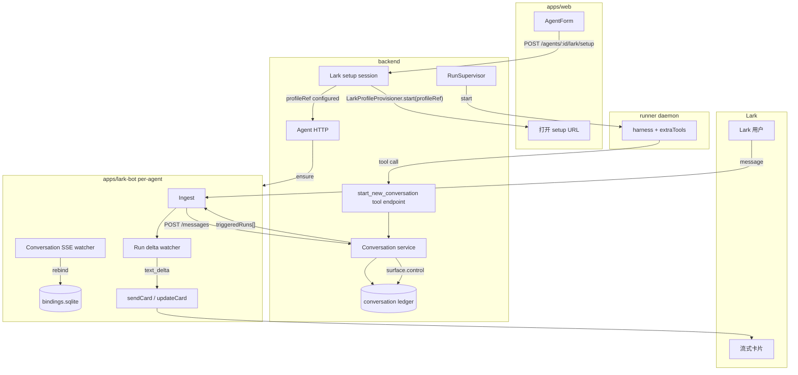
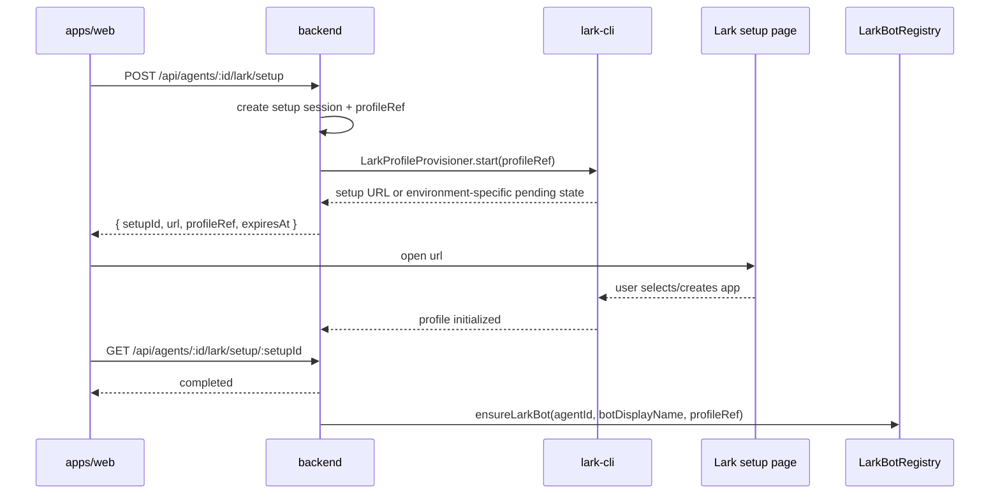
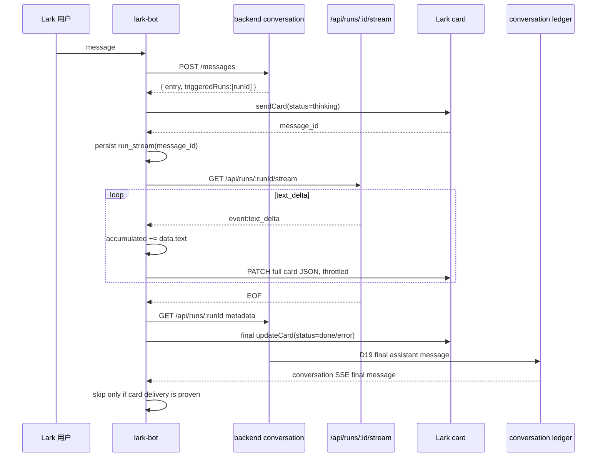
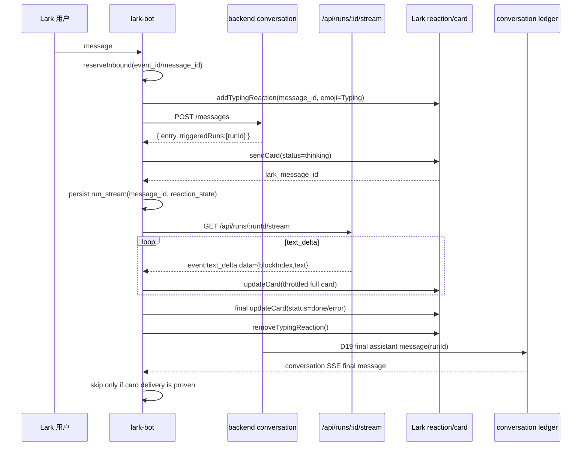

# M15.1 — Lark Bot Polish：Setup Link、流式卡片、新对话工具

> 根因：M15 已经把 Lark 作为第四个 surface 接到中立 conversation ledger：入站统一 `POST /messages`，出站订 ledger SSE 推回 Lark。但要让它成为可交付的日常入口，还差三件基础能力：**配置不应让用户手填 secret**，**长任务不能让 Lark 端静默等待最终文本**，**p2p 不能永远复用同一个上下文**。本 spec 在不改变 ledger 事实源的前提下，把 Lark Bot 从"能通"推进到"可用"。
>
> 关联：[M15 Lark Bot](./2026-06-13-m15-lark-bot.md) · [18-im-adapter](../../architecture/18-im-adapter.md) · [15-conversation](../../architecture/15-conversation.md) · [12-backend](../../architecture/12-backend.md) · [16-resident-runner](../../architecture/16-resident-runner.md) · [13-agent-spec](../../architecture/13-agent-spec.md)。
>
> 基线 commit：`next` HEAD（含 M15 Lark Bot scaffold、lark-bot sqlite binding、SSE watcher、profile init、agent lark orchestration、harness `extraTools` 注入口）。前置：M15 的入站幂等、出站水位、per-agent bot registry、`botDisplayName` group 触发语义已经落地或按 M15 修复清单完成。

---

## 一、问题：Lark surface 还缺三段用户体验闭环

### 1.1 配置问题：app secret 不该经过前端

M15 的配置路径是用户在 web 表单里填 `appId/appSecret`，backend 用 stdin 调 `lark-cli config init --app-secret-stdin` 写入 profile。这个设计已避免 secret 入库和 argv 泄漏，但仍有一个产品问题：**用户需要先去飞书开发者后台创建 app，再把 secret 复制回前端**。

M15.1 的产品形态是由 backend 创建一个 profile setup session，调用 `LarkProfileProvisioner.start(profileRef)`，返回 setup URL 给前端，让用户在浏览器里选择或创建 Lark app。目标实现环境中 `lark-cli config init --new` 可生成 setup URL，因此默认 provisioner 是 `cli_setup`；如果托管 runtime 禁用本地 config init，再切到 `mira_managed` 或 M15 的后端非交互初始化回退。

### 1.2 渲染问题：长任务期间 Lark 端没有进度

M15 出站只订 conversation ledger。ledger 的 assistant 消息由 D19 在 run 完成后一次性写回，所以 Lark 端只能收到最终文本。web 端能看 run stream，Lark 端却静默，这会让长任务看起来像"机器人没响应"。

M15.1 增加 run-level delta watcher：消息触发 run 后，lark-bot 先对原消息加一个短生命周期的 `Typing` reaction 作为即时反馈，再发占位卡片，并订阅 `/api/runs/:runId/stream`，把文本增量聚合成完整卡片内容并 PATCH 更新。飞书卡片 JSON 2.0 支持 `streaming_mode` 和 `streaming_config`，服务端每次提交完整卡片，客户端负责流式展示节奏[[流式更新卡片](https://open.larkoffice.com/document/uAjLw4CM/ukzMukzMukzM/feishu-cards/streaming-updates-openapi-overview)]。

### 1.3 上下文问题：p2p 永远只有一个 conversation

M15 的 p2p 绑定是 `larkChatId → conversationId`。这保证同一个 Lark 单聊能持续上下文，但也意味着用户换话题后旧上下文会一直污染后续 run。

M15.1 不让 lark-bot 自己猜用户意图并直接改绑定，而是把"开启新对话"做成 backend tool 注入 harness。agent 在理解用户自然语言意图后调用 `start_new_conversation`，backend 创建新 conversation、复制成员、写入 `surface.control` ledger entry。lark-bot 消费该 control entry 后，才把本地 `chat_binding` rebind 到新 conversation。

---

## 二、目标形态



| 关注点 | M15 | M15.1 |
|---|---|---|
| Lark profile 配置 | 前端传 `appId/appSecret`，backend 非交互写入 profile | backend 生成 setup URL，用户在 Lark 流程里选择/创建 app，前端不接触 secret |
| Lark 回复形态 | run 完成后发最终纯文本 | 先发占位卡片，run 中持续 PATCH 更新，run 完成后固化最终卡片 |
| run 与 Lark 消息关联 | lark-bot 只知道 ledger seq，不知道 runId | `POST /messages` 返回 `triggeredRuns[]`，lark-bot 可订 `/api/runs/:runId/stream` |
| p2p 上下文 | 一个 Lark 单聊永久绑定一个 conversation | agent 可调用 tool 创建新 conversation，lark-bot 通过 `surface.control` rebind |
| backend 与 Lark 边界 | backend 不解析 Lark 消息 | 继续保持；backend 只暴露 setup / conversation tool / public stream 契约 |
| 复用已有能力 | M15 新建 lark-bot | 复用 `extraTools`、conversation service、ledger SSE、run SSE，不重复造 runner 或 checkpointer |

---

## 三点五、真实探索结论（2026-06-14）

本节是 M15.1 落地前的 spike 结论，后续实现必须以这里为准，而不是按理想 API 猜测。注意：不同 Mira / 本地 runtime 可能安装不同 `lark-cli`，因此实现不能只按版本号分支，必须在启动时做 capability probe，并把探测结果写入 setup/card transport 日志。

1. **目标实现环境的 `lark-cli` 是 1.0.53，支持 M15.1 需要的 shortcut 行为**。`lark-cli im +messages-send --help` 可正常返回 flags，包含 `--msg-type interactive`、`--content`、`--as bot`、`--idempotency-key`。M15.1 可以把 1.0.53 作为默认实现路径，但仍要保留 capability probe，避免托管 runtime 或旧镜像回退到 1.0.26 时静默坏掉。
2. **`lark-cli config init --new` 在目标实现环境可用**。它会输出 QR code / setup URL，并等待用户在浏览器中选择或创建 app。因此 Part A 默认走 `cli_setup` provisioner：backend 启动 setup session，解析 setup URL 返回给前端，完成后只保存 profile 引用。
3. **Mira 托管 runtime 仍可能禁用本地 config init**。如果 capability probe 返回 `config is not supported in Mira environment` 或无法生成 setup URL，才切到 `mira_managed` provisioner 或 M15 的 `legacy_secret_stdin` 回退。这个回退是环境适配，不是默认产品路径。
4. **interactive card send 和 message PATCH 的 bot 身份 dry-run 已验证**。`sendCard` 使用 `lark-cli im +messages-send --msg-type interactive --content ... --as bot --idempotency-key ...`；`updateCard` 使用通用 `lark-cli api PATCH /open-apis/im/v1/messages/<message_id> --as bot --params ... --data ...`。dry-run 能显示 `{ "as": "bot" }`，说明 strict-mode user 拦截不是目标环境事实。
5. **`updateCard` 仍优先封装通用 API PATCH，而不是依赖 typed schema shortcut**。即使 1.0.53 的 shortcut/help 可用，通用 PATCH 的请求形态更接近 OpenAPI 原语，也更容易在 dry-run 中 fixture 化。
6. **backend 已存在 `/api/runs/:id/stream`，不是 `/api/runs/:id/events`**。`/events` 是 EventLog SSE；`/stream` 是 ephemeral delta fan-out，来自 `RunSupervisor.subscribeDelta()`，不会落 EventLog。Lark 流式卡片必须订 `/stream`，最终一致性仍靠 conversation ledger。
7. **当前 `/api/runs/:id/stream` 只发送 runner delta，不发送 `run_done` / `run_error` 事件**。`run_done` 时 supervisor 直接关闭 delta subscribers；EOF 只能说明流关闭，watcher 必须查询 run metadata 判断 succeeded / failed / cancelled。
8. **`text_delta` 的 SSE payload 是对象，不是裸字符串**。真实 data 形态是 `{ "blockIndex": number, "text": string }`；parser 必须从 `data.text` 提取归一化文本，并忽略无法识别的 payload。
9. **当前 `sendMessage()` 不返回 Lark message_id**。卡片流式必须新增 sender，使用 `--format json` 解析 stdout 中的 message id，并持久化 `lark_message_id`；字段路径必须用 fixture profile 做一次真实验证后写测试。
10. **OpenClaw 的 Feishu 插件采用"Typing reaction lifecycle + streaming card"，不是固定 ack 表情**。它在回复生命周期开始时给被回复消息添加 `Typing` reaction，结束或 idle 时删除；streaming card 则先创建 CardKit card，再把 card_id 作为 interactive message 发出，后续通过 CardKit element update 推送增量。因此 M15.1 应把"收到消息后的即时反馈"建模为可清理、可失败、不影响主链路的 lifecycle，而不是一次性静态 emoji。

结论：M15.1 的默认路径是 **CLI setup + bot interactive card send + bot PATCH update + Typing reaction lifecycle**。所有外部 CLI 能力都必须先 probe，再选择实现；probe 失败时降级，不把失败扩散到 ingest/run/ledger 主链路。

---

## 三、不变量

1. **ledger 仍是唯一事实源**：入站 Lark 消息、agent 最终回复、surface control 都写入 conversation ledger；web 和 Lark 对历史的观察最终一致。
2. **backend 不认识 Lark chat 绑定**：`larkChatId → conversationId` 仍只在 lark-bot 本地 sqlite；backend 不存 `chat_id`。
3. **setup 只产出 profile 引用**：DB 保存 `larkProfileRef`、setup 状态和非敏感展示字段；app secret 不进前端、不进 DB、不进日志。
4. **流式卡片是运行时投影，不替代 ledger**：run delta 只驱动卡片更新；run 完成后的 D19 assistant message 仍要落 ledger。
5. **新对话由 agent tool 发起，不由 lark-bot 文本规则发起**：自然语言理解属于 agent；lark-bot 只执行 control entry。
6. **tool 只在 Lark main run 中注入**：web/CLI 普通 run 不应看到 Lark 专属的 rebind 语义；reflect run 必须显式 strip `surfaceContext`，不能继承父 run 的 Lark tool。
7. **所有跨进程写操作都要幂等**：setup session 可重试；card send/update 有 idempotency key 或本地状态；conversation rebind 可重复消费同一 control entry。

---

## 四、Part A — Profile Setup Link

### 4.1 用户流程



### 4.2 HTTP 契约

```http
POST /api/agents/:id/lark/setup
Content-Type: application/json

{
  "botDisplayName": "CodingBot",
  "brand": "feishu"
}
```

```jsonc
{
  "setupId": "setup_01J...",
  "profileRef": "agent:agent_123",
  "url": "https://...",
  "status": "pending",
  "expiresAt": 1781403664000
}
```

```http
GET /api/agents/:id/lark/setup/:setupId
```

```jsonc
{
  "setupId": "setup_01J...",
  "profileRef": "agent:agent_123",
  "status": "completed",
  "error": null
}
```

```http
DELETE /api/agents/:id/lark/setup/:setupId
```

取消未完成 setup。若 lark-cli 子进程仍在等待，应 SIGTERM；不得 SIGKILL，避免跳过 CLI 自身清理流程。

### 4.3 数据结构

```ts
export interface LarkProfileSetupSession {
  setupId: string;
  agentId: string;
  profileRef: string;
  botDisplayName: string | null;
  brand: "feishu" | "lark";
  status: "pending" | "completed" | "failed" | "expired" | "cancelled";
  url: string | null;
  error: string | null;
  createdAt: number;
  updatedAt: number;
  expiresAt: number;
}
```

M15.1 先允许 setup session 存内存态；但 agent 最终的 `larkProfileRef` / `larkBotDisplayName` 必须进 agent store。若 backend 重启导致 pending session 丢失，UI 可重新创建 setup session，不能留下半启用 agent。

### 4.4 Provisioner 封装

`lark-cli config init --new` 是默认实现路径，但不要在业务代码里散落 CLI 调用。setup 能力必须通过 provisioner 抽象隔离，启动时先 probe 当前 runtime 是否支持 CLI setup；不支持时再切到 Mira 托管 provisioner 或 legacy stdin 回退。

```ts
export type LarkProfileProvisionerKind = "cli_setup" | "mira_managed" | "legacy_secret_stdin";

export interface LarkProfileSetupResult {
  setupId: string;
  profileRef: string;
  url: string;
  waitForCompletion: Promise<void>;
  cancel(): Promise<void>;
}

export interface LarkProfileProvisioner {
  kind: LarkProfileProvisionerKind;
  start(input: {
    agentId: string;
    profileRef: string;
    brand: "feishu" | "lark";
    timeoutMs: number;
  }): Promise<LarkProfileSetupResult>;
  probe(profileRef: string): Promise<"ready" | "not_ready" | "invalid">;
}
```

`lark-cli` 是 Lark 传输层与 profile 管理入口；OpenClaw 的 Feishu extension 也把 channel entry、secrets、runtime 拆成独立 contract，而不是把凭据、运行时和业务逻辑混在一个模块里[[channel-entry.ts](https://raw.githubusercontent.com/openclaw/openclaw/main/extensions/feishu/channel-entry.ts)]。M15.1 采用同样的边界：setup 只负责 profile，lark-bot runtime 只负责消息面。

### 4.5 安全约束

- setup URL 可以返回给当前登录用户，但不得写入长期日志。
- `profileRef` 由 server 生成，不允许前端传入任意 profile 名，防止 profile hijack。
- stderr/stdout 进入日志前必须 scrub：URL token、secret、authorization header、app secret-like 字符串。
- 若 setup 失败，错误响应只返回类别：`timeout` / `cancelled` / `cli_not_found` / `permission_denied` / `unknown`，不要透传原始 stderr。
- `PATCH /agents/:id` 中不再接受 `profileRef` 字段；启用 Lark 必须来自成功 setup session 或既有后端 profile。

---

## 五、Part B — 飞书卡片流式渲染

### 5.1 真实边界：订 `/stream`，不是订 `/events`

M15.1 的卡片流式不能订 `/api/runs/:runId/events`。当前 backend 有两个 run 相关 SSE：

| Endpoint | 来源 | 是否回放历史 | M15.1 用途 |
|---|---|---:|---|
| `/api/runs/:runId/events` | EventLog | 是 | 审计、run 生命周期、非实时投影 |
| `/api/runs/:runId/stream` | `RunSupervisor.subscribeDelta()` ephemeral fan-out | 否 | Lark 卡片实时 text delta |

因此 Lark 卡片 watcher 的输入是：

```http
GET /api/runs/:runId/stream
Accept: text/event-stream
```

当前 supervisor 对 runner delta 的处理是：若 `ev.type && ev.payload`，就 `#pushEphemeral(runId, ev.type, ev.payload)`。SSE 线上格式是标准 event/data 分离：

```text
event: text_delta
data: {"blockIndex":0,"text":"hello"}
```

因此 watcher 需要两层解析：先解析 SSE frame，得到 `{ eventName, dataText }`；再 `JSON.parse(dataText)`，交给 event parser 归一化。`/stream` 当前不会发送 `run_done` 或 `run_error`，这些只能由 EOF 后查询 run metadata 派生。

```ts
export interface RawRunTextDeltaPayload {
  blockIndex: number;
  text: string;
}

export type RunStreamEvent =
  | { type: "text_delta"; runId: string; blockIndex: number; text: string }
  | { type: "unknown"; runId: string; rawType: string; raw: unknown };

export function parseSseFrames(chunk: string): Array<{
  eventName: string;
  dataText: string;
}>;

export function parseRunStreamEvent(input: {
  eventName: string;
  data: unknown;
  runId: string;
}): RunStreamEvent;
```

`parseRunStreamEvent` 只接受 `eventName === "text_delta"` 且 `data` 形如 `{ blockIndex: number, text: string }` 的 payload；无法识别时返回 `unknown` 并忽略，不能让卡片 watcher 因新增 event 类型崩溃。

### 5.2 原则：卡片是运行时投影，ledger 是最终兜底



安全阀：**只有 `sendCard` 成功、`lark_message_id` 已持久化、且 done/error final update 成功后，conversation SSE watcher 才允许按 `runId` 跳过最终文本。其他任何情况都必须走 M15 纯文本 fallback。**

### 5.3 即时反馈：Typing Reaction Lifecycle

成熟 Lark bot 不应该等到第一段模型输出才让用户看到反馈。OpenClaw 的 Feishu 插件验证了一个更稳的模式：**reply lifecycle 启动时加 `Typing` reaction，流式卡片负责承载正文，reply idle/完成时清理 reaction**。这不是业务回复，也不是最终状态，只是"已收到，正在处理"的短生命周期投影。

M15.1 采用同一原则，但保持可降级：reaction 失败不阻断 ingest，不阻断 run，不阻断最终文本 fallback。

```ts
export interface LarkTypingReactionState {
  messageId: string;
  reactionId: string | null;
  startedAt: number;
  status: "none" | "active" | "removed" | "failed";
  lastError?: string;
}

export interface LarkFeedbackReactionTransport {
  addTypingReaction(input: {
    profile: string;
    messageId: string;
  }): Promise<LarkTypingReactionState>;

  removeTypingReaction(input: {
    profile: string;
    state: LarkTypingReactionState;
  }): Promise<void>;
}
```

命令形态优先用通用 API dry-run/真实验证后固化，不依赖 shortcut：

```bash
# add
lark-cli --profile <profile> api POST /open-apis/im/v1/messages/<message_id>/reactions \
  --data '{"reaction_type":{"emoji_type":"Typing"}}'

# remove
lark-cli --profile <profile> api DELETE /open-apis/im/v1/messages/<message_id>/reactions/<reaction_id>
```

生命周期规则：

1. **添加时机**：`reserveInbound` 成功且判定会触发 run 后，对用户原始 Lark message 添加 `Typing` reaction；如果消息是重放、过旧或没有 `message_id`，跳过。
2. **不重复添加**：同一 inbound message 已有 active reaction 时不再 add，避免重复 push notification。
3. **清理时机**：final card update 成功、run error fallback、card send/update fallback、进程 idle cleanup 时都尝试 remove。
4. **失败语义**：add/remove 失败只记录本地状态；除 rate limit / quota 类错误需要短期 backoff 外，不影响主链路。
5. **事件回环**：lark-bot 如果订阅 reaction event，必须忽略 bot 自己发出的 reaction，且必须忽略 `Typing` reaction，避免把内部反馈重新路由成用户消息。
6. **验收语义**：用户看到的第一反馈可以是 `Typing` reaction 或占位卡片；2 秒内至少出现其中一个。reaction 不是最终回复，不能作为跳过 ledger final text 的依据。

更新后的主链路：



### 5.4 Backend：`POST /messages` 返回 triggered runs

当前 lark-bot 需要知道哪个 run 是由这条入站消息触发的。M15.1 扩展 `POST /api/conversations/:id/messages` 响应：

```ts
export interface PostMessageResponse {
  entry: LedgerRow;
  seq: number;
  triggeredRuns: Array<{
    agentMemberId: string;
    runId: string;
  }>;
}

function deriveThreadId(conversationId: string, agentMemberId: string): string {
  return `${conversationId}:${agentMemberId}`;
}
```

兼容要求：旧调用方如果只读取 `{ seq }` 不应破坏。当前 backend 已返回 `{ agentMemberId, runId }`；`threadId` 不放进响应，由 lark-bot 如有需要按 `conversationId:agentMemberId` 推导。

### 5.5 Card transport contract

`sendCard` 不能复用当前 `sendMessage()`，因为当前 `sendMessage()` 只返回 `{ ok, error }`，没有 Lark `message_id`。M15.1 新增独立 transport：

```ts
export interface CardSendOk {
  ok: true;
  messageId: string;
  raw?: unknown;
}

export interface CardSendErr {
  ok: false;
  error: string;
  retryable: boolean;
}

export interface LarkCardTransport {
  sendCard(input: {
    profile: string;
    chatId: string;
    card: Record<string, unknown>;
    idempotencyKey: string;
  }): Promise<CardSendOk | CardSendErr>;

  updateCard(input: {
    profile: string;
    messageId: string;
    card: Record<string, unknown>;
  }): Promise<{ ok: true; raw?: unknown } | CardSendErr>;
}
```

发送卡片命令形态继续按既有调研文档：

```bash
lark-cli --profile <profile> im +messages-send \
  --chat-id <oc_xxx> \
  --msg-type interactive \
  --content '<full card JSON>' \
  --as bot \
  --idempotency-key '<conversationId>:<runId>:card' \
  --format json
```

更新卡片优先使用通用 API PATCH，不依赖 typed schema shortcut，便于 dry-run 和 fixture 化：

```bash
lark-cli --profile <profile> api PATCH /open-apis/im/v1/messages/<message_id> \
  --as bot \
  --params '{"message_id_type":"open_message_id"}' \
  --data '{"content":"<full card JSON string>"}'
```

实现 gate：`sendCard` 和 `updateCard` 的 bot 身份 dry-run 已验证；正式实现仍要用 fixture-test profile 验证 `--format json` stdout 中 message id 的字段路径，并把该 JSON 作为单测 fixture。若真实发送或更新失败，M15.1 降级为"最终卡片 + 纯文本 fallback"，不阻塞 setup 和 new conversation。

### 5.6 Card render contract

卡片 renderer 接受稳定模型，输出完整 Card JSON 2.0：

```ts
export type LarkRunCardStatus =
  | "thinking"
  | "streaming"
  | "done"
  | "error"
  | "fallback_text";

export interface LarkRunCardModel {
  runId: string;
  conversationId: string;
  title: string;
  status: LarkRunCardStatus;
  content: string;
  footer?: string;
  error?: string;
  updatedAt: number;
}

export interface LarkRunCardRenderOptions {
  maxMarkdownChars: number;
  maxSummaryChars: number;
  includeDebugRunId: boolean;
}

export function renderLarkRunCard(
  model: LarkRunCardModel,
  options?: Partial<LarkRunCardRenderOptions>,
): Record<string, unknown>;
```

状态映射：

| 状态 | Header | Markdown | Summary | 允许跳过 final ledger 文本 |
|---|---|---|---|---:|
| `thinking` | `Mira 正在思考` | `_正在思考..._` | `生成中...` | 否 |
| `streaming` | `Mira 正在回复` | accumulated markdown | `生成中...` | 否 |
| `done` | `Mira 已完成` | final markdown | `已完成` | 是，但必须满足 5.2 安全阀 |
| `error` | `Mira 回复中断` | partial markdown + error summary | `回复中断` | 否 |
| `fallback_text` | 不发卡片 | 不发卡片 | 不发卡片 | 否 |

最小模板：

```json
{
  "schema": "2.0",
  "config": {
    "streaming_mode": true,
    "streaming_config": {
      "print_frequency_ms": { "default": 50 },
      "print_step": { "default": 3 },
      "print_strategy": "fast"
    },
    "summary": { "content": "生成中..." },
    "update_multi": true,
    "width_mode": "fill",
    "enable_forward": true
  },
  "header": {
    "title": { "tag": "plain_text", "content": "Mira 正在回复" },
    "template": "blue"
  },
  "body": {
    "direction": "vertical",
    "padding": "12px 12px 12px 12px",
    "vertical_spacing": "8px",
    "elements": [
      {
        "tag": "markdown",
        "element_id": "agent_output",
        "content": "_正在思考..._"
      },
      {
        "tag": "hr",
        "element_id": "divider_1"
      },
      {
        "tag": "plain_text",
        "element_id": "run_status",
        "content": "生成中"
      }
    ]
  }
}
```

卡片 JSON 2.0 的 `update_multi` 只能为 `true`，且正文元素的 `element_id` 必须在同一卡片内唯一、仅含字母/数字/下划线、以字母开头、不超过 20 字符；一张卡片最多 200 个元素或组件[[卡片 JSON 2.0 结构](https://open.larkoffice.com/document/uAjLw4CM/ukzMukzMukzM/feishu-cards/card-json-v2-structure)]。

### 5.7 Markdown normalize / truncate

agent 输出不能直接塞进卡片。renderer 必须先 normalize：

```ts
export interface NormalizedMarkdown {
  markdown: string;
  truncated: boolean;
  originalChars: number;
  renderedChars: number;
}

export function normalizeForLarkMarkdown(input: string): NormalizedMarkdown;
```

规则：

1. 统一换行为 `\n`。
2. 如果 fenced code block 未闭合，补一个 closing fence。
3. 单行超过 `MAX_CARD_LINE_CHARS` 时硬截断并追加 `…`。
4. 总长度超过 `MAX_CARD_MARKDOWN_CHARS` 时截断，并追加：`\n\n内容过长，已展示前 N 字。完整结果请在 Web 端查看。`
5. 图片 markdown 暂时转为普通链接，避免卡片图片上传链路成为 M15.1 阻塞项。
6. 对卡片 markdown 中的 `&`、`<`、`>` 做 HTML entity escape，避免被卡片 markdown/parser 误解释。

默认值：

```ts
const MAX_CARD_MARKDOWN_CHARS = 12000;
const MAX_CARD_LINE_CHARS = 2000;
const MAX_CARD_ELEMENTS = 8;
```

### 5.8 Run stream 本地状态

```sql
CREATE TABLE IF NOT EXISTS run_stream (
  run_id              TEXT PRIMARY KEY,
  lark_chat_id        TEXT NOT NULL,
  conversation_id     TEXT NOT NULL,
  lark_message_id     TEXT,
  source_message_id   TEXT,
  typing_reaction_id  TEXT,
  typing_status       TEXT NOT NULL DEFAULT 'none', -- none | active | removed | failed
  status              TEXT NOT NULL DEFAULT 'starting', -- starting | streaming | done | error | fallback_text
  accumulated         TEXT NOT NULL DEFAULT '',
  card_send_failed    INTEGER NOT NULL DEFAULT 0,
  card_update_failed  INTEGER NOT NULL DEFAULT 0,
  final_ledger_seq    INTEGER,
  last_error          TEXT,
  created_at          INTEGER NOT NULL,
  updated_at          INTEGER NOT NULL
);
```

去重条件必须是：

```ts
function canSkipFinalLedgerText(run: RunStreamRecord): boolean {
  return run.status === "done"
    && !!run.larkMessageId
    && run.cardSendFailed === 0
    && run.cardUpdateFailed === 0;
}
```

### 5.9 Watcher 状态机与节流

```ts
const FLUSH_INTERVAL_MS = 150;
const MAX_BUFFER_CHARS_BEFORE_FLUSH = 120;

async function onTextDelta(delta: { blockIndex: number; text: string }) {
  accumulated += delta.text;
  pendingChars += delta.text.length;
  persistAccumulated(runId, accumulated);

  if (Date.now() - lastFlushAt < FLUSH_INTERVAL_MS && pendingChars < MAX_BUFFER_CHARS_BEFORE_FLUSH) {
    return;
  }

  const card = renderLarkRunCard({ status: "streaming", content: accumulated, ...base });
  const result = await transport.updateCard({ profile, messageId, card });
  if (!result.ok) markCardUpdateFailed(runId, result.error);
  lastFlushAt = Date.now();
  pendingChars = 0;
}
```

EOF 不是 done。由于 `/stream` 是 ephemeral fan-out，连接结束只能说明 stream 断了，watcher 应检查 run metadata：

```ts
const meta = await getRun(runId);
if (meta.status === "succeeded") finalUpdate("done");
else if (meta.status === "failed" || meta.status === "cancelled") finalUpdate("error");
else reconnectOrFallback();
```

### 5.10 最终消息去重

D19 最终 assistant message 仍会进入 ledger。M15.1 增加可选 run 关联字段：

```ts
export interface AssistantMessageContent {
  text: string;
  runId?: string;
}
```

D19 / `onRunComplete` 写 final assistant message 时必须带 `runId`。当前 backend 直接 `JSON.stringify(content)` 写 ledger，没有注入 runId；M15.1 必须在 assistant content 为对象或 block array 时包装/扩展出 runId，再写入 ledger。conversation SSE watcher 只在 `canSkipFinalLedgerText(run)` 为真时跳过，否则必须发送最终文本。

---

## 六、Part C — P2P 自然语言开启新对话

### 6.1 为什么做成 tool

"新开一个话题""重置上下文""刚才那段忘掉"是自然语言，不是稳定命令。把它写成 lark-bot 的正则会误伤正常聊天；把它写进 prompt 又无法真正修改 binding。正确边界是：agent 负责理解意图，backend tool 负责执行状态迁移，lark-bot 负责消费 surface control。

### 6.2 Backend endpoint

```http
POST /api/conversations/:id/start-new
Content-Type: application/json

{
  "reason": "用户要求重置上下文",
  "title": "新的对话",
  "requestedByRunId": "run_xxx",
  "idempotencyKey": "run_xxx:start_new_conversation"
}
```

响应：

```jsonc
{
  "oldConversationId": "conv_old",
  "newConversationId": "conv_new",
  "controlSeq": 456
}
```

服务端语义：

1. 校验调用方 run 属于旧 conversation。
2. 创建 new conversation。
3. 复制旧 conversation 中的 AgentMember 与当前 Lark HumanMember；不要复制历史 ledger。
4. 在旧 conversation 写入 `surface.control` entry。
5. 返回 new conversation id。

幂等要求：同一个 `idempotencyKey` 重试必须返回同一个 `newConversationId/controlSeq`，不能创建多个新 conversation。MVP 可先查旧 conversation ledger 中是否已有相同 `requestedByRunId + type` 的 `surface.control`；后续再补独立 idempotency 表。

### 6.3 `surface.control` entry

```json
{
  "type": "lark.start_new_conversation",
  "oldConversationId": "conv_old",
  "newConversationId": "conv_new",
  "reason": "用户要求重置上下文",
  "requestedByRunId": "run_xxx",
  "idempotencyKey": "run_xxx:start_new_conversation",
  "effectiveAfterSeq": 456
}
```

`surface.control` 是 ledger 事件，不是 chat message。web 可以选择展示系统提示，lark-bot 必须消费它完成 rebind。

Backend 类型要求：

```ts
export type LedgerKind = "message" | "member.joined" | "member.left" | "todo" | "surface.control";
```

`surface.control` 与 `todo` 一样不得投影进 agent checkpointer。`broadcastMessage()` 必须显式过滤它，否则 control JSON 会污染下一轮 agent 上下文。

### 6.4 Harness tool 注入

`createGenericAgent` 已支持 `extraTools`，但当前 runner daemon 创建 agent 时尚未传入该参数。M15.1 需要打通三段：`HostToRunner.start.spec` 携带 `surfaceContext`，`buildAgentSpecV2` 在 Lark 触发 run 时写入该字段，runner daemon 根据该字段创建 `extraTools` 并传给 `createGenericAgent`。

```ts
export interface SurfaceContext {
  surface: "lark" | "web" | "cli";
  conversationId: string;
  runId: string;
  capabilities: Array<"start_new_conversation">;
}
```

runner daemon 创建 agent 时：

```ts
const extraTools = spec.mode !== "reflect" && spec.surfaceContext?.surface === "lark"
  && spec.surfaceContext.capabilities.includes("start_new_conversation")
  ? [createStartNewConversationTool({
      backendUrl,
      backendAuthToken,
      conversationId: spec.surfaceContext.conversationId,
      runId: spec.surfaceContext.runId,
    })]
  : [];

const agent = await createGenericAgent({
  workspace,
  model,
  threadId: spec.threadId,
  checkpointer,
  extraTools,
});
```

Reflect run 修正：daemon `#fireReflect` 当前会 `{ ...parent.spec, mode: "reflect" }`，因此必须在构造 `reflectSpec` 后 `delete reflectSpec.surfaceContext`，或在 tool 注入条件中硬性要求 `spec.mode !== "reflect"`。

Tool 定义：

```ts
export function createStartNewConversationTool(input: {
  backendUrl: string;
  backendAuthToken: string | null;
  conversationId: string;
  runId: string;
}): Tool {
  return {
    name: "start_new_conversation",
    description:
      "Start a fresh backend conversation for the current external chat when the user asks to reset context, start a new topic, or open a new conversation.",
    inputSchema: {
      type: "object",
      properties: {
        reason: { type: "string", description: "Why the user wants a fresh conversation." },
        title: { type: "string", description: "Optional short title for the new conversation." },
      },
      required: ["reason"],
    },
    async execute(args) {
      const resp = await fetch(`${input.backendUrl}/api/conversations/${input.conversationId}/start-new`, {
        method: "POST",
        headers: {
          "Content-Type": "application/json",
          ...(input.backendAuthToken ? { "x-auth-token": input.backendAuthToken } : {}),
        },
        body: JSON.stringify({
          reason: args.reason,
          title: args.title,
          requestedByRunId: input.runId,
          idempotencyKey: `${input.runId}:start_new_conversation`,
        }),
      });
      if (!resp.ok) throw new Error(`start_new_conversation failed: HTTP ${resp.status}`);
      return await resp.json();
    },
  };
}
```

### 6.5 Lark Bot rebind

```ts
export function rebindChatConversation(
  db: Database,
  larkChatId: string,
  oldConversationId: string,
  newConversationId: string,
): boolean {
  const result = db.run(
    "UPDATE chat_binding SET conversation_id = ?, pushed_seq = 0 WHERE lark_chat_id = ? AND conversation_id = ?",
    [newConversationId, larkChatId, oldConversationId],
  );
  return result.changes > 0;
}
```

Watcher 处理：

```ts
if (entry.kind === "surface.control") {
  const control = parseControl(entry.content);
  if (control.type === "lark.start_new_conversation") {
    db.transaction(() => {
      rebindChatConversation(db, chatId, control.oldConversationId, control.newConversationId);
      markPushed(control.oldConversationId, entry.seq);
    })();
    closeWatcher(control.oldConversationId);
    watch(control.newConversationId, 0);
    sendToLarkOnly(profile, chatId, "已开启新的对话。", `${control.newConversationId}:system:new-chat`);
  }
}
```

确认消息只是 Lark UX sugar，不能再通过 `POST /messages` 写进新 conversation；否则 bot 会把自己的系统提示当成用户上下文。实现上需要区分 `sendToLarkOnly` 与 conversation ingest 路径。

---

## 七、文件改动清单

| 文件 | 改动 |
|---|---|
| `apps/backend/src/features/lark-bot/setup.ts` | 新增 setup session manager：调用 `LarkProfileProvisioner.start(profileRef)`、解析 setup URL 或托管 pending state、管理 pending/completed/failed/cancelled |
| `apps/backend/src/features/lark-bot/profile.ts` | 保留 M15 非交互 init；新增 setup link flow；统一 stderr/stdout scrub |
| `apps/backend/src/features/agent/http.ts` | 新增 `POST/GET/DELETE /api/agents/:id/lark/setup`；移除前端可写 `profileRef`；返回 setup 状态与 lark status |
| `apps/backend/src/features/agent/with-lark-orchestration.ts` | setup completed 后写入 agent lark profile 并 ensure bot；update enabled=true 时支持既有 profile 重启 |
| `apps/web/src/components/AgentForm.tsx` | Lark 区块改为"创建/继续 setup"按钮 + botDisplayName；不再要求用户粘贴 appSecret |
| `apps/web/src/lib/api.ts` | 增加 Lark setup API client 与类型 |
| `apps/backend/src/features/conversation/service.ts` | `postMessage` 返回 `triggeredRuns[]`；新增 `startNewConversationForSurface`；`broadcastMessage` 过滤 `surface.control` |
| `apps/backend/src/features/conversation/http.ts` | `POST /messages` 响应扩展；新增 `POST /conversations/:id/start-new` |
| `apps/backend/src/features/conversation/ports.ts` | `LedgerKind` 新增 `surface.control` |
| `apps/backend/src/main.ts` | D19 final assistant message 注入 `runId` |
| `packages/runner-protocol/src/index.ts` | `HostToRunner.start.spec` 增加可选 `surfaceContext` |
| `packages/runner-daemon/src/runner-daemon.ts` | 根据 `surfaceContext` 注入 `start_new_conversation` extra tool；reflect run strip `surfaceContext` |
| `packages/runner-daemon/src/start-new-conversation-tool.ts` | 新增 backend tool 封装；只通过公开 HTTP 调 backend；若后续 harness 建立 tools 目录再下沉 |
| `apps/lark-bot/src/card-sender.ts` | `sendCard` / `updateCard`，封装 lark-cli interactive message 与 PATCH |
| `apps/lark-bot/src/feedback-reaction.ts` | `addTypingReaction` / `removeTypingReaction`，封装 `Typing` reaction lifecycle、rate-limit backoff 与 cleanup |
| `apps/lark-bot/src/card-renderer.ts` | `buildStreamingCard`，负责状态、markdown、summary、streaming config |
| `apps/lark-bot/src/run-delta-watcher.ts` | 解析 SSE frame；从 `{ blockIndex, text }` 提取 text；订 `/api/runs/:runId/stream`，聚合 text delta，节流更新卡片；EOF 后查 run metadata |
| `apps/lark-bot/src/bindings-sqlite.ts` | 新增 `run_stream` 表、typing reaction 状态、run stream CRUD、`rebindChatConversation` |
| `apps/lark-bot/src/ingest.ts` | reserve 成功后启动 typing reaction；读取 `triggeredRuns[]`，为每个 run 启动 card stream；失败 fallback 到 M15 文本路径并清理 reaction |
| `apps/lark-bot/src/sse-watcher.ts` | 处理 `surface.control`；按 `runId` 跳过已完成卡片对应的最终文本 |
| `apps/lark-bot/docs/card-streaming-research.md` | 回填 M15.1 spike 结果：PATCH CLI 形态、限流、body size、群聊 update_multi 行为 |

---

## 八、提交拆分

1. `feat(backend): lark profile setup sessions`
   - ✅ 新增 setup session manager 与 agent HTTP routes；`profileRef` server-generated；setup URL 可返回；pending/cancelled/failed/completed 状态可查询；stderr/stdout scrub；前端不再传 appSecret。

2. `feat(web): lark setup link workflow`
   - ✅ AgentForm 展示 setup 按钮、状态轮询、botDisplayName；用户点击 URL 完成 Lark app 选择/创建；完成后 agent lark status 变为 configured/running。

3. `feat(conversation): return triggered runs from postMessage`
   - ✅ `POST /messages` 返回 `triggeredRuns[]`；web/CLI 兼容旧调用；lark-bot ingest 可拿 runId；测试覆盖 p2p 触发、group 未 @ 不触发、group @ 触发。

4. `feat(lark-bot): immediate feedback and card renderer`
   - ✅ reserve 成功后添加 `Typing` reaction；card renderer 输出 Card JSON 2.0；markdown normalize/escape/truncate；reaction/card 失败都能 fallback。

5. `feat(lark-bot): run delta watcher for streaming cards`
   - ✅ 入站触发 run 后发占位卡片；订 run delta stream；聚合 text delta；150ms 左右节流更新；done/error 更新最终状态；清理 `Typing` reaction；`run_stream` 表可恢复/去重。

6. `feat(backend): start-new conversation surface control`
   - ✅ 新 endpoint 创建新 conversation、复制成员、写 `surface.control`；权限校验 run/conversation 归属；重复调用有幂等保护。

7. `feat(runner): inject start_new_conversation tool for lark runs`
   - ✅ runner protocol 带 `surfaceContext`；daemon 只在 Lark run 注入 tool；harness `extraTools` 不与默认 tools 重名；tool 只通过 backend HTTP 执行。

8. `feat(lark-bot): consume surface control and rebind p2p chat`
   - ✅ watcher 识别 `lark.start_new_conversation`；本地 binding rebind；关闭旧 watcher、启动新 watcher；给 Lark 用户发送"已开启新的对话"；同一 control entry 重放不重复 rebind。

9. `test(e2e): m15.1 lark polish flows`
   - ✅ setup flow、streaming card fallback、p2p new conversation、ledger/web history consistency、restart recovery 全覆盖；`turbo test/typecheck/build` 全绿。

---

## 九、验收清单

### Setup Link

- [ ] 前端不再要求用户输入 appSecret。
- [ ] `POST /agents/:id/lark/setup` 返回 setup URL、setupId、profileRef。
- [ ] setup URL 只给当前用户，不写长期日志。
- [ ] setup completed 后 agent store 保存 `larkProfileRef` 与 `botDisplayName`，并拉起对应 lark-bot。
- [ ] setup failed/cancelled/expired 后不会留下 enabled=true 但 profile 不可用的半配置状态。
- [ ] 前端不能传入或覆盖任意 `profileRef`。
- [ ] lark-cli 不存在、URL 解析失败、用户超时、权限失败均有明确状态与安全错误信息。

### Streaming Card

- [ ] Lark 入站触发 run 后，Lark 端 2 秒内出现 `Typing` reaction 或占位卡片。
- [ ] `Typing` reaction 在 run done/error/fallback/idle cleanup 后被移除；移除失败不影响最终回复。
- [ ] 重放消息、过旧消息、重复 inbound 不会重复添加 reaction 或制造 push notification flood。
- [ ] run 产生 `event:text_delta` + `data:{blockIndex,text}` 时，卡片持续更新，且更新频率被节流。
- [ ] `/stream` EOF 后 watcher 查询 run metadata；succeeded 才把卡片状态变为完成，内容为最终聚合文本。
- [ ] run error 后卡片状态变为错误，并保留可读错误摘要。
- [ ] card send/update 失败时，仍能通过 M15 ledger SSE 路径发送最终纯文本。
- [ ] D19 final message 进入 ledger 后，若对应 run 的卡片已完成，不再重复发送纯文本。
- [ ] lark-bot 重启后不会重复为已完成 run 发送最终文本；未完成 run 可安全 fallback。

### New Conversation Tool

- [ ] Lark p2p 用户说"开个新对话 / 重置上下文 / 换个话题重新开始"时，agent 可调用 `start_new_conversation`。
- [ ] backend 创建新 conversation，不复制旧历史，只复制必要成员。
- [ ] 旧 conversation 写入 `surface.control`，web 端可观察到控制事件。
- [ ] lark-bot 消费 control 后更新 `chat_binding`，后续同一 p2p 消息进入新 conversation。
- [ ] 重放同一 control entry 不会重复创建 watcher 或重复发送确认消息。
- [ ] 非 Lark run 不注入 Lark 专属 tool。

### 边界与安全

- [ ] backend 仍不存 `lark_chat_id`。
- [ ] app secret 不进入前端、DB、日志、错误响应、trace。
- [ ] 所有 lark-cli 参数都不把 secret 放入 argv。
- [ ] setup、card update、rebind 的错误不会破坏 ledger 最终一致性。
- [ ] `turbo test`、`turbo typecheck`、`turbo build` 全绿。

---

## 十、实施记录

（落地时回填：实际 commit、CLI spike 结果、偏离设计之处、限流数据、卡片 PATCH 命令形态。）
