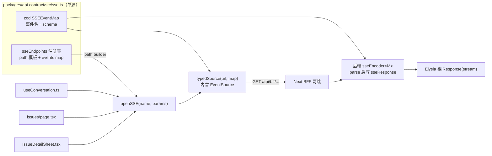

# API 类型收敛：手写约定 → Elysia + Eden Treaty 端到端类型

> 状态：实施 spec（含逐项 before/after、文件行号、产品动线、回归点、分阶段 PR）
> 基准 HEAD：`8f9e3312`（storage-convergence + zod normalization 已落地，3 DB→2 DB 完成，drizzle→$inferSelect 类型链已贯通）
> 所有 `file:line` 均基于 HEAD 工作树核验，非 dist/.turbo 残留。行号标注为 `±5 行` 精度（少量定义在 spec 写成后的 PR 中发生了位移）。
> 上游依据：[Elysia 端到端类型](https://elysiajs.com/eden/overview)（无代码生成、靠 TS 类型推导）+ [Eden Treaty Response](https://elysiajs.com/eden/treaty/response)（SSE/stream 被解释为 `AsyncGenerator`，可 `for await`）。本 spec 把「靠人脑维护的 API 约定」换成「编译器维护的单一真源」。

---

## 0. 出发点：三个 app 的 API 边界全靠人肉约定

HEAD 核验，当前 backend / web / lark-bot 之间**没有任何编译期契约**，全靠三处各写一遍、人工对齐：

1. **backend 出口**：`Bun.serve`（`server.ts:9-14`，`idleTimeout: 0`）+ **手搓正则路由**（`http/router.ts`，301 行 if 阶梯），每个 handler 自己 `parseJsonBody` + zod `safeParse`（如 `features/agent/http.ts:39-58` 的 `createSchema`）。**handler 返回 `Response`，返回体 shape 不进任何类型**——`json(row)` 里的 `row` 是什么字段，编译器一无所知。
2. **web 入口**：`api.ts` 把后端**每个返回体手抄一遍** TS interface——`ProjectRow`（`api.ts:5-13`）、`IssueRow`（`:18-28`）、`AgentRow`（`:142-159`）、`LarkConfig`（`:121-127`）、`RunMeta`（`:166-171`）等十余个，再用 `apiFetch<AgentRow>(...)`（`:194`）把字符串路径和手写泛型**靠人眼对齐**。后端改一个字段名，web 的 interface 不会报错，只会在运行时拿到 `undefined`。
3. **lark-bot 入口**：6 个出站 `fetch`（`bootstrap.ts:60`、`ingest.ts:96/121/165`、`diagnostics.ts:54`、`sse-watcher.ts:86`），返回体一律 `as` **裸断言**——`(await resp.json()) as { name: string; larkEnabled?: boolean }`（`bootstrap.ts:68`）、`as { conversationId: string }`（`ingest.ts:114`）、`as { seq: number; triggeredRuns: ... }`（`ingest.ts:185-188`）。`as` 是「我向编译器保证」，不是「编译器替我验证」——后端字段一改，这里静默错位。

**HEAD 实证——存储收敛后 web 已漂移**（`8f9e3312` 核验）：

| 漂移点 | backend（真源，storage-convergence 后） | web `api.ts`（手抄副本，未同步） |
|---|---|---|
| run→span 字段名 | `spanId`, `parentSpanId`（`service.ts:13-19`） | `runId` :442, `parentRunId` :447 — **仍用旧名** |
| heartbeat/transport 死字段 | 已删（`service.ts:1-3` 注释 "heartbeat/transport removed"） | `RunOpsDetail.attempts[].heartbeatAt` :471, `heartbeatAgeMs` :472, `transport` :475 — **残留** |
| `AgentRuntimeStatus` 死字段 | 无 `heartbeatTimeoutMs`（`service.ts:55-67`） | `heartbeatTimeoutMs` :490 — **残留** |
| `CancelRunResult` 死变体 | 2 个变体：`abort_sent` / `already_terminal`（`service.ts:69-72`） | 3 个变体，含 `detached_waiting_reaper` :528 — **残留** |
| `RecoverRunResult` 死变体 | 3 个变体（`service.ts:74-77`） | 含 `heartbeat_fresh_but_transport_detached` :534 — **残留** |

**编译器全程沉默。** 因为两边各自手写 interface，tsc 认为它们是两个独立类型——这正是本 spec 要消灭的问题。

**一句话**：API 契约的真源现在是「三份手写副本 + 程序员的记忆」。任何后端改动都要靠人记得去改另外两处，漏一处就是一个运行时 bug。这正是 [storage-convergence](./2026-06-27-storage-convergence.md) 收敛存储真源之后，**最后一处仍靠约定支撑的真源**。

本 spec 把这份契约收敛成**单一编译期真源 = Elysia app 的类型**：backend 用 Elysia 定义路由 + TypeBox 校验 schema，导出 `export type App = typeof app`；web/lark-bot 经 Eden Treaty `treaty<App>()` 直接拿到端到端推导出的请求/响应类型，**删掉所有手抄 interface 和 `as` 断言**。后端改字段，web/lark-bot **编译失败**——把运行时 bug 提前到编译期。

> 范围声明：本里程碑做**传输层契约收敛**，不动任何业务语义。route 路径、HTTP 方法、auth 机制、SSE 线协议、BFF cookie→token 翻译**全部保持现状行为**，只换底层框架与类型来源。前端组件、业务 service、drizzle schema **不改**。

### 编号体系

- `Bn`：backend 改动项（Elysia 化）。
- `Wn`：web 改动项（Eden Treaty 化）。
- `Ln`：lark-bot 改动项。
- `Cn`：契约包（`packages/api-contract`）改动项。
- `En`：其余 e2e 跨进程飞地收敛项（env / lark content / lark event / 枚举）。
- `Gn`：治理/防裂化项（约束文档 + CLAUDE.md 指针）。
- `Phase n`：施工阶段，按依赖排，每个 = 一个可独立 review 的 PR。

---

## 1. 收敛目标（一句话锚点）

```text
API 契约唯一真源 = Elysia app 类型（export type App = typeof app）。
  · backend：Bun.serve + 手搓正则路由 + 每 handler 自校验 → Elysia 链式 app + TypeBox schema + auth macro。
  · 契约出口：新建 packages/api-contract，只 re-export `type App`（零运行时依赖，不泄漏 backend 重依赖到下游类型图）。
  · web：删掉 api.ts 全部手抄 interface + apiFetch 泛型 → treaty<App>() 端到端推导；
        react-query 收敛成 feature 级 queryOptions(params)——key 与 queryFn 绑定、params 单一来源，组件只调 useXxx hook；
        BFF 代理保留（cookie→token + x-user-id + 401 不变）。
  · lark-bot：删掉 6 处 `as` 断言 → treaty<App>() 直连后端，请求/响应类型自动对齐。

SSE：3 个流式端点保留浏览器原生 EventSource（自动重连/Last-Event-ID/readyState 不可替代），
  但「事件名→载荷」收敛成一张 zod schema map（SSEEventMap）作单源——后端 sseEncoder + 前端 typedSource 都从它推导，
  发送即校验、接收即校验、TS 类型经 z.infer 同源。Eden 的 AsyncGenerator 表达不了多事件名，显式不走 treaty。

auth 不变：x-auth-token 共享密钥 + 常量时间比较（infra/auth.ts），改写成 Elysia macro，逐路由挂载，/health 豁免。
```

---

## 2. 产品动线（改动后的开发者体验，先讲动线再讲技术）

> 用户要求「保证模块的产品完备性」。本模块的「用户」是**改这套代码的开发者**；本节定义改完后三条核心开发动线。§3 起的技术 Phase 都为支撑这三条动线服务。

### 动线 A — 改一个后端字段：编译器替你查全链

```text
后端给 AgentRow 加一个字段 / 改一个字段名（features/agent/http.ts 的返回体）
  ↓ tsc（或 IDE 即时）
web：所有用到该字段的组件立即标红（类型来自 treaty<App>()，不再是手抄 interface）
lark-bot：bootstrap.ts 取 agent.name 处若字段被删，立即标红（不再是 `as` 静默放过）
  ↓ 改完红的地方
全链对齐，零运行时惊喜
```

**关键变化**：现状改后端字段，web/lark-bot **不会报错**（手抄 interface 和 `as` 都和后端解耦）；收敛后类型从 app 单源推导，改一处即全链可见。

### 动线 B — 加一个新端点：定义即契约

```text
后端新增 .post('/api/foo', handler, { body: t.Object({...}), response: t.Object({...}) })
  ↓ 无需任何手工同步
web 立即可 `treaty.api.foo.post({ ... })`，请求体 + 返回体全程补全
lark-bot 同理
```

**关键变化**：现状加端点要「写 handler + 注册进 router 正则阶梯 + web 手抄返回 interface + 手写 apiFetch 包装」四步且易漏；收敛后只剩「定义路由」一步，schema 即文档即类型即校验。

### 动线 C — 流式端点：行为不变，类型补齐其余

```text
对话/Issue 看板/Issue 时间线 SSE：前端 EventSource 自动重连 + 心跳保活（不动）
  但事件名↔载荷经 SSEEventMap（zod）单源，typedSource 自动推导回调类型 + 运行时校验
其余非流式端点：全部走 treaty + react-query 自定义 hooks，类型安全 + 缓存去重
  ↓
SSE 的线协议（: ping 心跳、message revision state=done/error）原样保留；
开发者心智：流式走 typedSource(EventSource)，非流式走 useXxx() hook（treaty+react-query），边界清晰
```

**关键变化**：现状 SSE 和普通请求都混在 `apiFetch`/裸 fetch 里，且每个组件各写 queryKey/parse；收敛后职责分离——**流式走 `typedSource`（EventSource 重连不可替代 + zod codec 补类型），非流式走 `useXxx()` hook（treaty 类型 + react-query 缓存 + `queryOptions(params)` 绑定 key 与 queryFn、params 单一来源去重）**。

---

## 3. Phase 1 — 抽契约包 + Elysia 骨架并存（`C1` + `B1`，地基，零行为变更）

### 3.1 病灶

- backend 的返回体类型**不存在**：`json(row)`（`http/response.ts:4`）吃 `unknown`，编译器看不到 shape。
- web 想拿后端类型只能手抄，因为直接 `import type` `@my-agent-team/backend` 会把 `adapter-anthropic`/`drizzle-orm`/`handlebars`（`apps/backend/package.json` deps）整条拖进 web 的类型图——又重又会引入 Node-only 类型。

### 3.2 新建 `packages/api-contract`（`C1`）

零运行时依赖的契约出口包，仿照现有 `@my-agent-team/conversation`（`packages/conversation/package.json`，deps 仅 message+zod）：

```text
packages/api-contract/
  package.json     name: @my-agent-team/api-contract，dependencies: { elysia }（仅类型用）
  src/index.ts     export type { App } from "@my-agent-team/backend/app"
  tsconfig.json    composite，只产 .d.ts
```

> 决策：**为何不让 web 直接 import backend**？backend deps 含 `adapter-anthropic`/`drizzle-orm`/`handlebars`（核验自 `apps/backend/package.json`），直接依赖会把这些拖进 web/lark-bot 的类型解析。`api-contract` 做一道「类型防火墙」：只 re-export `type App`，`elysia` 作为类型 peer，下游只为类型付费、不为运行时付费。这正是仓里已有的 `@my-agent-team/conversation`/`@my-agent-team/message` 零依赖包的同款手法。

### 3.3 backend 引入 Elysia，与现路由**并存**（`B1`）

本 Phase **不迁移任何路由**，只立骨架，确保可编译、可被 api-contract 导出类型：

```text
apps/backend/package.json   + dependencies: elysia
apps/backend/src/app.ts     新建：const app = new Elysia()；export type App = typeof app
                            先挂一条 .get('/health', ...) 验证 Eden 链路打通
```

- `server.ts`（`:9-14`）暂不动，仍 `Bun.serve({ fetch: router })`。Elysia app 此阶段只为「让 api-contract 有 `App` 可导」，不接管流量。
- 验收：web 能 `import type { App } from "@my-agent-team/api-contract"`，`treaty<App>().health.get()` 类型通。

---

## 4. Phase 2 — auth macro + 非流式路由迁移（`B2`，主体工作）

### 4.1 auth 收敛成 macro（`B2-a`）

现状：每路由手工包 `withAuth(handler, token)`（`http/middleware.ts:3-13`），底层 `checkAuth` 常量时间比较（`infra/auth.ts:1-6`）。

迁移：抽成 Elysia macro，保留**完全相同**的 401 行为与常量时间比较：

```text
.macro({ auth: { resolve({ headers, status }) {
    if (!checkAuth(headers["x-auth-token"], token)) return status(401, { error: "Unauthorized" });
} } })
```

- `checkAuth` 函数体（`crypto.timingSafeEqual`）**原样复用**，只是入参从 `Request` 改成 header 串。
- `/health` 不挂 `auth`（对齐现状 router.ts:55 health 在 auth 之前）。

### 4.2 路由分组迁移，逐 feature 搬（`B2-b`）

把 8 个 feature 的 handler（`features/{agent,conversation,runtime-ops,issue,project,column-config,cron}/http.ts` + `span/http.ts` 的 resume）从「返回 `Response` 的裸函数」改写成 Elysia 路由，**业务 service 调用不变**，只换外壳：

| 现状（router.ts 正则 + http.ts handler） | 迁移后（Elysia） |
|---|---|
| `path.match(/^\/api\/agents\/([^/]+)$/)` + `agents.getById(r, id)` | `.get('/api/agents/:id', ({ params }) => svc.getById(params.id))` |
| `parseJsonBody` + `createSchema.safeParse`（agent/http.ts:39-58） | `{ body: t.Object({...}) }` TypeBox，校验内建、失败自动 400 |
| `json(row, 201)` | `return status(201, row)`，**返回体进类型** |
| `withAuth(handler, token)` | `{ auth: true }` |

**route-ordering 风险全部消解**：现状靠注释手工保序的若干处——

- issue：`/events`（SSE）必须在 `/:id` 前（router.ts:190 注释）；`/:id/transition`、`/:id/deliverables`、`/:id/review-decision`、`/:id/timeline/events`、`/:id/timeline` 必须在 `/:id` 前（router.ts:199/202/208/211 多条注释）。
- cron：`/:id/enable` 必须在 `/:id` 前（router.ts:274 注释）。

Elysia 的 radix-tree 路由器**按 specificity 匹配，不按声明顺序**，静态段优先于参数段——这类「忘了排序就 404」的脆弱性从根上消失（B2 的隐性收益）。

### 4.3 405 / 404 / 错误边界（`B2-c`）

- 现状每 feature 块尾大量 `return json({ error: "Method not allowed" }, 405)`（router.ts 各 feature 块）：Elysia 路由未命中方法天然 405，**这些样板全删**。
- 现状顶层 try/catch（router.ts:293-299）映射 `HttpError`→status、其余→500 不泄漏内部信息：改成 Elysia `.onError`，逻辑等价（`HttpError` 取 `.status`，否则 500 + 通用文案）。
- 现状 `notFound`（router.ts:28）：Elysia 默认 404，保留 `{ error: "Not found" }` body 形状。

### 4.4 server.ts 切到 Elysia（`B2-d`）

```text
server.ts: Bun.serve({ fetch: router }) → app.listen({ port, hostname })
           或保留 Bun.serve 但 fetch: app.fetch（二选一，倾向 app.listen 原生）
           idleTimeout: 0 的等价（SSE 长连）→ Elysia 下确认 server idleTimeout 配置
```

- `http/router.ts`（301 行）整文件删除；`http/middleware.ts` 删除（并入 macro）；`http/response.ts` 的 `json`/`parseJsonBody` 删除（Elysia 内建），**`sseResponse` 保留**（见 Phase 3）。

---

## 5. Phase 3 — SSE 经 zod codec 收敛（`B3`，保留 EventSource、补齐类型）

### 5.1 现状：SSE 是契约真源外的第四块飞地

3 个流式端点经 `sseResponse<T>`（`http/response.ts:30-75`）手工拼 `ReadableStream`，心跳为 `: ping\n\n` 注释帧，终态靠 message revision `state=done/error` 而非 SSE close：

- conversation events（`features/conversation/http.ts` events fn，`event: entry.kind` 多事件名 = message / member.joined / member.left / todo；前端 `useConversation.ts:65` 消费）
- issue board events（`features/issue/http.ts:348`，`event: "issue"`；前端 `issues/page.tsx:88`）
- issue timeline events（`features/issue/http.ts:307`，`event: "issue-event"`；前端 `IssueDetailSheet.tsx:134`）

**病灶**：后端 `serialize` 回调里 `event` 名是裸字符串、`data` 是 `unknown`；前端每个 `addEventListener` 各自 `JSON.parse` + 各自 `safeParse`/`as`。conversation 端前端就重复了 4 段几乎一样的「监听 → parse → 校验 → 忽略失败」（`useConversation.ts:107/140/159`）。**SSE 的事件名↔载荷映射，是和手抄 interface、`as` 断言同构的第四份手写副本**，Phase 2/4 把非流式收敛了，这里不收敛就留一条尾巴。

### 5.2 决策：不强行 Eden 化，但用 zod codec 把「事件名→schema」收敛成单源（`B3`）

先厘清两件互不矛盾的事：

1. **消费侧必须保留 `EventSource`**。依据 [Eden Treaty Response](https://elysiajs.com/eden/treaty/response)：Eden 把 stream 解释为单条 `AsyncGenerator`，**表达不了多事件名**（`event: message` / `member.joined` / `todo` 是 SSE 的命名事件），也**替代不了** `EventSource` 的浏览器原生自动重连、`Last-Event-ID` 续传、`readyState` 状态机。强行 Eden 化要在前端自己重写重连逻辑，负收益。
2. **但「裸流」≠「无类型」**。现状放弃类型不是 EventSource 的锅，是因为「事件名→载荷」这张表从没被写成代码。把它写成一张 **zod schema map**，后端编码器和前端解码器都从这张表推导，EventSource 照用，类型和运行时校验同时补齐。

**三件套设计（真源 = `SSEEventMap`，值为 zod schema）：**

```text
packages/api-contract/src/sse.ts（或 packages/conversation 复用）新建：
  // 真源：事件名 → zod schema。一张表喂后端编码器 + 前端解码器
  export const conversationEvents = {
    "message":       LedgerEntrySchema,    // 复用 packages/conversation/ledger.ts:19 现成 zod
    "member.joined": LedgerEntrySchema,
    "member.left":   LedgerEntrySchema,
    "todo":          LedgerEntrySchema,
  } satisfies SSEEventMap;
  export const issueBoardEvents    = { "issue":       IssueRowSchema } satisfies SSEEventMap;
  export const issueTimelineEvents = { "issue-event": IssueEventSchema } satisfies SSEEventMap;
```

```text
后端 sseEncoder<M extends SSEEventMap>(map)：
  - 约束 event 名 ∈ keyof M（拼错事件名 → 编译失败）
  - data 经 map[event].parse 校验后再 JSON.stringify（发送即验证）
  - 包进现有 sseResponse，: ping 心跳 / state=done 终态语义零改动

前端 typedSource<M>(url, map)：
  - 内部仍 new EventSource(url)，onopen/onerror/readyState/重连全部透出（reconnect 不可替代，保留）
  - 每个 addEventListener(name) 自动从 map[name] 推导回调入参类型
  - 内部统一 JSON.parse + map[name].safeParse，失败走统一 onError，业务层不再各写 parse/校验
```

### 5.3 schema-first 前置（`B3` 的必要改造）

zod codec 要求三个载荷类型都有 zod schema 作真源：

- `LedgerEntry`：**已是 zod**（`packages/conversation/ledger.ts:19` `z.object`，含 `safeParseLedgerEntry`/`serializeLedgerEntry`）——直接复用，零改动。
- `IssueRow`：现为裸 `interface`（`features/issue/entities.ts:3`）→ 改写成 `IssueRowSchema = z.object({...})`，`type IssueRow = z.infer<...>`（schema-first，字段一比一）。
- `IssueEvent`：TYPE 已从 `$inferSelect` 推导（storage-convergence 成果，`types.ts:16-19`），但**尚无可用作 SSE 运行时校验的 zod schema**——`drizzle-zod` 的 `createSelectSchema` 产出的是 DB 行 codec（含 JSON transform），SSE 载荷需要独立 zod schema（`z.infer` 产出两侧 TS 类型）。

> 决策：为什么连 SSE 都要上 zod，而非只补 TS 类型？因为 SSE 的 `data` 来自网络字符串，**编译期类型管不到运行时载荷**。zod 一张表同时产出：① 后端发送前校验、② 前端接收后校验、③ 两侧 TS 类型（`z.infer`）。这正是 `packages/conversation/ledger.ts` 已经验证过的同款手法（serialize/safeParse 配对），把它从 conversation 一个 feature 推广到全部 SSE。

### 5.4 收益与边界



- **收敛**：事件名↔载荷映射从「后端裸字符串 + 前端各自 parse」变成一张 zod map 单源；前端 `useConversation.ts` 的 4 段重复 parse/校验塌缩成 `typedSource` 一次封装（与 §6.4 hooks 收敛同向）。
- **URL 也单源**：3 个流式端点的 URL 现状在组件里各拼一遍（`useConversation.ts:65`、`issues/page.tsx:88`、`IssueDetailSheet.tsx:134`），与 schema map 是两套手写副本、会各自漂移。把「path 模板 + events map」绑成一张 `sseEndpoints` 注册表，URL 由 builder 生成、map 同源取出（与 §6.4 `queryOptions(params)` 的「params 单一来源」同构）；组件只调 `openSSE(name, params)`，不再出现裸 URL 模板。
- **保留**：`EventSource` 自动重连 / `Last-Event-ID` / `readyState`；`: ping` 心跳；`state=done/error` 终态；线协议字节级不变 → 前端重连体验零回归。
- **延后**：SSE 全面 Eden（AsyncGenerator）化仍显式不做（见 §8 延后项）。

---

## 6. Phase 4 — web Eden Treaty + react-query 收敛（`W1`，点亮端到端类型 + 灭重复 hooks）

> 范围：本 Phase 同时收两条独立但叠加的债——① 传输/类型（treaty 替手抄 interface）；② 缓存层（react-query 的 queryKey/queryFn 在 ~30 个文件里各写一遍）。两者都架在同一个 treaty client 上，故合并一个 PR。

### 6.1 BFF 代理保留，treaty 指向 BFF（`W1-a`）

现状两跳：组件 → `apiFetch('/api/bff/${path}')`（`api.ts:93-117`，带 cookie `maw_session`）→ Next route `/api/bff/[...path]/route.ts` → `bff.ts proxyRequest`（`:60-105`，注入 `x-auth-token` + `x-user-id`，删 host）→ backend。

**BFF 必须保留**——它承担三件事，treaty 直连后端会全丢：① cookie→`x-auth-token` 翻译（密钥不暴露给浏览器）；② `x-user-id` 注入（来自 `readSession`，route.ts）；③ session 401 强制跳 `/login`（`api.ts:106-109`）。

迁移：treaty 的 baseURL 指向**同源 `/api/bff`**，而非后端：

```text
web/src/lib/client.ts 新建：
  export const client = treaty<App>("/api/bff", {
    fetch: { credentials: "include" },     // 带 maw_session cookie，对齐 api.ts:97
    onResponse: 拦截 401 → window.location.href = "/login"（对齐 api.ts:106-109）
  })
```

- BFF route.ts、bff.ts `proxyRequest` **不动**——它对 path 透传，treaty 发往 `/api/bff/agents/x` 与现状 `apiFetch('agents/x')` 落到 BFF 的形状一致。
- treaty 拿到的**类型**来自 `App`（真源），但**流量**仍过 BFF（auth 真源）。类型走捷径、流量走安全通道，两者解耦。

### 6.2 删手抄 interface + apiFetch 泛型（`W1-b`）

- `api.ts` 的手抄类型（`ProjectRow` :5-13、`IssueRow` :18-28、`IssueEvent` :41-47、`IssuePriority` :17、`IssueStatus` :16、`AgentRow` :143-157、`LarkConfig` :121-127、`RunMeta` :165-170、`ConversationSnapshot` :180-186、`IssueRunSummary` :49-53、`ColumnConfigRow` :65-81 等）→ **全删**，改从 treaty 推导。需要给组件用的类型经 Eden 的 `treaty.api.agents.get` 返回类型提取（如 `type AgentRow = ...InferResponse`），不再手写字段。
- **后 storage-convergence 新增的手抄类型也要删**（`SessionRow` :414-420、`SessionDetail` :422-428、`SessionSpan` :430-437、`RunOpsListItem` :441-455、`RunOpsDetail` :457-485、`AgentRuntimeStatus` :487-500、`SurfaceOpsItem` :502-510、`TraceOpsDetail` :512-523、`CancelRunResult` :525-529、`RecoverRunResult` :531-535、`RunInsights` :539-574、`InsightsSummary` :576-582、`RunDiagnosis` :608-611）。
- **已确认的死字段**（backend 已删，web 手抄残留，`tsc` 不报错）：`RunOpsDetail.attempts[].heartbeatAt` :471、`heartbeatAgeMs` :472、`transport` :475、`AgentRuntimeStatus.heartbeatTimeoutMs` :490、`CancelRunResult.detached_waiting_reaper` :528、`RecoverRunResult.heartbeat_fresh_but_transport_detached` :534。
- **已确认的字段名漂移**（backend 已 rename runId→spanId、parentRunId→parentSpanId，web 仍用旧名，`tsc` 不报错）：`RunMeta.runId` :166、`RunOpsListItem.runId` :442、`RunOpsListItem.parentRunId` :447、`RunOpsDetail.run.runId` :459、`RunOpsDetail.run.parentRunId` :463、`CancelRunResult.runId` :525-528、`RunInsights.runId` :540。
- `apiFetch<T>`（:93-117）+ `api` 对象（:194-414，约 50 个函数）→ 改为 `client.api.xxx.get/post/...` 直调；保留一层薄封装（命名兼容）以减小组件改动面，但**泛型来自推导，不再手写 `<AgentRow>`**。
- **保留**：`ApiError`（:80-86）语义、401 跳转、204→undefined（:115）。

### 6.3 server-component 直连 + SSE 消费经 typedSource（`W1-c`）

- `conversations/[id]/page.tsx:6-19` 服务端组件直连后端（绕过 BFF，用 `x-auth-token`）做首屏 bootstrap：这是服务端、密钥可用，**可改可不改**——倾向保留（首屏 SSR 直连更快），但可选用 server 端 treaty 实例。
- 3 个 `EventSource` 消费点（`useConversation.ts:65`、`issues/page.tsx:88`、`IssueDetailSheet.tsx:134`）→ 改用 §5 的 `typedSource(url, map)`，URL 经 `sseEndpoints` 注册表的 `openSSE(name, params)` 取（path 与 map 同源，组件不再手写 URL）：**EventSource 实例与重连语义不变**，仅把各自的 `JSON.parse + safeParse/as` 收口到 codec。`useConversation.ts` 的 4 段重复监听塌缩为按 map 遍历。

### 6.4 react-query 收敛：queryOptions 绑定 + feature hooks（`W1-d`）

#### 6.4.1 病灶：queryKey 是前端第三份手写副本，且 key 与请求参数易漂移

HEAD 核验，`@tanstack/react-query` 的 `queryKey` 在约 30 个文件里**内联手写、跨文件靠人眼对齐**——和手抄 interface、`as` 断言同构。更深的坑是 **key 与 queryFn 的请求参数各写一遍、会随时间漂移**：key 里写 `id`、queryFn 后来改成 `userId`/`orgId`，编译器与 react-query 都不报错，只在运行时拿到错数据。重复最重的：

| queryKey | 重复点 | 风险 |
|---|---|---|
| `["agents"]` | 9 处 query（agents/page:16、ops/agents/page:16、ops/page:43、AddMemberButton:27、CronJobForm:65、ColumnConfigPanel:75、IssueDetailSheet:111、NavRail:51、AgentList:15）+ 3 处 invalidate（AgentForm:103/136/153） | 改名后漏 invalidate 某列表 → 界面不刷新 |
| `["issues"]` | 1 query（issues/page:80）+ 6 处 invalidate（issues/page:90/120、IssueDetailSheet:171/182/191、IssueKanban:172/187） | 任一处拼错 key → 乐观更新失效 |
| `["ops","insights","summary",range]` | **3 个图表组件逐字重复**（CostBreakdownChart:25、TokenTrendChart:21、TopToolsChart:25） | 三份独立请求同一数据，缓存不共享 |
| `["conv",id]` / `["conversations",agentId]` | 各 3 / 5 处 | member 变更后刷新依赖人记得带对 key |

每个页面都重复 `useQuery({ queryKey: [...], queryFn: () => api.xxx() })` + 对应 `invalidateQueries`，queryFn 还各自手填 api 函数名。

#### 6.4.2 分层收敛，均架在 treaty client 上

```text
client (treaty<App>)        ← 类型 + 请求真源（W1-a/b）
   ↓
features/*/queries.ts        ← keys 工厂 + queryOptions(params)：key 与 queryFn 绑定、params 单一来源
features/*/mutations.ts      ← mutation + invalidate 复用同一 keys 工厂
   ↓
features/*/hooks.ts          ← useXxx 仅 useQuery(xxxQuery(params))，组件接触不到 key/fn
   ↓
页面/组件只 const { data } = useAgentDetail({ id })
```

> 核心约束（防漂移的根因）：**组件既不写 `queryKey` 也不写 `queryFn`，且 key 与 Eden 调用参数必须同源**。扁平 key 工厂只解决「key 集中」，解决不了「key 里是 `id`、queryFn 后来改成 `userId` 却没人察觉」这类漂移——必须把 key 和 queryFn 绑进同一个 `queryOptions(params)`，并让 `params` 同时喂 key 和请求。

#### 6.4.2 keys 工厂（层级化，invalidate 可按层命中）

每个 feature 一份 `query-keys.ts`，key 结构层级化（`all → lists/details → 具体`），这样 mutation 可按 `userKeys.details()` 一次失效整组：

```text
// features/agents/query-keys.ts
export const agentKeys = {
  all:     ["agents"] as const,
  lists:   () => [...agentKeys.all, "list"] as const,
  list:    (p: AgentListParams) => [...agentKeys.lists(), p] as const,
  details: () => [...agentKeys.all, "detail"] as const,
  detail:  (p: AgentDetailParams) => [...agentKeys.details(), p] as const,
};
```

#### 6.4.3 `queryOptions(params)`——key 与 queryFn 绑定，params 单一来源

不把 key、fn 拆开暴露给组件自由组合，而是导出一个 `xxxQuery(params)`，**`params` 同时生成 queryKey 和 Eden 请求参数**：

```text
// features/agents/queries.ts
import { queryOptions } from "@tanstack/react-query";
export type AgentDetailParams = { id: string };          // ← 单一来源

export function agentDetailQuery(params: AgentDetailParams) {
  return queryOptions({
    queryKey: agentKeys.detail(params),                  // params → key
    queryFn:  () => unwrap(client.api.agents({ id: params.id }).get()), // 同一 params → 请求
  });
}
```

- 未来若详情需要加 `orgId`，只在 `AgentDetailParams` 加字段、在这一个函数里改 key 与请求——组件零感知、不可能漏改一侧。
- `loader / prefetch / useQuery` 三处复用同一份：`queryClient.ensureQueryData(agentDetailQuery(params))`。
- `unwrap` 统一把 treaty `{ data, error }` → 抛 `ApiError`（保留现语义）+ 401 跳转；返回体类型由 `App` 推导，不再手抄。

#### 6.4.4 hooks 层：组件唯一入口

```text
// features/agents/hooks.ts
export function useAgentDetail(p: AgentDetailParams) { return useQuery(agentDetailQuery(p)); }
export function useAgents(p: AgentListParams = {})    { return useQuery(agentListQuery(p)); }

// features/agents/mutations.ts —— invalidate 复用 keys 工厂，不手写数组
export function useUpdateAgent() {
  const qc = useQueryClient();
  return useMutation({
    mutationFn: (input: AgentUpdate) => unwrap(client.api.agents({ id: input.id }).patch(input)),
    onSuccess: (_d, input) => {
      qc.invalidateQueries({ queryKey: agentKeys.detail({ id: input.id }) });
      qc.invalidateQueries({ queryKey: agentKeys.lists() });   // 按层失效整组列表
    },
  });
}
```

- **交付 feature 模块**：`agents / issues / conversations / cron / projects / column-configs / identity / ops`，每个含 `query-keys.ts + queries.ts + mutations.ts + hooks.ts`。组件只 import `hooks.ts`。
- 注意：`["ops","insights","summary",range]` 三图表统一 `useInsightsSummary({ range })`，自动去重；queryKey 内放 `params` plain object 由 react-query 稳定 hash（params 须可序列化，禁放 Date/Map/函数/类实例）。

#### 6.4.5 约束加固（lint + 目录边界）

漂移靠约定挡不住，需机器加固：

- `queryKey:` / `queryFn:` 只许出现在 `features/*/queries.ts`、`mutations.ts`（ESLint `no-restricted-syntax` 限定文件，或 review 硬规则）。
- 组件文件**禁止**直接出现 `queryKey:`、直接调 `client.api.*`——只能调 `hooks.ts` 导出的 `useXxx`。
- `client`（treaty 实例）只许被 `queries.ts`/`mutations.ts` import。

#### 6.4.6 收益

- 组件不写 key、不写 fn、不接触 treaty；key 与请求参数同源 → 漂移概率趋零。
- mutation invalidate 复用 keys 工厂、按层命中（`agentKeys.lists()` 一次失效所有列表变体），替代现状 9 处 `["agents"]` / 6 处 `["issues"]` 散落手写。
- `loader/prefetch/useQuery` 共用 `queryOptions` → SSR 首屏与客户端零重复定义。
- 职责分离定型：**treaty = 类型+请求 / queryOptions = key+fn+params 绑定 / hooks = 组件入口 / react-query = 缓存**。

### 6.5 验证

- `grep -n "apiFetch<" web/src/lib/api.ts` 归零；手抄 interface grep 归零。
- `grep -rn "queryKey:\|queryFn:" web/src/{app,components}` 归零（只许出现在 `features/*/queries.ts|mutations.ts`）。
- `grep -rn "client\.api\." web/src/{app,components}` 归零（组件不直连 treaty）。
- `grep -rn "new EventSource" web/src` 仅出现在 `typedSource` 内部一处。

---

## 7. Phase 5 — lark-bot Eden Treaty 化（`L1`，灭掉 6 处 `as`）

### 7.1 直连后端（无 BFF）

lark-bot 是无头桥接，无浏览器、无 cookie，直接用 `x-auth-token`（`bootstrap.ts:55` `authHeaders`）。treaty 直连后端 baseURL：

```text
lark-bot/src/client.ts 新建：
  treaty<App>(backendUrl, { headers: { "x-auth-token": backendAuthToken } })
lark-bot/package.json + dependencies: @my-agent-team/api-contract, @elysiajs/eden
```

### 7.2 6 处 fetch → treaty，删 `as`（`L1`）

| 现状 | 迁移后 |
|---|---|
| `fetch('/api/agents/:id')` + `as { name; larkEnabled? }`（bootstrap.ts:60/68） | `client.api.agents({id}).get()`，类型自动 |
| `fetch('/api/conversations', POST)` + `as { conversationId }`（ingest.ts:96/114） | `client.api.conversations.post(body)` |
| `fetch('/api/conversations/:id/members', POST)`（ingest.ts:121） | `client.api.conversations({id}).members.post(body)` |
| `fetch('/api/conversations/:id/messages', POST)` + `as { seq; triggeredRuns }`（ingest.ts:165/185-188） | `client.api.conversations({id}).messages.post(body)` |
| `fetch('/api/internal/surfaces/lark/heartbeat', POST)`（diagnostics.ts:54） | `client.api.internal...post(body)` |
| `sse-watcher.ts:86` 的 SSE fetch | **保留裸 fetch**（流式，对齐 Phase 3 决策） |

- 404 优雅退出（bootstrap.ts:61-64）、错误日志（ingest.ts 各 `!resp.ok`）等业务分支**逻辑不变**，只是错误检查从 `resp.ok` 改成 treaty 的 `{ data, error }` 判别。
- `sse-watcher.ts` 的流式监听**保留 fetch**（与前端 EventSource 同理，流式不 Eden 化）。

---

## 7A. Phase 6 — 其余 e2e 漂移飞地 + 防裂化约束（`E1`+`G1`）

> HTTP/SSE/react-query 三类收敛后，仍有几块跨进程契约靠手写约定维持、编译器看不见。本里程碑顺势收掉其中跨进程高危的三块，并立一份**可执行约束文档**，防止未来 agent/人重新裂化。范围外的两块（DB JSON 列、模板变量）登记为延后债。

### 7A.1 病灶盘点（HEAD 核验）

| 飞地 | 真源缺口（证据） | 漂移场景 | 处置 |
|---|---|---|---|
| **环境变量名跨进程不一致**（`E1-a`） | backend `BACKEND_AUTH_TOKEN`（`config.ts:28`），lark-bot `BACKEND_AUTH_TOKEN`（`args.ts:32`），web BFF `BACKEND_TOKEN`（`bff.ts:8`），web page `BACKEND_TOKEN`（`conversations/[id]/page.tsx:7`）——同一后端密钥两个名字，四进程各裸读 `process.env` | 改任一进程 env 名，另一进程编译不报错，运行时 401/连不上，部署后才暴露 | 本里程碑收（PR-0） |
| **lark→backend `content` 内层无契约**（`E1-b`） | lark-bot 写 `content={text,source,larkEventId,larkMessageId}`（`ingest.ts:171-176`）→ backend 收成 `content: z.unknown()`（`conversation/http.ts:37`），内层零校验 | lark-bot 改字段名，backend 不报错，去重/溯源字段静默丢失 | 本里程碑收（并入 PR-5） |
| **Lark webhook event 手抄解析**（`E1-c`） | `event-parser.ts:3-17` 手写 `LarkMessageEvent` interface + `JSON.parse(line) as Record<string,unknown>` 后逐字段手工 narrow | lark-cli 输出字段变更，手写 narrowing 静默丢消息，无编译信号 | 本里程碑收（并入 PR-5） |
| **`IssueStatus` 枚举双写**（`E1-d`） | backend `entities.ts:20` 与 web `api.ts:16` 各抄一份五值联合；多处 `as IssueStatus` 强转 | backend 加一个 status，web 类型不报错，看板列静默缺失 | 本里程碑收（并入 PR-4） |
| DB JSON 列写读脱钩 | `deliverable/adapter-sqlite.ts:13`、`runtime-ops/store.ts`、`checkpoint-events-store.ts:32` 均 `JSON.parse(...) as T` | 写入结构变更，读出 `as` 不报错，取到 undefined | **延后债**（与 storage-convergence 同源） |
| Handlebars 模板变量脱钩 | `render.ts:13` `PromptVars=Record<string,unknown>`；`buildPromptVars` 键与库内模板字符串仅靠字符串约定 | 改 vars 键名，`{{}}` 静默渲染空串（`strict:false`） | **延后债** |

### 7A.2 收敛手法（`E1`）

- **环境变量单源**：抽一份共享 zod `envSchema` + `parseEnv()`，三进程统一调用；变量名成单源，缺失/拼错在启动时 fail-fast 而非运行时静默。统一命名（消除 `BACKEND_TOKEN` 与 `BACKEND_AUTH_TOKEN` 的不一致）。
- **lark `content` 单源**：把 `content` 形状提成共享 zod schema（放 `api-contract` 或 `@my-agent-team/message`），lark-bot 写入与 backend 接收两端 `import` 同一 schema，backend 用它替 `z.unknown()`；Eden 化后写入响应也自动类型化。
- **lark event 单源**：`LarkMessageEvent` 改 zod schema，`parseEvent` 用 `safeParse` 替手写 narrow。
- **`IssueStatus` 单源**：枚举挪入共享包（`z.enum` / `as const`），backend 与 web 两端 `import`，消除 web 本地副本与 `as IssueStatus` 强转。

### 7A.3 防裂化约束文档（`G1`，本里程碑的"地基硬化"）

新增 [`docs/architecture/e2e-contract-rules.md`](../../architecture/e2e-contract-rules.md)——design-philosophy 铁律 1「统一本体，不复制语义」在传输/跨进程层的**可执行版**。结构为 agent 在「动手那一刻」能激活的形态：

- **§1 触发器决策表**：`当你要做 X → 先去 Y 取真源 → 禁止 Z`（if-then，非泛原则；按任务模式触发）。
- **§2 目标态真源地图**：每类契约的真源文件 / 消费方式 / 反模式一张表（把全局知识前置成不用搜索的查表）。
- **§3 grep 自检**：每类裂化配一条 grep，用非零返回替代「tsc 过了就行」的假信号。
- **§4 加新契约自问三连**：让未覆盖的新情况能按第一性外推。

同时在 `CLAUDE.md` 的 Design Philosophy 段加强指针（CLAUDE.md 每次必读 → 激活整张表的入口）。

> 决策：为何把"写约束文档"列为里程碑交付项而非可选？因为收敛是**一次性的**，裂化是**持续的**——没有动手时刻能激活的约束，新代码会按"局部最省力路径"（手抄 interface / `as` / tsc 一过就提交）重新裂化，半年后回到原点。约束文档把"正确路径"变成 agent 的默认路径，是收敛成果的护栏。

---

## 8. 施工顺序与 PR 切分

```text
PR-0  Phase 6a env 单源 envSchema + parseEnv（E1-a）                   ← 零行为变更，独立可发，最先落
PR-1  Phase 1  api-contract 包 + Elysia 骨架并存（C1+B1）              ← 地基，零行为变更
PR-2  Phase 2  auth macro + 非流式路由全迁 + 删 router/middleware（B2） ← 主体，依赖 PR-1
PR-3  Phase 3  SSE 经 zod codec 收敛（SSEEventMap+sseEncoder+typedSource，B3）  ← 并入 PR-2/紧随，sseResponse 不动
PR-4  Phase 4  web treaty 化 + 删手抄 interface + react-query 收敛(queryOptions+hooks) + IssueStatus 共享枚举（W1+E1-d） ← 依赖 PR-2
PR-5  Phase 5  lark-bot treaty 化 + 灭 6 处 as + lark content/event 共享 zod（L1+E1-b+E1-c） ← 依赖 PR-2，与 PR-4 并行
PR-6  Phase 6b 防裂化约束文档 e2e-contract-rules.md + CLAUDE.md 指针（G1） ← 随 PR-2~5 落地后收尾，把目标态写进护栏
```

**强依赖**：PR-0 独立。PR-1 → PR-2 →（PR-4 / PR-5 并行）→ PR-6 收尾。PR-3 与 PR-2 同期（SSE 路由也要在 Elysia 下挂上）。

### 延后项（显式不在本里程碑）

- **DB JSON 列 zod 双向 codec**：`JSON.parse(...) as T`（`deliverable/adapter-sqlite.ts:13` 等）属存储真源，与上一轮 storage-convergence 同源，本传输契约里程碑不展开。
- **Handlebars 模板变量类型化**：`PromptVars=Record<string,unknown>`（`render.ts:13`）+ 模板字符串约定，属模板真源，正交，延后。
- **zod → TypeBox 业务校验语义增强**：本里程碑只把现有 zod schema（如 agent/http.ts:39-58）等价翻译成 TypeBox，**不**借机加严/放宽校验规则。校验规则的产品级调整另开。
- **OpenAPI/Swagger 自动文档**：Elysia 可经 `@elysiajs/swagger` 自动产 OpenAPI，是 app-as-truth 的顺势收益，但与类型收敛正交，延后。
- **SSE 全面 Eden 化**：待 Eden 的 SSE 重连语义成熟（[issue #1466](https://github.com/elysiajs/elysia/issues/1466) 等仍在演进）再评估，本里程碑显式保留 EventSource。

---

## 9. 验收标准

类型收敛（编译期可验证）：
- [ ] `packages/api-contract` 存在，零运行时依赖（deps 仅 elysia 类型），`export type { App }`。
- [ ] `apps/web/src/lib/api.ts` 不再有手抄返回体 interface（`ProjectRow`/`IssueRow`/`AgentRow`/`LarkConfig`/`RunMeta`/`ConversationSnapshot` 等改为从 `App` 推导）。
- [ ] `apps/lark-bot/src/` 6 处 `(await resp.json()) as {...}` 清零（流式 sse-watcher 除外）。
- [ ] 后端改一个返回字段名 → web/lark-bot `tsc` 报错（端到端类型联动验证）。
- [ ] SSE：`IssueRow`/`IssueEvent` schema-first 化（zod，`LedgerEntry` 复用现成）；`SSEEventMap` 一张 zod map 同时喂后端 `sseEncoder` + 前端 `typedSource`；事件名拼错 → 编译失败。
- [ ] SSE URL 单源：`sseEndpoints` 注册表绑 path 模板 + events map，3 处消费点经 `openSSE(name, params)` 取 URL，组件不再手写 `/events` 模板字符串。

react-query 收敛（编译期 + 结构）：
- [ ] 每 feature 一组 `query-keys.ts + queries.ts + mutations.ts + hooks.ts`；queryKey 层级化（all→lists/details→具体）。
- [ ] key 与 queryFn 经 `queryOptions(params)` 绑定、`params` 为单一来源；组件不出现 `queryKey:`/`queryFn:`/`client.api.*`，只调 `useXxx`。
- [ ] mutation invalidate 复用 keys 工厂、可按层命中（替代 9 处 `["agents"]` / 6 处 `["issues"]` 散落）；`loader/prefetch/useQuery` 共用 `queryOptions`。
- [ ] 3 个图表组件统一 `useInsightsSummary({range})`，缓存共享（不再三份独立请求同一 key）。
- [ ] lint/边界加固：`queryKey:`/`queryFn:`/`client` 仅许出现在 `features/*/queries.ts|mutations.ts`。

行为不变（运行时回归）：
- [ ] auth：非 `/health` 路由缺 `x-auth-token` → 401；常量时间比较保留。
- [ ] BFF：组件请求仍过 `/api/bff/*`，cookie→token 翻译 + `x-user-id` 注入 + 401 跳 `/login` 不变。
- [ ] route-ordering：issue `/events`、`/:id/transition` 等、cron `/:id/enable` 等所有静态段不被 `/:id` 吞（Elysia specificity 保证）。
- [ ] SSE：conversation/issue/timeline 三路 `EventSource` 实例与自动重连零回归；`: ping` 心跳 + `state=done/error` 终态语义不变；事件名↔载荷经 `SSEEventMap` zod 单源，前端消费收口到 `typedSource`（无散落 `JSON.parse`/`safeParse`/`as`）。
- [ ] 错误边界：`HttpError`→对应 status，其余→500 通用文案不泄漏内部；未知方法→405，未知路径→404 `{ error: "Not found" }`。

结构收敛：
- [ ] `http/router.ts`（301 行）、`http/middleware.ts` 删除；`http/response.ts` 仅留 `sseResponse`。
- [ ] `server.ts` 经 Elysia 起服务，SSE 长连不被 idle 超时切断（等价现 `idleTimeout: 0`）。

其余 e2e 飞地收敛 + 防裂化（`E1`+`G1`）：
- [ ] 环境变量经共享 `envSchema` + `parseEnv()` 三进程统一；`BACKEND_TOKEN` 与 `BACKEND_AUTH_TOKEN` 命名不一致消除；`grep -rn "process\.env\." apps/{backend,web,lark-bot}/src` 仅出现在 env 单源处。
- [ ] lark→backend 的 `content` 由共享 zod schema 约束，backend 不再 `content: z.unknown()`；改字段名两端 tsc 报错。
- [ ] `LarkMessageEvent` 改 zod + `safeParse`，`event-parser.ts` 无手写 `as Record<…>` narrow。
- [ ] `IssueStatus` 单一定义源（共享包），web 本地副本与 `as IssueStatus` 强转清零。
- [ ] 新增 `docs/architecture/e2e-contract-rules.md`（§1 触发器决策表 / §2 真源地图 / §3 grep 自检 / §4 自问三连）；`CLAUDE.md` Design Philosophy 段加指针。

---

## 10. 关联

- 上游 [Elysia 端到端类型](https://elysiajs.com/eden/overview) —— 无代码生成、`export type App = typeof app` 的真源模型
- 上游 [Eden Treaty Response](https://elysiajs.com/eden/treaty/response) —— SSE/stream 被解释为 AsyncGenerator（Phase 3 决策依据）
- 上一轮 spec [`2026-06-27-storage-convergence.md`](./2026-06-27-storage-convergence.md) —— 存储真源收敛（本 spec 收敛传输契约真源，同一「单一真源」主线的最后一块）
- 配套 plan `docs/superpowers/plans/2026-06-28-api-typesafe-elysia-eden-plan.md` —— 路由迁移逐条映射 + 类型提取伪代码 + 测试改造
- 既有零依赖契约包先例 `packages/conversation`、`packages/message` —— `api-contract` 的同款手法
