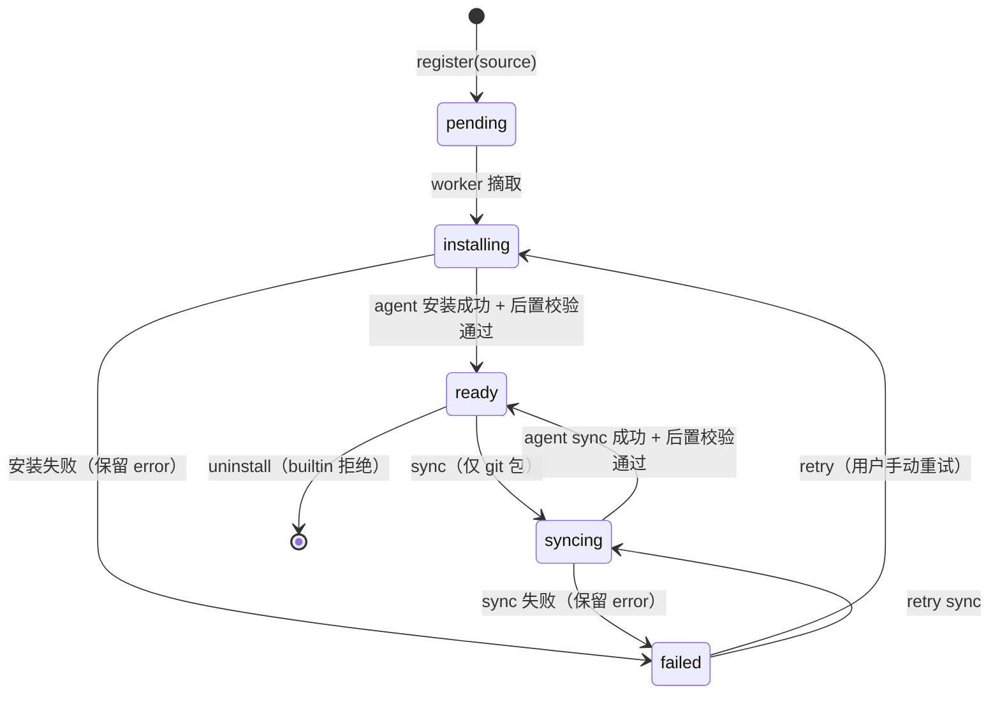
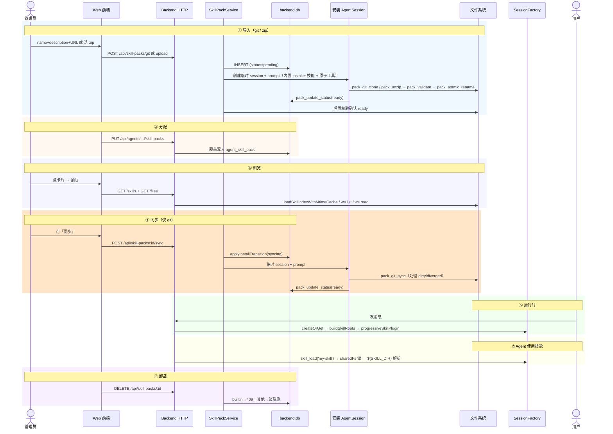

# Spec — Skill Pack Management：技能包导入、登记与按 Agent 分配

> **For agentic workers:** 本 spec 描述「技能包」从导入（git / zip）→ 登记 → 安装落盘 → 按 agent 分配 → 运行时装配的完整链路。安装/同步由 **builtin 技能 + 原子工具 + 临时 AgentSession** 驱动，LLM 自主处理 git 冲突等 corner case。配套实施 plan 见 `docs/superpowers/plans/2026-06-30-skill-pack-management-plan.md`。

## 1. 背景

目标能力：前端提供「技能包配置」入口，用户通过 **git URL** 或 **上传 zip** 安装技能包；安装后可把技能包**分配给指定 agent**；git 包支持**手动同步**拉取远端更新；系统自带一个不可卸载的 **builtin 技能包**（含安装器技能本身）。一个技能包 = 一个目录（内含若干 `SKILL.md` 子目录 + 可被脚本引用的资源文件）。

关键架构决策：安装/同步不硬编码 TypeScript 流水线，而是封装一组**原子工具**（git clone/unzip/validate/rename/updateStatus），由 **builtin 技能 `skill-pack-installer`** 指导一个临时 AgentSession 按需调用。这收益是 LLM 能处理 dirty working tree、merge conflict、diverged branch 等 corner case——优于机械脚本。

## 2. 当前代码事实

> 所有行号基于 HEAD `f9793896`。

### 2.1 progressive-skill 插件：引擎已就位

- `packages/plugin-progressive-skill/src/progressive-skill.ts:75` `progressiveSkillPlugin(options)`：接受 `roots?: string[]`（多目录、按优先级，**后者覆盖前者**）、`posixSkillRoot?: string`（把 `${SKILL_DIR}` 解析为磁盘真实路径）、`ws?: AgentFsLike` 或 `cwd?: string`。
- `progressive-skill.ts:88` `beforeModel` 钩子：经 `loadSkillIndexWithMtimeCache(ws, roots)` 扫描各 root 下的 `SKILL.md`，把索引注入 system message。
- `progressive-skill.ts:81` 暴露 `skill_load` 工具，模型按需加载技能正文。
- 缓存：`cache.ts` 的 `loadSkillIndexWithMtimeCache` 按 root 目录 mtime 失效，`invalidateSkillCache(root)` 可强制失效。
- fs 适配器 `nodeFsAdapter(cwd)`：所有读写经 `resolve(cwd, path)` 锁死在传入的根目录内。**`roots[]` 中的路径必须是相对于 ws 根目录的相对路径**。

### 2.2 唯一装配点：session-factory

- `apps/backend/src/features/span/session-factory.ts:285` 硬编码 `progressiveSkillPlugin({ cwd })`。
- `session-factory.ts:284` `fsMemoryPlugin({ cwd: config.workspaceRoot, root: "./memory/" })`——共享 fs adapter 的标准手法。
- `roots[]` 集合在 session 创建时固定，活 session 不感知后续变更。

### 2.3 agent 实体：当前无任何能力字段

- agents 表无技能/工具/能力字段。HTTP 全为 JSON body（Eden Treaty），无 multipart 上传范式。

### 2.4 lark 是"per-agent 可选能力"的范例分层

- agent 表字段 → service 包装器 → provisioner 异步状态机 → 运行时进程。技能包的异步状态机与 per-agent 关联可对照此分层。

### 2.5 迁移机制

drizzle，迁移目录 `apps/backend/drizzle/backend/`。

### 2.6 现状结论

仓库当前无任何 `SKILL.md` / `skills/` 目录，所有内容从零建立。

## 3. 第一性原则

### 3.1 技能包是领域本体，必须有独立存储与生命周期

技能包是一条有**来源、版本、安装状态、生命周期**的登记记录。builtin 包也是一条记录（不可卸载、默认存在）。运行时拿到的目录只是 `status=ready` 后的物化产物。领域词汇：**Skill**（单个 `SKILL.md`）、**Skill Pack**（分发单元）、**Skill Root**（物化目录）。

### 3.2 安装/同步由 Agent 驱动，原子工具为界

安装/同步不走硬编码 TypeScript 流水线。backend 提供一组**原子工具**（git clone / unzip / validate / rename / updateStatus），由 **builtin 技能 `skill-pack-installer`** 指导临时 AgentSession 调用。Agent 自主处理 git 冲突、dirty tree、diverged branch 等 corner case。`skill-pack-installer` 技能本身在 builtin 包内，seed 即就绪。

backend 角色退化为**编排层**：登记 pending → 创建临时 session → prompt → 后置校验。状态机不变（`pending→installing→ready|failed` + `ready→syncing→ready|failed`）。

### 3.3 共享落盘，绝不进 per-session 工作区

技能包装在 `<dataDir>/skill-packs/<packId>/`。`installPath` 由 `id + dataDir` 推导，不存表。运行时用共享 `nodeFsAdapter`（root 指向 `<dataDir>/skill-packs/`），`roots[]` 使用 pack ID（相对路径）。

### 3.4 分配是 agent × pack 的多对多关系

分配用关联表表达。运行时 session-factory 读分配 → 组 `roots[]`（builtin 在前）→ 传入 `progressiveSkillPlugin`。DI 设计：预解析 roots，传入 `BuildSessionSpecParams`，不注入 `SkillPackPort` 到 `SessionFactoryDeps`。

### 3.5 安全

- 安装 agent 的工具 cwd 锁定在 `<dataDir>/skill-packs/` 内，**无法访问系统路径**。
- `pack_update_status` 只接受 `applyInstallTransition` 合法转移，agent 无法破坏状态机不变量。
- 安装过程绝不执行包内脚本（无 postinstall hook）。
- zip 解包逐条 `assertSafeEntry` 防路径穿越。
- Agent 的实际脚本执行仍经既有 `permissionMode` + cwd 隔离。
- 安装为受控操作（经鉴权中间件，记录 actor 审计）。

### 3.6 名字冲突确定性可见

多个已分配包含同名技能时，按 roots 顺序后者覆盖前者，装配日志显式记录被覆盖项。

### 3.7 缓存与热更新边界

`roots[]` 在 session 创建时固定。git sync 后调用 `invalidateSkillCache(root)` 强制失效。改变分配只对新建 session 生效，不做热重载。

## 4. 目标

1. `skill_pack` 与 `agent_skill_pack` 两张表 + Port + SQLite adapter。
2. 原子工具套件（git clone / unzip / sync / validate / rename / updateStatus）+ builtin 技能 `skill-pack-installer` 驱动安装/同步。
3. builtin 包物理内容（repo 根 `skills/`）+ 启动 seed（含 installer 技能）。
4. HTTP 契约：技能包 CRUD + multipart zip 上传 + git 安装/同步 + 文件浏览 + per-agent 分配。
5. `session-factory` 改造 + 临时安装 session 创建。
6. 前端：卡片管理页 + 抽屉浏览 + sync 按钮 + AgentForm 分配。
7. 安全：工具沙箱、状态机校验、路径穿越防护、bootstrap reaper。

## 5. 非目标

- 活 session 热重载、版本回滚/多版本、技能市场、自动同步、私有 git 凭据托管 UI。

## 6. 实施分组与方案

### Patch P1 — 技能包实体与状态空间

`skill_pack` 表：

```
id            text  PK
name          text  NOT NULL            -- 用户填的展示名
description   text  NOT NULL            -- 用户填的描述
sourceKind    text  NOT NULL            -- 'builtin' | 'git' | 'zip'
sourceUrl     text                      -- git URL；zip 为原始文件名；builtin 为 null
versionRef    text                      -- git: 请求的 ref/branch/tag；zip/builtin: null
installedRef  text                      -- git: 实际 commit；zip: checksum
status        text  NOT NULL            -- 'pending'|'installing'|'ready'|'failed'|'syncing'
error         text                      -- failed 时的原因
createdAt     integer NOT NULL
updatedAt     integer NOT NULL
```

状态机（唯一写者经 `applyInstallTransition`）：



### Patch P2 — 迁移建表 + Port + SQLite adapter

- `schema.ts` 加 `skillPack`、`agentSkillPack` 两表 + drizzle-zod select schema。
- `agent_skill_pack`：

```
agentId    text NOT NULL   -- FK agents.id
packId     text NOT NULL   -- FK skill_pack.id
createdAt  integer NOT NULL
PRIMARY KEY (agentId, packId)
```

- **无 `enabled` 列**（分配即启用，unassign 即移除）。
- `SkillPackPort`：`register / get / list / applyInstallTransition / setInstalled / remove`；`listForAgent(agentId) / setAgentPacks(agentId, packIds[]) / removeAgentPack(packId)`。
- `sqliteSkillPackAdapter`（对照 `agent/adapter-sqlite.ts`）。

### Patch P3 — 原子工具套件 + builtin 安装技能 + SkillPackService

#### 3a. 原子工具（`features/skill-pack/tools.ts`）

每个工具是标准 `Tool` 实现，cwd 锁定在 `<dataDir>/skill-packs/`：

| 工具 | 输入 | 动作 |
|------|------|------|
| `pack_git_clone` | `{ url, ref?, targetDir }` | `git clone --depth 1 [--branch ref] <url> <cwd>/targetDir` → 返回 `{ commit }` |
| `pack_unzip` | `{ bufferB64, targetDir }` | 解包到 `<cwd>/targetDir`，逐条 `assertSafeEntry` → 返回 `{ checksum }` |
| `pack_git_sync` | `{ targetDir, ref? }` | 在 `<cwd>/targetDir` 内 `git fetch origin [ref] && git reset --hard FETCH_HEAD` → 返回 `{ commit }` |
| `pack_validate` | `{ targetDir }` | 调用 `loadSkillIndexWithMtimeCache(ws, [targetDir])` 校验至少一个合法 SKILL.md → 返回 `{ valid }` |
| `pack_atomic_rename` | `{ tmpDir, finalDir }` | `mv <cwd>/tmpDir <cwd>/finalDir`（原子 rename） |
| `pack_update_status` | `{ packId, status, error? }` | 调用 `applyInstallTransition(packId, status, { installedRef?, error? })` |

所有工具拒绝 `..`、绝对路径（`targetDir` 不含 `/`）。

#### 3b. builtin 技能 `skill-pack-installer`

位于 `skills/skill-pack-installer/SKILL.md`，内容指导 agent：
- 安装 git：`pack_git_clone` → `pack_validate` → `pack_atomic_rename` → `pack_update_status(ready)`
- 安装 zip：`pack_unzip` → `pack_validate` → `pack_atomic_rename` → `pack_update_status(ready)`
- 同步：`pack_git_sync` → `pack_validate` → `pack_update_status(ready)`
- 错误处理：dirty tree → `git stash` 后重试；diverged → `git reset --hard origin/<ref>`；网络错误 → 重试 3 次后退 `failed`

#### 3c. SkillPackService（`service.ts`）

编排层，不包含安装逻辑：
- `installFromGit(name, description, url, ref)` → `register(pending)` → `createInstallSession(packId, ctx)` → fire-and-forget prompt agent。
- `installFromZip(name, description, buffer)` → 同上。
- `syncGit(packId)` → `applyInstallTransition(packId, 'syncing')` → `createInstallSession(packId, ctx)` → fire-and-forget。
- `createInstallSession(packId, ctx)`：用 builtin 技能的 `skill-pack-installer` + 原子工具集 + 共享 fs adapter + 临时 workspace 创建 AgentSession，prompt 中包含 `packId`、`sourceUrl`、`versionRef` 等上下文。
- 安装完成后 backend 后置校验 `validatePackDir` + 目录存在 → 确认 `ready`。

### Patch P4 — builtin 包内容 + 启动 seed + reaper

- repo 根 `skills/` 下两个技能：
  - `skill-pack-installer/SKILL.md`（安装器技能本身）
  - `<example>/SKILL.md`（示例技能，含合法 frontmatter）
- seed：bootstrap 时若无 `sourceKind='builtin'` 记录 → copy `skills/` → `<dataDir>/skill-packs/builtin/` → 登记 `status=ready` 不可卸载记录。
- 新建 agent 默认 assign builtin（`agent.service.create` 中追加）。
- bootstrap reaper：启动时 `status IN ('pending','installing','syncing')` → `failed`。

### Patch P5 — HTTP 契约

- `GET /api/skill-packs` → 列表。
- `POST /api/skill-packs/git` → body `{ name, description, url, ref? }`，登记 pending 并异步启动安装 session。
- `POST /api/skill-packs/upload` → multipart（Elysia `t.File`，bodyLimit 50MB），附带 `name` + `description`。
- `POST /api/skill-packs/:id/sync` → 仅 git 包。
- `DELETE /api/skill-packs/:id` → builtin→409。
- `GET /api/skill-packs/:id/skills` → 复用 `loadSkillIndexWithMtimeCache`。
- `GET /api/skill-packs/:id/files?path=...` → 复用 `ws.list/ws.read`，`assertSafeEntry` 防穿越。
- `GET/PUT /api/agents/:id/skill-packs` → 读/全量替换。

### Patch P6 — session-factory 装配 + 安装 session

- `skill-roots.ts`：`buildSkillRoots(agentId, skillPackPort, dataDir)` → `{ ws, roots, posixSkillRoot }`。预解析，传入 `BuildSessionSpecParams`。
- 替换 `progressiveSkillPlugin({ cwd })` 为 `progressiveSkillPlugin(skillRoots)`。
- `createInstallSession(packId, ctx)`：独立 session 创建函数，不进入 session-registry。用 `packInstallerSkill` + 原子工具 + 共享 fs + 临时 cwd。maxSteps=20 防死循环。

### Patch P7 — 前端

- 卡片列表（name/description/source/status/installedRef/时间）。
- Git 安装表单（name + description + URL + ref）、ZIP 上传。
- **同步按钮**（仅 git 包，status=ready 时可用）。
- 点击卡片 → 抽屉（`GET /skills` → 技能清单 → `GET /files` → 目录树 → 文件阅读）。
- AgentForm 多选分配区。
- 安装中/syncing 状态轮询。

### Patch P8 — 文档翻态

- `CONTEXT.md` 已更新。
- architecture wiki 加 `skill-pack.md`。

## 7. 不变量

- `skill_pack.status` 只经 `applyInstallTransition` 变更（`pack_update_status` 工具内部经此校验）。
- `sourceKind='builtin'` 记录不可 uninstall。
- `installPath` 由 `id + dataDir` 推导。
- `roots[]` 为 pack ID（相对路径）。
- 安装 agent 工具 cwd 锁定在 `<dataDir>/skill-packs/`。
- 安装过程绝不执行包内脚本。
- 运行时 `roots` 中 builtin 恒在最前。
- 安装非原子失败不得留下半成品目录。
- 启动 reaper 清除非终态记录。
- git sync 完成后调用 `invalidateSkillCache(root)`。

## 8. 失败模式

| 场景 | 期望行为 |
|---|---|
| git URL 不可达 / clone 失败 | agent 捕获 → `pack_update_status(failed)` + error |
| sync dirty tree | agent `git stash` 后重试；放弃则 `failed` |
| sync diverged branch | agent `reset --hard` 后重试；放弃则 `failed` |
| 进程在 pending/installing/syncing 期间崩溃 | reaper → `failed` |
| zip 含路径穿越 | `pack_unzip` 拒绝 → agent 感知 → `failed` |
| zip 解包后 >500MB | 后端校验拒绝 → `failed` |
| zip 无合法 SKILL.md | `pack_validate` 返回 `{ valid: false }` → agent → `failed` |
| 安装 agent 超 maxSteps | session 终止 → 后置校验失败 → `failed` |
| 卸载 builtin | API 409 |
| 卸载被引用的包 | 级联清 `agent_skill_pack` + 删目录 |
| 改分配后活 session | 不热更，仅新建 session 生效 |
| 同名技能冲突 | 后者覆盖前者，装配日志记录 |

## 9. 验收

- git URL + zip 各装一个包，agent 驱动走到 `ready`。
- sync 处理 dirty/diverged 场景。
- 分配后新建 session 技能出现在 `<available-skills>`，`skill_load` 可加载，`${SKILL_DIR}` 解析正确。
- builtin 包默认 ready、不可卸载、新建 agent 默认带。
- 前端浏览包内技能清单 → 目录树 → 文件内容。
- 失败用例（坏 URL / 坏 zip / slip / bomb / 超步数）均落 `failed`。
- 启动 reaper 清 crash 遗留。
- backend typecheck 0 error。

## 10. E2E 流程



## 11. 关联页面

- `packages/plugin-progressive-skill/`（消费引擎 + `loadSkillIndexWithMtimeCache` / `invalidateSkillCache`）
- `apps/backend/src/features/span/session-factory.ts`（装配点 + 安装 session 创建）
- `apps/backend/src/features/agent/`（新建 agent 默认 assign builtin）
- `apps/backend/src/features/lark-bot/`（异步状态机范例）
- `apps/web/src/components/AgentForm.tsx`
- `CONTEXT.md`（领域词汇）
