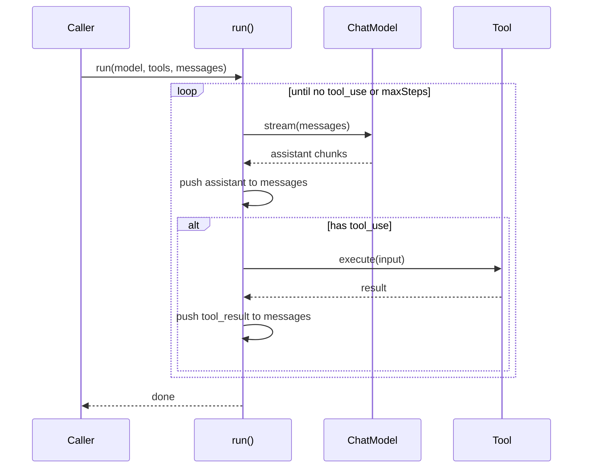

# Agent Loop

The core execution cycle. A while-loop that runs until the model stops calling tools or `maxSteps` is reached.

## Key properties

- **State belongs to caller**: `messages` array is caller-owned; `run()` appends in-place
- **Serial tool execution**: M1 executes tools one at a time, not parallel
- **Error handling**: Model errors propagate up. Tool errors become `is_error: true` tool_result blocks, letting the LLM recover from context
- **Streaming**: `AsyncIterable<AIMessageChunk>` carries delta through the entire stack

## L2 vs L3

L2 `run()` is the bare generator — caller provides everything each time. L3 `Agent.run()` wraps it with Thread, Plugin hooks, Checkpointer save points, and ContextManager shaping.
