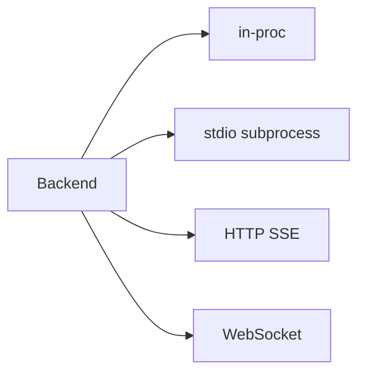

# Backend

The **top layer** of the agent stack. An always-on process managing multiple agent instances, maintaining agentId metadata, materializing workspaces, and exposing HTTP/SSE to frontends.

## Why Backend exists

Six first-principle facts:
1. Agent runs take seconds to minutes — HTTP short connections insufficient
2. Multiple users need agentId isolation
3. Agents persist across sessions — thread continuity needed
4. Streaming needs event channels — SSE/WebSocket
5. Deployment is independent of library code
6. Harness doesn't know agentId/sandbox — a layer must translate

## Responsibilities

| Responsibility | Details |
|---------------|---------|
| agentId table | `agentId → AgentSpec` mapping storage |
| Workspace materialization | `mkdir` + template copy on first agent creation |
| Agent lifecycle | Create, resume, run, abort, destroy, archive |
| Runner dispatch | Select transport (in-proc/stdio/HTTP/WebSocket) and sandbox |
| Session routing | threadId → runner instance mapping |
| Streaming | Runner `AgentEvent` → SSE/WebSocket to frontend |
| Multi-tenancy | Per-tenant workspace and checkpointer isolation |
| Auth + quota | API key validation, rate limiting |

## Runner transport



Runner entry ≤50 lines: deserialize AgentSpec → assemble harness → serialize events. No business logic.

## Sandbox transparency

Harness sees only a regular filesystem path. Backend bind-mounts workspace into sandbox, spawns runner inside. Swap sandbox implementation (firecracker/gvisor/wasm) → zero harness or entry changes.

## API surface

```
POST   /agents           — Create agent + materialize workspace
POST   /agents/:id/run   — Send input → SSE stream
POST   /agents/:id/abort — Abort current run
POST   /agents/:id/resume— Resume interrupted run
GET    /agents/:id/thread— Get thread state
DELETE /agents/:id       — Destroy + archive workspace
GET    /health           — Health check
```
