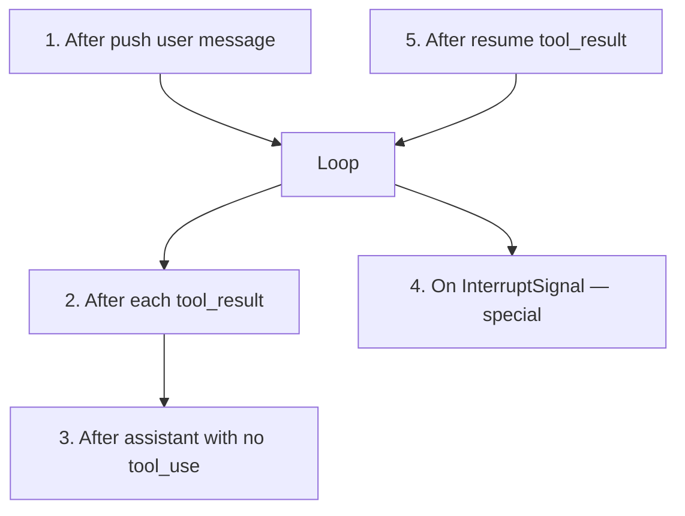

# Checkpointer

Framework's **internal capability** for agent state persistence and recoverability. Not a plugin — always present, only the implementation is replaceable.

**As of M9**: Checkpointer's scope is **narrowed** to agent-resume only. UX event projection is now owned by [[EventLog]], an independent port at L5.

## Two problems solved

1. **Crash recovery** — persist messages at tool boundaries; resume from last save
2. **Human-in-the-loop** — pause loop, exit process, wait for external decision, resume in new process

~~3. Execution observability~~ — **moved to [[EventLog]]**. Tier 3 (`appendEvent`/`readEvents`) is now optional internal audit, **not** the UX projection data source.

## Interface tiers

| Tier | Methods | Contract | Status |
|------|---------|----------|--------|
| 1 — Basic | `save()`, `load()` | **Mandatory** | ✅ |
| 2 — Interrupt | `saveInterrupt()`, `consumeInterrupt()` | Must be paired | ✅ |
| 3 — Events | `appendEvent()`, `readEvents()` | Must be paired | ⚠️ Demoted — optional internal audit; UX projection → [[EventLog]] |

## Tier 3 demotion — why

Event stream on Checkpointer Tier 3 works for single-process CLI but creates an unresolvable coupling for durable runs: backend SSE projection would need to hold Checkpointer, but Checkpointer is runner-injected and sandboxed away from backend. [[EventLog]] is the independent port that resolves this — backend projection only holds EventLog, never touches Checkpointer.

## Save timing (5 fixed points)

Save at tool boundaries only — messages always in legal API input state. Exception: interrupt save where last message is `assistant(tool_use)` — resume fills the gap.

## Interrupt & Resume

Tool throws `InterruptSignal` → framework saves state + interrupt → yields `{ type: 'interrupted' }` → generator returns. New process calls `agent.resume(command)` → consumes interrupt → pushes `tool_result` → continues loop.

**Recognition boundary (strict)**: `InterruptSignal` only recognized when thrown from `tool.execute()`. Plugin hooks, ContextManager, ChatModel — all treated as regular errors.

**Durable runs re-fork**: Backend doesn't call `agent.resume()` directly — it forks a new attempt subprocess with the original `storage.checkpointer` config forwarded. The subprocess entry calls `agent.resume()` → `consumeInterrupt`. Backend never reads checkpointer content.

## Built-in implementations

| Implementation | Storage | Use case |
|---------------|---------|----------|
| `inMemoryCheckpointer` | `Map<string, Message[]>` | Tests, single-process tasks |
| `fileCheckpointer` | JSON state + JSONL events | CLI, single-machine services |

## Sandbox isolation (known limitation)

Current implementations are in-process + local filesystem. Sandboxed runners will break this — container can't access host paths, can't share memory handles. **Long-term direction**: Checkpointer HTTP/RPC sub-service (backend holds DB connection, runner calls narrow HTTP API). Must complete before sandbox runners are enabled.
