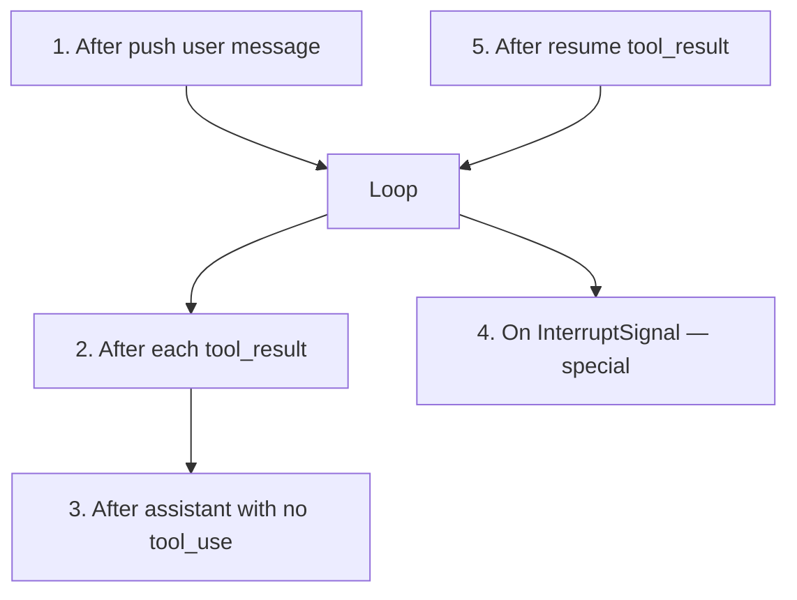

# Checkpointer

Framework's **internal capability** for agent state persistence and recoverability. Not a plugin — always present, only the implementation is replaceable.

## Three problems solved

1. **Crash recovery** — persist messages at tool boundaries; resume from last save
2. **Human-in-the-loop** — pause loop, exit process, wait for external decision, resume in new process
3. **Execution observability** — event stream for UX timeline replay and audit

## Interface tiers

| Tier | Methods | Contract |
|------|---------|----------|
| 1 — Basic | `save()`, `load()` | **Mandatory** |
| 2 — Interrupt | `saveInterrupt()`, `consumeInterrupt()` | Must be paired |
| 3 — Events | `appendEvent()`, `readEvents()` | Must be paired |

Capability detection at construction time: if only one of a pair is implemented, `createAgent()` throws immediately — fail fast.

## Save timing (5 fixed points)

Save at tool boundaries only — messages always in legal API input state. Exception: interrupt save where last message is `assistant(tool_use)` — resume fills the gap.

## Interrupt & Resume

Tool throws `InterruptSignal` → framework saves state + interrupt → yields `{ type: 'interrupted' }` → generator returns. New process calls `agent.resume(command)` → consumes interrupt → pushes `tool_result` → continues loop.

**Recognition boundary (strict)**: `InterruptSignal` only recognized when thrown from `tool.execute()`. Plugin hooks, ContextManager, ChatModel — all treated as regular errors.

## Built-in implementations

| Implementation | Storage | Use case |
|---------------|---------|----------|
| `inMemoryCheckpointer` | `Map<string, Message[]>` | Tests, single-process tasks |
| `fileCheckpointer` | JSON state + JSONL events | CLI, single-machine services |
