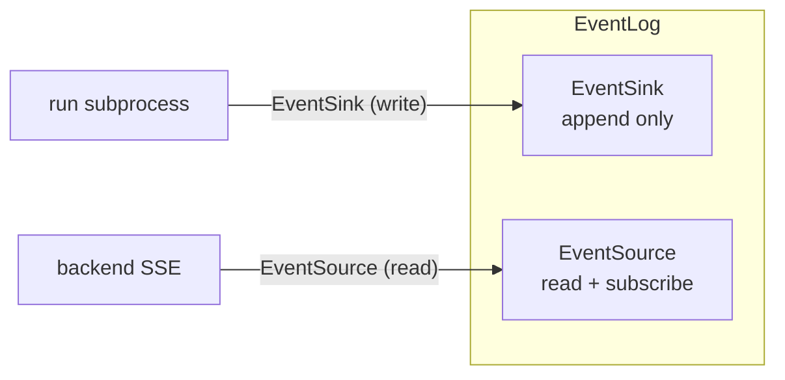

# EventLog

An **independent port** for run execution events — extracted from [[Checkpointer]] Tier 3, elevated to a standalone **append-only, projectable, subscribable** fact source. Defined at L5, owned by backend composition root.

## The split from Checkpointer

| Dimension | Checkpointer | EventLog |
|-----------|-------------|----------|
| **Serves** | Agent loop itself (crash recovery) | UX / audit / SSE projection (human-facing) |
| **Data shape** | Message **snapshots** (overwritable, interrupt state machine) | Event **append stream** (never updated) |
| **Read granularity** | By `threadId`, latest snapshot | By `runId` **or** `threadId`, with `afterSeq` incremental |
| **Injected by** | **Runner** (subprocess; backend doesn't touch) | **Backend** composition root |
| **Subscribable** | No (load is one-shot) | **Yes** (tail new events, SSE long-connection) |
| **Lifecycle** | Bound to thread | Bound to run (with thread_id for aggregation) |

If event stream stayed on Checkpointer, backend SSE projection would need to hold Checkpointer — but Checkpointer is runner-injected and sandboxed away from backend. Splitting EventLog resolves this.

## Four iron laws

All design follows from these four; violating any reintroduces coupling:

1. **Depend on abstract interface** — framework/backend only see `EventLog` interface; storage (PG LISTEN/NOTIFY, SQLite polling) sealed in adapter
2. **`subscribe` is EventLog's read dual** — not an executor or backend capability
3. **Executor and projector don't know each other** — run subprocess only calls `append`; backend SSE only calls `read`/`subscribe`; sole communication medium is EventLog
4. **Executor writes to the most durable layer** — run subprocess **directly writes EventLog** (fact source), never goes through "stdout → backend → EventLog" forwarding

## Interface: EventSink + EventSource

The port itself is `EventLog extends EventSink, EventSource`. Consumers reference only their role interface — compiler prevents `EventSink` from calling `subscribe`, and `EventSource` from calling `append`.

## Relationship with Checkpointer

- **Checkpointer = sole authority for resume** (stores trimmed input state after token-budget/summarizing/sliding-window)
- **EventLog = sole authority for observation/audit/projection** (stores complete untrimmed events)
- Both derive from agent loop at the same moment, but **projection targets differ — not upstream of each other, not interchangeable**

EventLog **cannot** replace Checkpointer for resume: replaying raw events would produce untrimmed full history, diverging from the real input state the model saw → token explosion or Anthropic 400.

## Built-in implementations

| Implementation | Mechanism | Use |
|---------------|-----------|-----|
| `postgresEventLog` | LISTEN/NOTIFY + polling fallback | Production |
| `sqliteEventLog` | Polling-only (WAL + busy_timeout) | Local dev / single-machine |
| `inMemoryEventLog` | In-process array + EventEmitter | Tests |

## Convergence invariant

`storage.eventLog` is **backend-determined and converged** — all runners must point to the same backend-accessible store. `storage.checkpointer` is **runner-chosen, can be heterogeneous** — different runners can use sqlite/redis/memory. Backend is permanently unaware of checkpointer medium.
