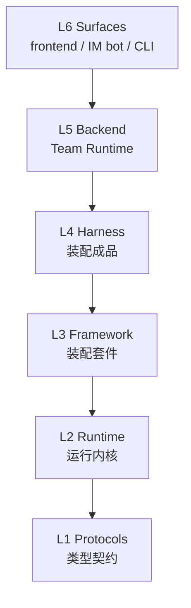

# Layer Architecture

The my-agent-team stack is 6 layers, each depending only downward.

## L1 — Protocols

Type contracts: `Message`, `ChatModel`, `Tool`. Zero runtime logic. The vocabulary shared by all layers above.

## L2 — Runtime

The `run()` async generator. Messages → model → tools → messages loop. Stateless, minimal — caller owns the messages array.

## L3 — Framework

`createAgent()` API that wraps L2 into a reusable `Agent` object with:
- **Thread** — named message container with fork support
- **Plugin** — 4 lifecycle hooks (beforeModel/afterModel/beforeTool/afterTool)
- **Internal capabilities** — [[Checkpointer]], [[ContextManager]], Logger

## L4 — Harness

Domain-closed, zero-assembly agent product. Two forms:
- **Code-driven**: system prompt baked into npm package
- **File-driven** (adopted): behavior controlled by workspace markdown files (SOUL.md, AGENTS.md, etc.)

## L5 — Backend (Team Runtime)

Always-on HTTP process. Multi-agent management, HTTP/SSE streaming, sandbox transparency, runner transport selection. Key L5 concepts:
- **[[EventLog]]** — Run execution event fact source (append-only, projectable, subscribable). Split from Checkpointer Tier 3. Owned by backend.
- **[[Conversation]]** — Multi-agent thread container + conversation ledger. Broadcast visibility + @-triggered execution. Defined at L5, never invades L4↓.
- **run/attempt split** — Logical run vs physical subprocess execution; `heartbeat_at` as single liveness truth source.

## L6 — Surfaces

User/IM access layer: frontend web (SPA), IM bot (Feishu/Slack), CLI. Consumes backend HTTP/SSE. Can be swapped without backend changes.

## Key rules

- Downward dependency only (L6→L5→L4→L3→L2→L1); upward = bug
- Cross-package imports only from `index.ts`
- AsyncIterable is the event stream — no EventBus
- State belongs to caller by default
- Harness never knows which surface it's mounted in
- Collaboration semantics stop at L5 — framework/harness/runner never see ledger/conversation
