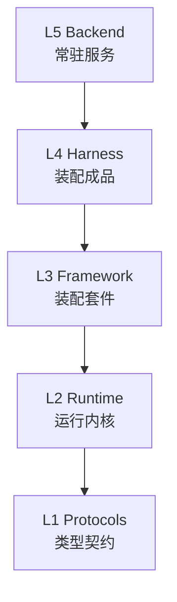

# Layer Architecture

The my-agent-team stack is 5 layers, each depending only downward.

## L1 — Protocols

Type contracts: `Message`, `ChatModel`, `Tool`. Zero runtime logic. The vocabulary that all layers above share.

## L2 — Runtime

The `run()` async generator. Messages → model → tools → messages loop. Stateless, minimal — caller owns the messages array.

## L3 — Framework

`createAgent()` API that wraps L2 into a reusable `Agent` object with:
- **Thread** — named message container with fork support
- **Plugin** — 4 lifecycle hooks (beforeModel/afterModel/beforeTool/afterTool)
- **Internal capabilities** — Checkpointer, ContextManager, Logger

## L4 — Harness

Domain-closed, zero-assembly agent product. Two forms:
- **Code-driven**: system prompt baked into npm package
- **File-driven** (adopted): behavior controlled by workspace markdown files (SOUL.md, AGENTS.md, etc.)

## L5 — Backend

Always-on process. Multi-agent management, agentId→workspace mapping, HTTP/SSE streaming, sandbox transparency, runner transport selection.

## Key rules

- Downward dependency only (L4→L3→L2→L1)
- Cross-package imports only from `index.ts`
- AsyncIterable is the event stream — no EventBus
- State belongs to caller by default
