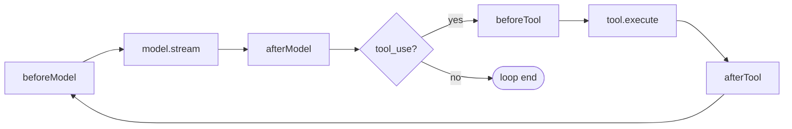

# Plugin System

Framework's **sole extension point**. A set of lifecycle hooks that let external code intercept the agent loop at 4 specific moments — without modifying framework or agent code.

## Why plugins exist

From first principles: some cross-cutting logic must see internal execution nodes AND span multiple nodes. Pure function wrappers around model/tool can't do this. The alternatives (forking run(), wrapping single objects, caller-side loop) all fail for multi-node concerns.

## The 4 hooks

Two categories, **type = semantics**:

| Category | Hooks | Return value | Failure |
|----------|-------|-------------|---------|
| **Transformer** | `beforeModel`, `beforeTool` | Modifies data flow | Aborts entire turn |
| **Observer** | `afterModel`, `afterTool` | Ignored (void) | Swallowed + warn |

## HookContext

Every hook receives `ctx` as first argument, exposing framework's 3 internal capabilities:

| Field | Plugin can... | Plugin must NOT... |
|-------|--------------|-------------------|
| `logger` | Log with framework-controlled level | Bypass to console |
| `checkpointer` | Read events, read interrupt state | Call `save()` / `saveInterrupt()` (framework's job) |
| `contextManager` | Call `shape()` for derived views | Mutate messages through it |

## Static tool declarations

Plugins can declare `tools?: readonly Tool[]` as a static field. Framework merges all `plugin.tools` with `config.tools` at construction time. **Duplicate names fail-fast** — no silent override.

This enables tight coupling: [[FS_Memory_Plugin]] declares `memory_read`/`memory_write`/`memory_search`; [[Progressive_Skill_Plugin]] declares `skill_load`.

## Plugin is NOT

- **Middleware** — no `next()`; framework auto-advances
- **Decorator** — decorator wraps one object; plugin sees the whole execution flow
- **EventBus** — no cross-plugin communication; merge into one plugin instead
- **Checkpointer** — checkpointing is framework-internal; plugin only observes
